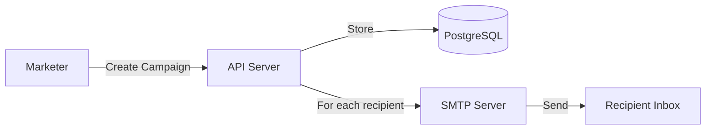
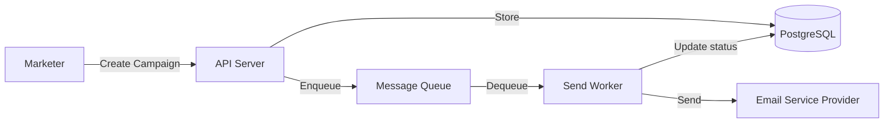
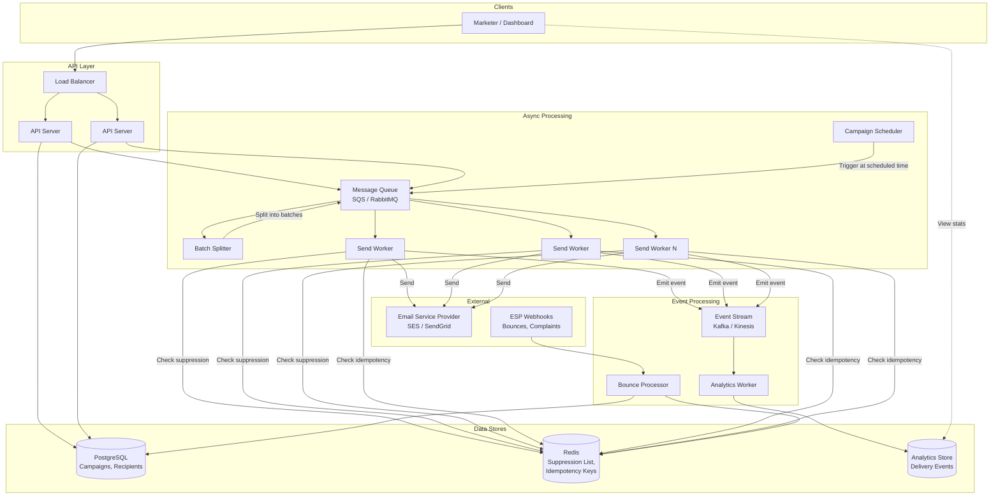

# System Design: Bulk Emailing Service

---

# 1. Problem Statement

**In plain English:** Build a service that lets a company send millions of emails — like marketing campaigns, transactional receipts, or notifications — reliably, without duplicates, and without getting flagged as spam.

**Core user actions:**
- A marketer creates a campaign (subject, body template, recipient list).
- The system personalizes each email (e.g., "Hi {{first_name}}").
- The system sends emails in batches, tracks delivery, and handles bounces and unsubscribes.
- The marketer views delivery stats (sent, opened, bounced, unsubscribed).

**Scale assumptions:**
- 100M emails/day across all campaigns.
- ~50K campaigns/day, each targeting 2K–500K recipients.
- Peak bursts of 10K emails/second.
- P99 latency for API response (enqueue a campaign) < 500ms.
- Actual email delivery is async — minutes to hours is fine.

**Non-functional requirements:**
- **Reliability:** Every email must be sent exactly once (or at-most-once — never duplicated).
- **Scalability:** Handle spikes without losing emails.
- **Availability:** The system should accept new campaigns 24/7.
- **Security:** Protect recipient data; authenticate senders.
- **Compliance:** Handle unsubscribes (CAN-SPAM / GDPR), bounce processing, spam reputation.

---

# 2. Requirements

## Functional Requirements
- Create campaigns with template, subject, and recipient list.
- Personalize emails using template variables.
- Schedule campaigns (send now or at a future time).
- Track delivery status per recipient: queued, sent, delivered, bounced, opened, clicked, unsubscribed.
- Handle bounces (hard and soft) automatically.
- Process unsubscribe requests and suppress future sends.
- Provide campaign analytics dashboard.

## Non-Functional Requirements
- At-most-once delivery (no duplicate emails).
- Horizontal scalability for sending workers.
- Throttling to respect ESP (Email Service Provider) rate limits.
- Retry transient failures with exponential backoff.
- Audit logging for compliance.

## Out of Scope
- Email editor / drag-and-drop builder UI.
- A/B testing logic.
- Full analytics (open/click tracking pixel infrastructure in detail).

---

# 3. Naive Solution

The simplest design: one server, one database, synchronous sending.



**How it works:**
1. Marketer calls `POST /campaigns` with template + recipient list.
2. API server stores the campaign and recipient list in PostgreSQL.
3. API server loops through each recipient, renders the template, and sends via SMTP — synchronously, one by one.
4. Delivery status is updated in the DB after each send.

**Why this works at small scale:**
- Simple to build and debug.
- Single database = strong consistency.
- 100 emails? Takes a few seconds. Fine.

**Why this breaks at scale:**
- Sending 100K emails synchronously in one API call? That request times out.
- One server = one bottleneck. SMTP calls take 50–200ms each → 100K × 100ms = ~3 hours per campaign, blocking the server.
- If the server crashes mid-send, you don't know which emails were sent → duplicates or missed emails.
- No throttling → the ESP (e.g., SendGrid, SES) rate-limits you or blacklists your IP.

---

# 4. Bottlenecks / Failure Modes

| Problem | What Happens | Why It's Bad |
|---------|-------------|--------------|
| **Synchronous sending** | API blocks for hours on large campaigns | Timeouts, poor UX, wasted server resources |
| **No queue** | If the server crashes, in-flight emails are lost | Emails never sent or sent twice on restart |
| **No idempotency** | Retry after crash re-sends already-sent emails | Duplicate emails → spam complaints → reputation damage |
| **Single SMTP connection** | Throughput capped at ~10 emails/sec | Can't handle 10K/sec bursts |
| **Hot partition / hot row** | All recipients for a campaign hit the same DB rows | DB contention, slow queries |
| **No throttling** | Burst of sends exceeds ESP rate limits | ESP blocks your account |
| **No bounce handling** | Hard bounces keep getting retried | Wastes resources, damages sender reputation |
| **No unsubscribe** | Emails sent to people who opted out | Legal liability (CAN-SPAM fines up to $50K/email) |
| **Storage growth** | Billions of delivery status rows | DB grows unbounded, queries slow down |

---

# 5. Evolved Solution

## Step 1: Make Sending Asynchronous

**Change:** Instead of sending emails in the API call, drop a "send campaign" job into a message queue. Background workers pick up jobs and send emails.

**Why it helps:**
- API responds immediately ("campaign queued") → user isn't waiting.
- Workers can be scaled independently.
- If a worker crashes, the message stays in the queue and another worker picks it up.

**Trade-off:** Now the marketer doesn't see instant results — they see "processing" for a while. You need a status page.



## Step 2: Batch Recipients

**Change:** Instead of one queue message per campaign, split recipients into batches (e.g., 500 per batch). Each batch is a separate queue message.

**Why it helps:**
- Parallelism: 10 workers can process 10 batches simultaneously.
- If one batch fails, only that batch retries — not the whole campaign.
- Smaller units of work = faster recovery.

**Trade-off:** More queue messages to manage. Need to track batch progress to know when the campaign is "done."

## Step 3: Add Idempotency

**Change:** Assign each email a unique **idempotency key** = `campaign_id + recipient_id`. Before sending, check if this key has already been processed.

**Why it helps:**
- If a worker crashes after sending but before marking "sent," the retry will check the idempotency key and skip the duplicate.
- Safe retries — the most important property for email systems.

**Trade-off:** Requires a fast lookup (cache or DB index) on the idempotency key. Small overhead per email.

**Implementation:**
```
idempotency_key = hash(campaign_id, recipient_email)
if already_sent(idempotency_key):
    skip
else:
    send_email()
    mark_sent(idempotency_key)
```

## Step 4: Throttling and Rate Limiting

**Change:** Add a rate limiter between workers and the ESP. Workers check a token bucket before sending.

**Why it helps:**
- Stays within ESP rate limits (e.g., SES allows 200 emails/sec by default).
- Prevents sudden bursts from damaging sender reputation.

**Trade-off:** Sending takes longer during bursts. Campaigns may take minutes instead of seconds.

## Step 5: Bounce and Unsubscribe Processing

**Change:** 
- ESP sends bounce/complaint notifications via webhook → a dedicated **Bounce Processor** service handles them.
- Add a **suppression list** — a set of email addresses that must never receive emails again.
- Before sending any email, check the suppression list.

**Why it helps:**
- Hard bounces (invalid email) are immediately suppressed → no wasted sends.
- Complaints (user clicked "report spam") are suppressed → protects sender reputation.
- Unsubscribe links trigger suppression → legal compliance.

**Trade-off:** Need to maintain and query the suppression list on every send. But it's a simple set lookup (Redis or DB index).

## Step 6: Template Rendering Service

**Change:** Extract template rendering into its own step. Store templates with placeholders (`{{first_name}}`). A **Renderer** service merges template + recipient data just before sending.

**Why it helps:**
- Templates can be cached and reused.
- Rendering and sending are separate concerns → easier to debug.
- Can pre-render in batches for efficiency.

**Trade-off:** One more service to maintain. But the logic is simple and stateless.

## Step 7: Delivery Tracking and Analytics

**Change:** 
- Use a separate **analytics store** (e.g., time-series DB or columnar store) for delivery events.
- Write delivery events (sent, delivered, opened, clicked) asynchronously via a stream.
- Dashboard reads from the analytics store, not the transactional DB.

**Why it helps:**
- Separates read-heavy analytics from write-heavy sending.
- Analytics queries don't slow down the sending path.
- Can aggregate stats efficiently.

**Trade-off:** Delivery stats are eventually consistent — the dashboard might lag by seconds.

---

# 6. Final Architecture



**Request lifecycle:**
1. Marketer creates a campaign via API → stored in PostgreSQL.
2. If scheduled, the Scheduler triggers at the right time. Otherwise, immediately enqueued.
3. Batch Splitter breaks the recipient list into batches of ~500 and enqueues each batch.
4. Send Workers dequeue batches, for each recipient:
   - Check suppression list (Redis) → skip if suppressed.
   - Check idempotency key (Redis) → skip if already sent.
   - Render template with recipient data.
   - Send via ESP (rate-limited).
   - Record idempotency key.
   - Emit "sent" event to event stream.
5. ESP sends delivery/bounce/complaint webhooks → Bounce Processor updates suppression list.
6. Analytics Worker consumes events and writes to Analytics Store.
7. Dashboard queries Analytics Store for campaign stats.

---

# 7. Data Model

## Campaigns Table (PostgreSQL)
| Column | Type | Notes |
|--------|------|-------|
| `campaign_id` | UUID (PK) | Unique identifier |
| `sender_id` | UUID (FK) | Who created this campaign |
| `subject` | TEXT | Email subject line |
| `template_id` | UUID (FK) | Reference to template |
| `status` | ENUM | draft, scheduled, sending, completed, paused |
| `scheduled_at` | TIMESTAMP | When to start sending (nullable) |
| `created_at` | TIMESTAMP | |
| `total_recipients` | INT | Denormalized count for quick display |

## Recipients Table (PostgreSQL)
| Column | Type | Notes |
|--------|------|-------|
| `recipient_id` | UUID (PK) | |
| `campaign_id` | UUID (FK, indexed) | Which campaign |
| `email` | VARCHAR(255) | Recipient email |
| `personalization` | JSONB | `{"first_name": "Alice", ...}` |
| `status` | ENUM | queued, sent, delivered, bounced, complained |
| `sent_at` | TIMESTAMP | |

**Partition strategy:** Partition `recipients` table by `campaign_id` — all recipients for a campaign are co-located, and old campaigns can be archived/dropped.

## Suppression List (Redis Set)
- Key: `suppressed_emails`
- Members: email addresses that must not receive emails.
- Also queryable from PostgreSQL for durability, but Redis is the hot path.

## Idempotency Store (Redis)
- Key: `idem:{campaign_id}:{recipient_email_hash}`
- Value: `1` (exists = already sent)
- TTL: 7 days (campaigns don't last longer than that)

## Templates Table (PostgreSQL)
| Column | Type | Notes |
|--------|------|-------|
| `template_id` | UUID (PK) | |
| `body_html` | TEXT | HTML with `{{placeholders}}` |
| `body_text` | TEXT | Plain-text fallback |
| `created_at` | TIMESTAMP | |

---

# 8. API Design

## Create Campaign
```
POST /api/v1/campaigns
Authorization: Bearer <token>

{
  "subject": "Spring Sale!",
  "template_id": "tmpl-123",
  "recipient_list_id": "list-456",
  "scheduled_at": "2026-03-20T10:00:00Z"   // optional
}

Response 201:
{
  "campaign_id": "camp-789",
  "status": "scheduled"
}
```

## Get Campaign Status
```
GET /api/v1/campaigns/{campaign_id}
Authorization: Bearer <token>

Response 200:
{
  "campaign_id": "camp-789",
  "status": "sending",
  "total": 50000,
  "sent": 32000,
  "delivered": 30500,
  "bounced": 120,
  "complained": 5
}
```

## Upload Recipient List
```
POST /api/v1/recipient-lists
Authorization: Bearer <token>
Content-Type: multipart/form-data

file: recipients.csv

Response 201:
{
  "list_id": "list-456",
  "count": 50000
}
```

## Unsubscribe (public endpoint)
```
POST /api/v1/unsubscribe
{
  "token": "<signed-unsubscribe-token>"
}

Response 200: { "status": "unsubscribed" }
```

**Notes:**
- All mutating endpoints use **idempotency keys** in the header: `Idempotency-Key: <uuid>`.
- Pagination for listing campaigns: `GET /api/v1/campaigns?page=2&per_page=20`.
- API versioning via URL path (`/v1/`).

---

# 9. Scale and Performance

## Traffic Estimates
- 100M emails/day = ~1,150 emails/sec average, peaks at ~10K/sec.
- Each email record: ~500 bytes → 100M × 500 = **50 GB/day** of delivery data.
- Suppression list: ~10M emails × 50 bytes = **500 MB** — fits in Redis easily.

## Handling Spikes
- Message queue absorbs spikes. If 50 campaigns launch at once, the queue buffers all batches.
- Workers auto-scale based on queue depth (e.g., AWS Auto Scaling on SQS queue length).
- Rate limiter prevents ESP overload regardless of worker count.

## Hot-Key Mitigation
- Recipients are partitioned by `campaign_id` → no single hot partition unless one campaign has millions of recipients.
- For very large campaigns (>1M recipients), split into sub-campaigns automatically.

## Caching Strategy
- **Suppression list:** Redis set, updated on every bounce/unsubscribe. Checked on every send. No TTL — persistent.
- **Templates:** Cache rendered templates in local memory (LRU cache) per worker. TTL: 5 minutes.
- **Idempotency keys:** Redis with 7-day TTL.

---

# 10. Reliability and Failure Handling

| Failure | What Happens | Mitigation |
|---------|-------------|------------|
| **Worker crashes mid-batch** | Queue message becomes visible again after visibility timeout | Another worker picks it up; idempotency keys prevent duplicates |
| **ESP is down** | Send calls fail | Retry with exponential backoff (1s, 2s, 4s, 8s...); after 5 retries, move to DLQ |
| **Queue is full** | API can't enqueue | Return 503 to client; client retries; alert ops team |
| **DB is slow** | Campaign creation slows | DB read replicas for dashboard queries; writes go to primary only |
| **Redis is down** | Can't check suppression/idempotency | Fall back to DB lookup (slower but correct); or pause sending until Redis recovers |
| **Duplicate webhook** | Same bounce processed twice | Idempotent suppression list update (adding to a set is idempotent) |

**Dead-Letter Queue (DLQ):**
- After 5 failed attempts, a message goes to the DLQ.
- An alert fires. An engineer investigates.
- Emails in the DLQ are not lost — they can be replayed after the issue is fixed.

**Disaster Recovery:**
- PostgreSQL: daily backups + WAL (Write-Ahead Log) streaming to a standby.
- Redis: AOF (Append-Only File) persistence + replica.
- Queue: use a managed service (SQS, Azure Service Bus) with built-in durability.

---

# 11. Security and Abuse Prevention

| Concern | Mitigation |
|---------|-----------|
| **Authentication** | API keys or OAuth 2.0 tokens for all API calls |
| **Authorization** | Campaigns can only be viewed/modified by the owning account |
| **Rate Limiting** | Per-account rate limit on campaign creation (e.g., 100 campaigns/hour) |
| **Spam Prevention** | Monitor complaint rate; auto-pause campaigns with complaint rate > 0.1% |
| **Unsubscribe Compliance** | Every email includes a one-click unsubscribe link (RFC 8058); suppression list honored on every send |
| **Data Privacy** | Recipient PII (email, name) encrypted at rest; access logged |
| **Encryption** | TLS for all API calls; TLS for SMTP (STARTTLS); encryption at rest for DB and object storage |
| **Unsubscribe Token** | Signed (HMAC) to prevent forged unsubscribe requests |
| **Audit Logging** | Every campaign creation, send, bounce, and unsubscribe is logged with timestamp and actor |

---

# 12. Interview Talking Points

Use this checklist to make sure you cover everything:

- [ ] **Assumptions:** 100M emails/day, peak 10K/sec, async delivery is acceptable.
- [ ] **Async is essential:** Email sending must be decoupled from the API — queues are non-negotiable.
- [ ] **Idempotency:** `campaign_id + recipient_email` as idempotency key prevents duplicates on retry.
- [ ] **Batching:** Split large recipient lists into batches of ~500 for parallel processing.
- [ ] **Throttling:** Rate limiter between workers and ESP to respect rate limits and protect sender reputation.
- [ ] **Bounce processing:** Webhooks from ESP update suppression list; hard bounces are permanent.
- [ ] **Unsubscribe handling:** Legal requirement; suppression list checked before every send.
- [ ] **Trade-offs:** Eventual consistency for analytics vs. strong consistency for send status.
- [ ] **Scalability:** Workers scale horizontally; queue depth triggers auto-scaling.
- [ ] **Failure handling:** DLQ for messages that fail after retries; idempotency ensures safe retry.
- [ ] **Cost:** ESP charges per email; batching and suppression reduce wasted sends.
- [ ] **Security:** PII encrypted at rest, TLS in transit, signed unsubscribe tokens.
- [ ] **Monitoring:** Track queue depth, send rate, bounce rate, complaint rate, p99 latency.

---

# 13. Common Follow-Up Questions

**Q: How do you prevent sending duplicate emails?**
A: Each email has an idempotency key (`campaign_id + recipient_email`). Before sending, the worker checks if the key exists in Redis. If yes, skip. If no, send and then record the key. This makes retries safe.

**Q: What if a worker crashes after sending but before recording the idempotency key?**
A: The message goes back to the queue. The next worker will not find the idempotency key, so it might send a duplicate. This is a rare edge case. To mitigate: record the idempotency key *before* sending (risk: recording but not sending → email never sent). The trade-off is at-most-once vs. at-least-once. For marketing email, at-most-once (risk: some emails not sent) is safer than duplicates.

**Q: How do you handle a campaign with 10 million recipients?**
A: Split into 20,000 batches of 500. Each batch is a queue message. Workers process in parallel. At 10 workers doing 100 emails/sec each, that's 1,000 emails/sec → 10M emails in ~2.8 hours. Scale workers to go faster.

**Q: How do you protect sender reputation?**
A: (1) Throttle sends to stay within ESP limits. (2) Monitor bounce/complaint rates and auto-pause campaigns with high complaint rates. (3) Warm up new sending domains gradually. (4) Honor unsubscribes immediately.

**Q: Why not send directly via SMTP instead of using an ESP?**
A: Managing SMTP infrastructure, IP reputation, deliverability, and spam filtering is a full-time job. ESPs (SES, SendGrid, Postmark) handle all of this. The cost (~$0.10 per 1,000 emails) is worth it.

**Q: How do you handle scheduled campaigns?**
A: The Scheduler service polls for campaigns where `scheduled_at <= now()` and `status = 'scheduled'`. When found, it enqueues the campaign and updates status to 'sending'. The Scheduler uses a distributed lock (or simply relies on DB `UPDATE ... WHERE status = 'scheduled'` with row-level locking) to prevent double-trigger.

**Q: How would you add open/click tracking?**
A: Embed a tiny transparent pixel (``) for opens. Wrap links through a redirect service for clicks. Both generate events → event stream → analytics store. This is a common follow-up but can be out-of-scope for the initial design.

---

# Summary in 60 Seconds

> "A bulk email system is fundamentally an async job processing pipeline. The API accepts campaigns and enqueues them. A batch splitter breaks recipient lists into manageable chunks. Send workers process batches in parallel, checking a suppression list and idempotency keys before each send. Emails go through an ESP like SES or SendGrid. Bounce and complaint webhooks update the suppression list. Delivery events flow through an event stream to an analytics store for dashboards. The key design choices are: async processing via queues, idempotency to prevent duplicates, throttling to protect sender reputation, and a suppression list for compliance. The system scales by adding workers and is resilient because the queue buffers work and retries handle transient failures."

---

# What I Would Say If the Interviewer Pushes Deeper

**On idempotency edge cases:**
> "There's a fundamental tension between at-most-once and at-least-once delivery. If I record the idempotency key *before* sending, I might record it but fail to send — the email is lost. If I record *after* sending, a crash between send and record means a duplicate. For marketing email, I'd choose at-most-once: record first, then send. Missing one email is better than spamming. For transactional email (receipts, password resets), I'd choose at-least-once: send first, then record. A duplicate receipt is better than no receipt."

**On multi-region:**
> "For a global system, I'd run workers in multiple regions but use a single source of truth for the suppression list (replicated Redis with eventual consistency is fine — a few seconds of lag won't cause a legal problem). The queue can be regional, and the ESP handles global delivery. The main concern is that the campaign DB stays consistent — I'd keep it in one region with read replicas elsewhere."

**On cost optimization:**
> "The biggest cost driver is the ESP per-email fee. Reducing unnecessary sends (via suppression list, bounce handling, and deduplication) directly reduces cost. Beyond that, I'd batch database writes, use spot/preemptible instances for workers, and archive old delivery data to cold storage after 90 days."
