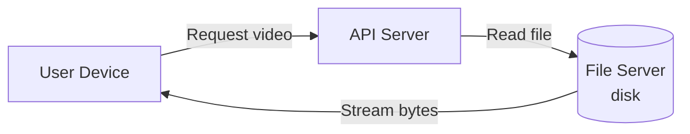
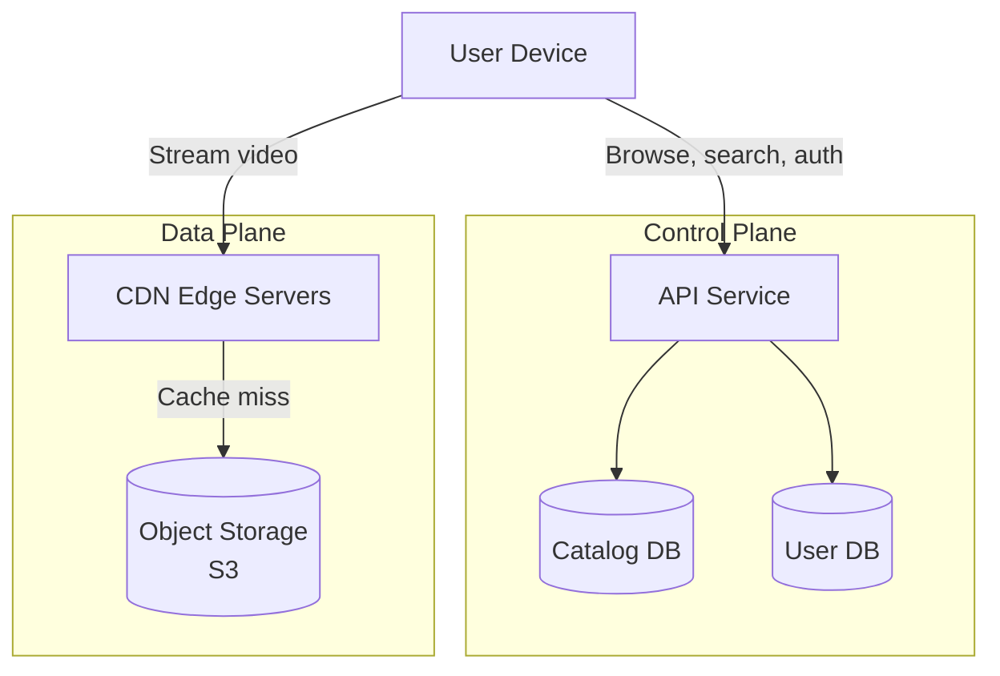
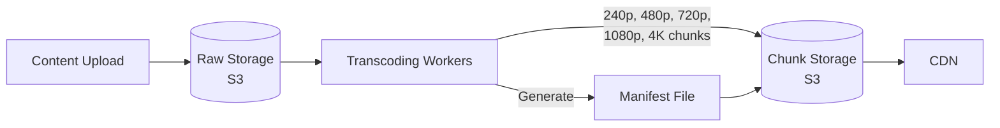
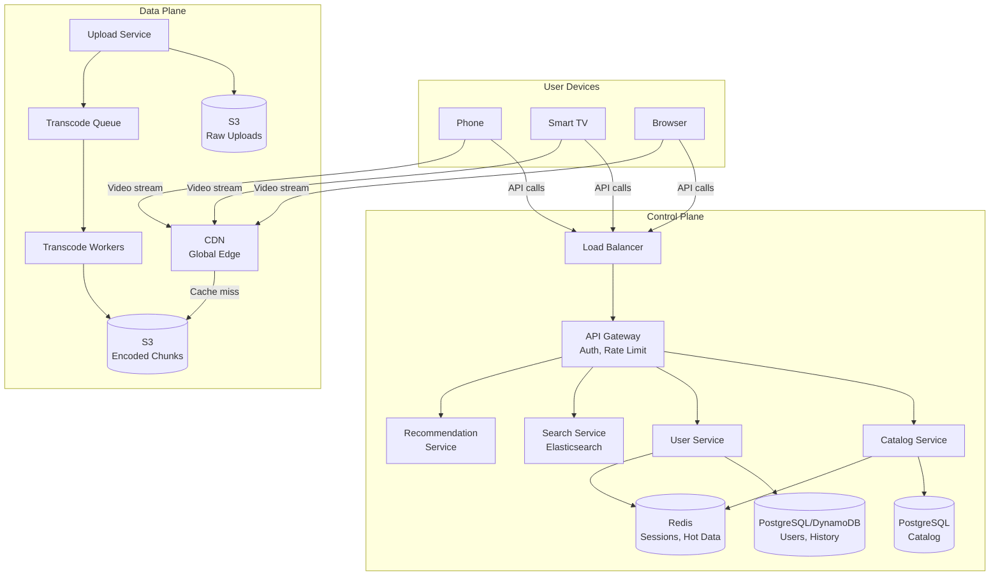
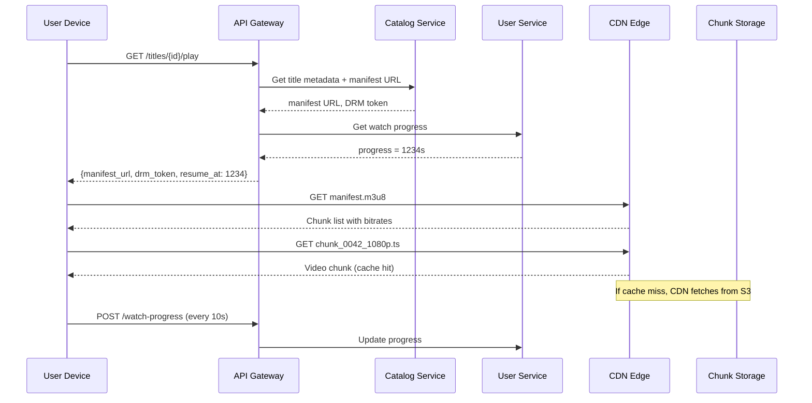

# System Design: Netflix / Video Streaming Service (VOD)

---

# 1. Problem Statement

**In plain English:** Build a service like Netflix where users can browse a catalog of movies and shows, press play, and watch video that streams smoothly — adapting quality to their internet speed — from anywhere in the world.

**Core user actions:**
- Browse and search a catalog of titles.
- Press play and watch a video that starts quickly and doesn't buffer.
- Resume where they left off.
- Get personalized recommendations.

**Scale assumptions:**
- 200M active users.
- 10M concurrent viewers at peak.
- 100K titles in the catalog.
- Each title has 5–10 encoded versions (different resolutions/bitrates).
- Average video: 1 hour = ~3 GB (1080p) → 100K titles × 5 versions × 3 GB = **~1.5 PB** of video.
- Peak bandwidth: 10M viewers × 5 Mbps = **50 Tbps**.

**Non-functional requirements:**
- **Low latency:** Video should start playing within 2 seconds.
- **High availability:** 99.99% uptime — users expect it to always work.
- **Scalability:** Handle millions of concurrent streams.
- **Geo-awareness:** Serve video from servers close to the user.
- **Reliability:** No playback interruptions. Smooth quality transitions.

---

# 2. Requirements

## Functional Requirements
- User registration and authentication.
- Browse / search catalog.
- Play video with adaptive bitrate streaming.
- Track and resume watch history.
- Support multiple devices (phone, tablet, TV, browser).
- Upload and process new content (content team).

## Non-Functional Requirements
- Sub-2-second playback start time.
- Adaptive bitrate: quality adjusts to network speed without user action.
- Global delivery via CDN.
- 99.99% availability for playback.
- Content DRM (Digital Rights Management) — prevent piracy.

## Out of Scope
- Recommendation algorithm internals (just the hook/interface).
- Billing and subscription management.
- Social features (sharing, profiles in depth).

---

# 3. Naive Solution

One server stores videos as files. Users download and play them.



**How it works:**
1. User searches for a movie. API returns matched titles from the DB.
2. User clicks play. API reads the video file from disk and streams it back.
3. The entire file is one big MP4.

**Why this works at small scale:**
- A few hundred users watching different things? A beefy server with a big disk can handle it.
- No encoding pipeline needed — just upload the original file.

**Why this breaks at scale:**
- **Bandwidth:** One server can't push 50 Tbps. Even 1 Gbps serves only ~200 simultaneous 5 Mbps streams.
- **Latency:** A user in Tokyo streaming from a server in Virginia has 150ms round-trip → slow start, buffering.
- **No adaptive bitrate:** One big file = one quality. Bad network? Buffering.
- **Single point of failure:** Server goes down = no one can watch anything.
- **Storage:** 1.5 PB doesn't fit on one disk.

---

# 4. Bottlenecks / Failure Modes

| Problem | What Happens | Impact |
|---------|-------------|--------|
| **Single server bandwidth** | Can't serve millions of streams | Buffering, failed playback |
| **Geo latency** | Users far from server get slow start times | Poor user experience |
| **No adaptive bitrate** | Users with slow internet can't watch at all | Buffering, abandonment |
| **Monolithic video file** | Can't seek efficiently; must download entire file | Slow start, memory issues |
| **Single point of failure** | Server crash = total outage | 0% availability |
| **Storage limits** | PBs of video don't fit on one machine | Can't onboard content |
| **No encoding pipeline** | Raw uploads are huge and not optimized | Wasted bandwidth, incompatible formats |
| **No DRM** | Anyone can download and redistribute content | Piracy, legal liability |
| **Hot content** | Popular new releases create traffic spikes on specific files | Overload |

---

# 5. Evolved Solution

## Step 1: Separate the Control Plane from the Data Plane

**Key concept:** The **control plane** handles metadata — catalog, search, user profiles, watch history, authentication. The **data plane** handles the actual video bytes — storage, encoding, and delivery.

**Why this helps:**
- Metadata operations are small (KB) and need low latency.
- Video delivery is large (GB) and needs high throughput.
- They scale differently and fail independently.

**Trade-off:** Two separate systems to operate. But the separation is essential.



## Step 2: Chunk Videos and Use Adaptive Bitrate Streaming

**Change:** Instead of one big file, split each video into small **chunks** (2–10 seconds each). Encode each chunk at multiple bitrates (240p, 480p, 720p, 1080p, 4K). Generate a **manifest file** that lists all chunks and their bitrates.

**Formats:** HLS (HTTP Live Streaming) or DASH (Dynamic Adaptive Streaming over HTTP).

**How it works:**
1. The player downloads the manifest file first.
2. For each 4-second chunk, the player picks the best bitrate based on current download speed.
3. If the network slows down, the next chunk is fetched at a lower bitrate → no buffering.
4. If the network speeds up, quality improves.

**Why it helps:**
- Video starts fast: the player only needs the first chunk (~500 KB at low quality) to begin.
- Adapts to network conditions in real time.
- Each chunk is a small HTTP request → cacheable by CDN.

**Trade-off:** Encoding pipeline is more complex (one video → multiple resolutions × many chunks). Storage cost increases ~5× per title.

## Step 3: Add a CDN (Content Delivery Network)

**Change:** Deploy video chunks to CDN edge servers worldwide (e.g., CloudFront, Akamai). Users download from the nearest edge server.

**Why it helps:**
- A user in Tokyo hits a Tokyo edge server, not Virginia → latency drops from 150ms to 5ms.
- Popular content is cached at the edge → origin server rarely touched.
- CDN handles the massive bandwidth (50 Tbps distributed across thousands of edge nodes).

**Trade-off:** CDN costs money (~$0.02–0.08/GB). But it's the only way to serve global scale.

**Cache strategy:**
- Popular titles: always cached at edge.
- Long-tail titles: cached on first request, evicted after TTL.
- Manifest files: cached with short TTL (minutes) to allow updates.

## Step 4: Build an Encoding / Transcoding Pipeline

**Change:** When content is uploaded, run it through an encoding pipeline that produces all required formats.



**Why it helps:**
- Standardizes all content into consistent formats.
- Can run in parallel (each resolution is independent).
- Happens offline — doesn't affect playback.

**Trade-off:** Encoding is CPU-intensive and slow. A 2-hour movie takes ~30 minutes to encode at one resolution. At 5 resolutions, that's ~2.5 hours (or ~30 minutes with parallelism).

## Step 5: Watch History and Resume

**Change:** Track `{user_id, title_id, timestamp, progress_seconds}` in a database. When the user returns, resume from `progress_seconds`.

**Why it helps:** Core UX feature — users expect to resume.

**Implementation:** The player sends a heartbeat every 10 seconds with the current position. This can be written to a fast store (Redis or DynamoDB) and asynchronously synced to the persistent store.

**Trade-off:** High write volume (10M concurrent users × 1 write/10s = 1M writes/sec). Use a write-optimized store or batch writes.

## Step 6: Search and Recommendations

**Change:** 
- **Search:** Use a search index (Elasticsearch) over catalog metadata (title, genre, actors, tags).
- **Recommendations:** A separate service calls a recommendation model and returns personalized title lists. The model is trained offline.

**Why it helps:** Users find content faster → more engagement.

**Trade-off:** Search index must be kept in sync with catalog DB (eventual consistency is fine). Recommendation model adds ML infrastructure.

---

# 6. Final Architecture



**Request lifecycle — pressing Play:**



---

# 7. Data Model

## Titles (PostgreSQL)
| Column | Type | Notes |
|--------|------|-------|
| `title_id` | UUID (PK) | |
| `name` | TEXT | Display name |
| `type` | ENUM | movie, series, episode |
| `parent_id` | UUID (FK, nullable) | Series → Season → Episode hierarchy |
| `description` | TEXT | |
| `genre` | TEXT[] | Array of genres |
| `release_year` | INT | |
| `duration_seconds` | INT | |
| `manifest_url` | TEXT | URL to HLS/DASH manifest in S3/CDN |
| `thumbnail_url` | TEXT | |
| `created_at` | TIMESTAMP | |

**Index:** `(genre, release_year)` for browsing. Full-text index on `name` for basic search; Elasticsearch for rich search.

## Users (PostgreSQL or DynamoDB)
| Column | Type | Notes |
|--------|------|-------|
| `user_id` | UUID (PK) | |
| `email` | VARCHAR | Unique |
| `subscription_tier` | ENUM | basic, standard, premium |
| `created_at` | TIMESTAMP | |

## Watch History (DynamoDB or wide-column store)
| Column | Type | Notes |
|--------|------|-------|
| `user_id` | Partition Key | |
| `title_id` | Sort Key | |
| `progress_seconds` | INT | Last known position |
| `last_watched_at` | TIMESTAMP | For "continue watching" |
| `completed` | BOOLEAN | |

**Why DynamoDB:** 1M writes/sec for progress updates. Key-value access pattern. No complex queries needed.

---

# 8. API Design

## Browse Catalog
```
GET /api/v1/titles?genre=action&page=1&per_page=20
Authorization: Bearer <token>

Response 200:
{
  "titles": [
    { "title_id": "...", "name": "...", "thumbnail_url": "...", "type": "movie" }
  ],
  "next_page": 2
}
```

## Search
```
GET /api/v1/search?q=stranger+things
Authorization: Bearer <token>

Response 200:
{
  "results": [ { "title_id": "...", "name": "Stranger Things", "type": "series" } ]
}
```

## Play Title
```
GET /api/v1/titles/{title_id}/play
Authorization: Bearer <token>

Response 200:
{
  "manifest_url": "https://cdn.example.com/titles/abc/manifest.m3u8",
  "drm_token": "eyJ...",
  "resume_at_seconds": 1234
}
```

## Update Watch Progress
```
POST /api/v1/watch-progress
Authorization: Bearer <token>
{
  "title_id": "abc",
  "progress_seconds": 1244
}

Response 204 No Content
```

## Upload Content (internal)
```
POST /api/v1/internal/titles/{title_id}/upload
Authorization: Bearer <internal-token>
Content-Type: multipart/form-data

file: movie.mp4

Response 202 Accepted:
{
  "transcode_job_id": "job-123",
  "status": "queued"
}
```

---

# 9. Scale and Performance

## Traffic Estimates
- 200M users, ~10% concurrent at peak = 20M API calls/min for browse/search.
- 10M concurrent streams × 5 Mbps = 50 Tbps (handled by CDN, not our servers).
- Watch progress writes: 10M × 1 write/10s = **1M writes/sec**.
- Catalog reads: cacheable — Redis handles 100K+ ops/sec per node.

## Handling Spikes
- **New release launch:** Millions of users press play at the same time.
  - CDN pre-warms: push popular content to edge before release.
  - API auto-scales behind load balancer.
  - Watch progress store (DynamoDB) scales automatically.
- **CDN absorbs 99%+ of video traffic.** Origin is only hit for cache misses.

## Hot-Key Mitigation
- Popular titles are cached at every CDN edge → no hot key at origin.
- For catalog metadata, Redis caches the top 1,000 titles → no DB pressure.

## Caching Strategy
| Layer | What's Cached | TTL |
|-------|--------------|-----|
| CDN edge | Video chunks | Hours to days (popular), demand-cached (long tail) |
| CDN edge | Manifest files | 1–5 minutes (to allow updates) |
| Redis | Catalog metadata, search results | 5–15 minutes |
| Redis | User sessions | 30 minutes |
| Client | Downloaded chunks | Session duration |

---

# 10. Reliability and Failure Handling

| Failure | Impact | Mitigation |
|---------|--------|------------|
| **CDN edge down** | Users in that region lose cache | CDN auto-routes to next-nearest edge; origin still serves |
| **Origin S3 outage** | New cache fills fail | Multi-region S3 replication; CDN serves from cache until recovery |
| **Control plane API down** | Can't browse or start new playback | Multiple API instances behind LB; already-playing streams unaffected (data plane is independent) |
| **Transcode worker failure** | Encoding job stalls | Queue redelivers message; job is idempotent (re-encode from raw source) |
| **Watch progress DB down** | Progress not saved | Buffer writes in local queue; replay when DB recovers. Users might lose a few seconds of progress |
| **DRM service down** | Can't issue DRM tokens | Cache DRM tokens with short TTL; fail open for non-premium content (business decision) |

**Key resilience insight:** Because the control plane (metadata) and data plane (video) are separate, a control plane outage doesn't interrupt active playback. The player already has the manifest and can keep fetching chunks from CDN.

---

# 11. Security and Abuse Prevention

| Concern | Mitigation |
|---------|-----------|
| **Authentication** | OAuth 2.0 / JWT tokens; session management in Redis |
| **Authorization** | Subscription tier determines content access; checked at play-time |
| **DRM** | Widevine, FairPlay, or PlayReady — encrypts video chunks; only authorized players can decrypt |
| **Signed URLs** | Manifest and chunk URLs are signed with expiring tokens → prevents URL sharing |
| **Rate Limiting** | API gateway rate-limits per user and per IP |
| **Concurrent Stream Limit** | Per subscription tier (e.g., Basic = 1 stream, Premium = 4) — enforced by tracking active sessions |
| **Content Protection** | Watermarking for premium content to trace leaks |
| **Encryption** | TLS for all API and CDN traffic; encryption at rest for S3 and DB |

---

# 12. Interview Talking Points

- [ ] **Control plane vs. data plane:** Metadata API and video delivery are separate systems that scale independently.
- [ ] **Chunking + ABR:** Videos split into 2–10s chunks at multiple bitrates; player picks quality per chunk.
- [ ] **CDN is non-negotiable:** 50 Tbps of video can't come from origin servers. CDN edge nodes serve 99%+ of traffic.
- [ ] **Object storage for video:** S3/Blob is designed for large files. DB stores only metadata.
- [ ] **Encoding pipeline:** Async, parallelizable, idempotent. Raw → multiple formats/resolutions.
- [ ] **Watch history at scale:** DynamoDB or equivalent for 1M writes/sec. Not PostgreSQL.
- [ ] **Pre-warming CDN:** Push popular new releases to edge before launch.
- [ ] **Trade-offs:** CDN cost vs. latency; storage cost (5× per title) vs. ABR quality; eventual consistency for watch history.
- [ ] **Separation of concerns:** Browse/search failures don't affect active playback.
- [ ] **Security:** DRM, signed URLs, concurrent stream limits.
- [ ] **Scalability:** CDN scales horizontally (add edge nodes); API scales behind LB; DB scales via read replicas + DynamoDB for hot paths.

---

# 13. Common Follow-Up Questions

**Q: How does adaptive bitrate streaming actually work?**
A: The player downloads a manifest file listing all available chunks at different bitrates. It measures download speed after each chunk. If speed drops, it requests the next chunk at a lower bitrate. If speed increases, it requests higher quality. The switch happens seamlessly between chunks — users see a brief quality change but no buffering.

**Q: How do you handle a massive spike when a popular show launches?**
A: Pre-warm the CDN — push encoded chunks to edge nodes before release. The catalog API caches the title metadata. API servers auto-scale behind the load balancer. The actual video traffic hits CDN, not our infrastructure. The only hot path hitting our services is the `/play` endpoint (manifest URL + DRM token), which is a lightweight call.

**Q: What's the difference between HLS and DASH?**
A: Both are adaptive bitrate streaming protocols. HLS (HTTP Live Streaming) was created by Apple and uses `.m3u8` manifests and `.ts` chunks. DASH (Dynamic Adaptive Streaming over HTTP) is an open standard using `.mpd` manifests and `.mp4`/`.m4s` chunks. In practice, Netflix uses DASH. Most services support both for device compatibility.

**Q: How long does transcoding take?**
A: Encoding a 2-hour movie at one resolution takes ~30 minutes on a powerful machine. With 5 resolutions in parallel, it's still ~30 minutes total. The pipeline is async — content is uploaded hours/days before it's available. For urgent content, you can throw more compute at it.

**Q: How do you handle subtitles?**
A: Subtitles are stored as separate files (WebVTT or SRT format) alongside the video chunks. The manifest references available subtitle tracks. The player downloads them independently. They're tiny (a few KB) and highly cacheable.

**Q: Why not just serve the full video file?**
A: Three reasons: (1) No adaptive bitrate — users with slow connections can't watch; (2) Seeking requires downloading everything before the seek point; (3) CDN caching works at chunk level — hot chunks are cached, not entire multi-GB files.

---

# Summary in 60 Seconds

> "A video streaming service separates the control plane (catalog, auth, user profiles, recommendations) from the data plane (video storage and delivery). Videos are encoded into multiple resolutions and split into small chunks (2–10 seconds each) for adaptive bitrate streaming. Chunks are stored in object storage (S3) and served globally through a CDN. When a user presses play, the API returns a manifest URL and DRM token. The player fetches chunks from the nearest CDN edge, adjusting quality based on network speed. Watch progress is saved to a high-throughput store like DynamoDB. The encoding pipeline is async — new content is transcoded into all formats before publication. The CDN handles the massive bandwidth requirements, while our services only handle lightweight API calls."

---

# What I Would Say If the Interviewer Pushes Deeper

**On CDN cost:**
> "CDN is the biggest cost at Netflix scale — bandwidth charges at $0.02-0.08/GB across millions of users adds up fast. Netflix actually built their own CDN (Open Connect) where they colocate servers inside ISPs. For our design, we'd start with a commercial CDN and negotiate volume pricing. We can optimize by caching only popular content at edge and serving long-tail from regional caches."

**On consistency for watch history:**
> "Watch progress is eventually consistent — if a user switches from phone to TV, there might be a few seconds of lag before the latest position syncs. This is acceptable. We write to a fast local buffer, then async to the persistent store. If we need stronger consistency, we could use a single DynamoDB table with strong read consistency, but that increases read latency."

**On live content:**
> "This design is for VOD (video on demand). Live streaming is fundamentally different — you can't pre-encode the whole video, chunks are created in real time, and latency must be seconds, not minutes. I'd use a different architecture for live: ingest → real-time transcoding → edge push → near-real-time playback. That's a separate system design problem."
