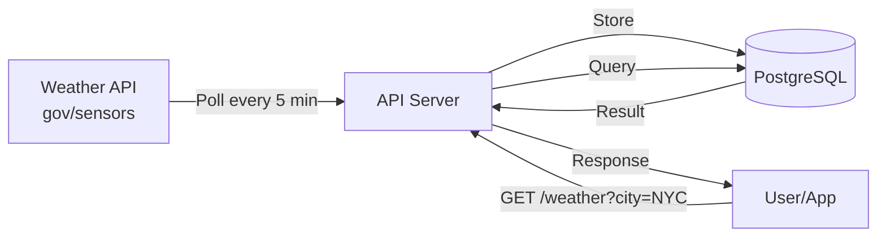
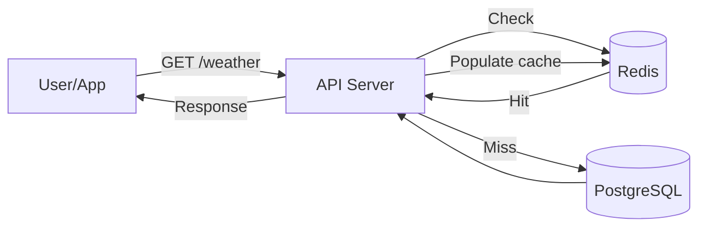
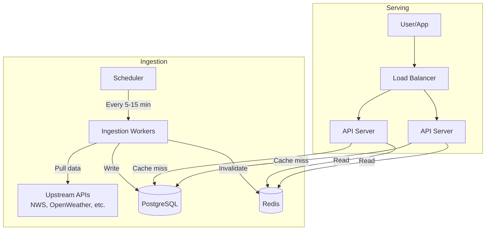
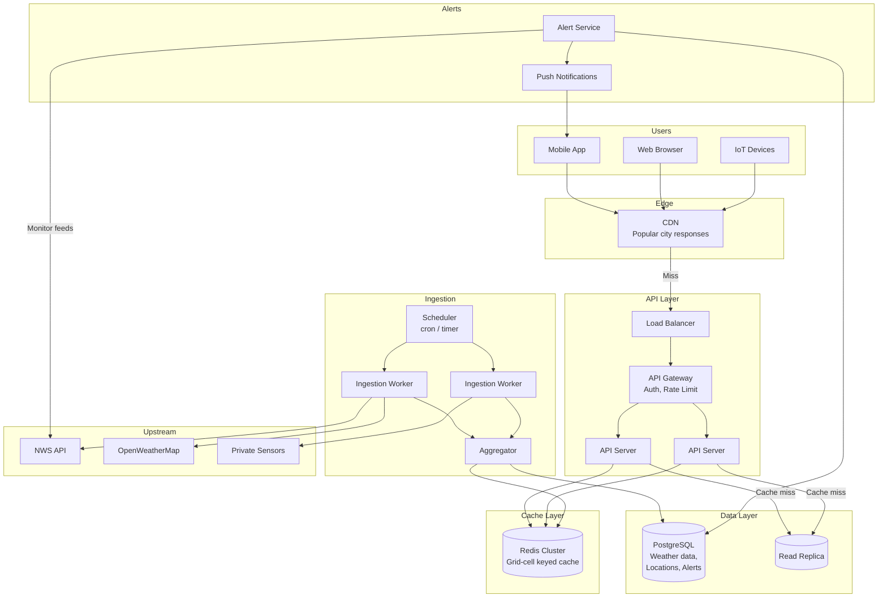

# System Design: Weather System

---

# 1. Problem Statement

**In plain English:** Build a service that collects weather data from multiple sources (government APIs, sensors, satellites), keeps it fresh, and serves it to millions of users and apps quickly — showing current conditions, hourly forecasts, and alerts for any location.

**Core user actions:**
- Look up current weather for a city or GPS coordinate.
- View hourly and daily forecasts.
- Receive severe weather alerts (storms, heat waves).
- Apps and IoT devices query the API continuously.

**Scale assumptions:**
- 50M daily active users + APIs/IoT devices.
- 500K weather locations (cities, zip codes, coordinate grids).
- Data refreshed every 5–15 minutes from upstream sources.
- 100K read requests/sec at peak (morning rush, severe weather events).
- Writes are small: ~500K location updates every 15 minutes = ~550 writes/sec.
- Read-to-write ratio: **~200:1** — this is a **read-heavy** system.

**Non-functional requirements:**
- **Low latency:** P99 < 100ms for current weather queries.
- **High availability:** 99.9% — weather apps are critical during severe events.
- **Freshness:** Data no more than 15 minutes old for current conditions.
- **Geo-awareness:** Users should get weather for their location efficiently.
- **Scalability:** Handle 10× spikes during severe weather events.

---

# 2. Requirements

## Functional Requirements
- Ingest weather data from multiple upstream providers.
- Serve current conditions by location (city name, zip code, lat/lng).
- Serve hourly and 7-day forecasts.
- Push severe weather alerts.
- Historical weather data queries (lower priority).

## Non-Functional Requirements
- Read-optimized: cache aggressively.
- Data freshness within 15 minutes.
- Horizontal read scaling.
- Graceful degradation: if upstream is down, serve slightly stale data rather than nothing.

## Out of Scope
- Weather prediction/modeling algorithms.
- Satellite image processing.
- Detailed historical analytics.

---

# 3. Naive Solution

One server polls upstream weather APIs and stores results. Users query the server directly.



**How it works:**
1. A cron job on the server polls upstream weather APIs every 5 minutes for all locations.
2. Weather data is stored in PostgreSQL.
3. Users query `GET /weather?city=NYC` → server queries DB → returns result.

**Why this works at small scale:**
- 1,000 users? PostgreSQL handles the queries easily.
- 500K locations × 1 KB each = 500 MB — trivial for a single DB.
- A single cron job can poll 500K locations in 5 minutes (if upstream APIs are fast enough).

**Why this breaks at scale:**
- **100K reads/sec on a single DB** → PostgreSQL maxes out around 20K reads/sec.
- **Single server** → single point of failure.
- **Polling 500K locations every 5 minutes** → 1,600 API calls/sec to upstream. Many upstream APIs have rate limits → you get throttled.
- **Severe weather spike** → traffic jumps 10× in a region, DB can't keep up.
- **No geo-optimization** → User queries by lat/lng require geo-spatial queries on every request, which are slow without indexing.

---

# 4. Bottlenecks / Failure Modes

| Problem | What Happens | Impact |
|---------|-------------|--------|
| **DB overload (reads)** | 100K reads/sec exceeds DB capacity | Slow responses, timeouts |
| **Upstream rate limiting** | Can't refresh data fast enough | Stale weather data |
| **Single server** | Server crash = total outage | No weather data during a storm — worst possible time |
| **Geo queries are slow** | PostGIS queries without caching cost 10–50ms each | P99 blows up at scale |
| **Severe weather spikes** | 10× traffic to one region | Hot partitions, slow responses |
| **Stale data after ingestion failure** | Upstream goes down | Users see hours-old weather |
| **No alert push** | Users must refresh to see alerts | Miss critical severe weather warnings |
| **Duplicate ingestion** | Multiple instances poll the same data | Wasted requests, potential data conflicts |

---

# 5. Evolved Solution

## Step 1: Add a Cache Layer

**Change:** Put Redis in front of PostgreSQL. Cache weather data by location key.

**Why it helps:**
- Redis handles 100K+ reads/sec per node.
- Weather data changes every 5–15 minutes → a cache with 5-minute TTL is fine.
- Cache hit ratio will be >95% because weather for popular cities is requested constantly.

**Trade-off:** Data might be up to 5 minutes stale (on top of the 15-minute refresh cycle). For weather, this is completely acceptable.



## Step 2: Separate Data Ingestion from Serving

**Change:** Create a dedicated **Ingestion Service** that polls upstream APIs and writes to the DB. The API servers only read.

**Why it helps:**
- Ingestion and serving scale independently.
- Ingestion can be rate-limited and throttled to respect upstream limits.
- If ingestion fails, the API still serves cached/slightly stale data (graceful degradation).

**Trade-off:** Need coordination so ingestion doesn't overwhelm upstream APIs. Use a task scheduler with distributed locks.



## Step 3: Pre-Compute and Cache Weather by Grid Cell

**Change:** Instead of querying lat/lng in real time, divide the world into grid cells (e.g., 0.1° × 0.1° ≈ 11 km × 11 km at the equator). Pre-compute weather for each grid cell during ingestion. User queries snap to the nearest grid cell.

**Why it helps:**
- Eliminates expensive geo-spatial queries at read time.
- Cache key is simple: `weather:{grid_lat}:{grid_lng}` — fast hash lookup.
- Nearby users share the same cache entry → higher hit ratio.

**Trade-off:** Weather is approximate (within ~11 km). For most use cases, this is fine. For hyperlocal weather, use finer grids.

**Grid cell calculation:**
```
grid_lat = round(lat, 1)  # e.g., 40.7128 → 40.7
grid_lng = round(lng, 1)  # e.g., -74.0060 → -74.0
cache_key = f"weather:{grid_lat}:{grid_lng}"
```

## Step 4: Add a CDN for Popular Locations

**Change:** Serve weather data for the most popular locations (top 10K cities) through a CDN. The CDN caches the JSON response.

**Why it helps:**
- CDN absorbs the majority of traffic (top 10K cities cover >80% of queries).
- Users get sub-10ms responses from edge.
- Origin servers handle only cache misses and less popular locations.

**Trade-off:** CDN cache TTL must be short (5 minutes) to maintain freshness. CDN invalidation costs a small fee per purge.

## Step 5: Severe Weather Alerts via Push

**Change:** Add an **Alert Service** that monitors upstream alert feeds. When a severe weather alert is issued:
1. Store the alert in the DB.
2. Push to subscribed users via push notification / WebSocket.
3. Expose alerts via API.

**Why it helps:**
- Users don't have to poll for alerts — they're pushed in real time.
- Critical for safety: tornado warnings need to reach users in seconds.

**Trade-off:** Push notification infrastructure adds complexity. Need user location tracking for targeted alerts.

## Step 6: Multiple Upstream Sources with Aggregation

**Change:** Ingest from multiple providers (NWS, OpenWeatherMap, private sensors). An **Aggregator** merges and reconciles conflicting data.

**Why it helps:**
- No single source dependency — if one is down, others cover.
- Can improve accuracy by averaging or taking the median.
- Some sources are better for certain regions.

**Trade-off:** Aggregation logic is complex. Need to handle conflicting data, different update frequencies, and different data formats.

---

# 6. Final Architecture



**Request lifecycle:**
1. User opens app → `GET /weather?lat=40.7&lng=-74.0`.
2. CDN checks cache: hit → return cached JSON (< 10ms).
3. CDN miss → request goes to LB → API Gateway (auth, rate limit) → API Server.
4. API Server computes grid cell key: `weather:40.7:-74.0`.
5. Check Redis: hit → return (< 5ms from origin).
6. Redis miss → query PostgreSQL read replica → populate Redis (TTL: 5 min) → return.
7. Meanwhile, Ingestion Workers poll upstream APIs every 5–15 minutes → Aggregator merges data → writes to PostgreSQL → invalidates Redis cache.

---

# 7. Data Model

## Weather Data (PostgreSQL)
| Column | Type | Notes |
|--------|------|-------|
| `location_id` | UUID (PK) | |
| `grid_lat` | DECIMAL(5,1) | Rounded latitude |
| `grid_lng` | DECIMAL(5,1) | Rounded longitude |
| `temperature_f` | DECIMAL | Current temp |
| `humidity` | DECIMAL | Percentage |
| `wind_speed_mph` | DECIMAL | |
| `condition` | VARCHAR | "sunny", "cloudy", "rain", etc. |
| `forecast_hourly` | JSONB | Array of hourly forecasts |
| `forecast_daily` | JSONB | Array of 7-day forecasts |
| `source` | VARCHAR | Which upstream provided this |
| `observed_at` | TIMESTAMP | When the data was measured |
| `ingested_at` | TIMESTAMP | When we received it |

**Index:** `(grid_lat, grid_lng)` — primary lookup pattern. Also unique constraint on this pair.

## Locations / Cities (PostgreSQL)
| Column | Type | Notes |
|--------|------|-------|
| `city_id` | UUID (PK) | |
| `name` | VARCHAR | "New York" |
| `state` | VARCHAR | "NY" |
| `country` | VARCHAR(2) | "US" |
| `latitude` | DECIMAL | Precise lat |
| `longitude` | DECIMAL | Precise lng |
| `grid_lat` | DECIMAL(5,1) | Maps to weather grid |
| `grid_lng` | DECIMAL(5,1) | Maps to weather grid |

**Index:** `(name, state, country)` for text lookup. `(grid_lat, grid_lng)` for join with weather data.

## Alerts (PostgreSQL)
| Column | Type | Notes |
|--------|------|-------|
| `alert_id` | UUID (PK) | |
| `type` | VARCHAR | "tornado_warning", "heat_advisory" |
| `severity` | ENUM | watch, warning, emergency |
| `affected_grids` | JSONB | List of grid cells affected |
| `message` | TEXT | Human-readable alert |
| `issued_at` | TIMESTAMP | |
| `expires_at` | TIMESTAMP | |

---

# 8. API Design

## Get Current Weather
```
GET /api/v1/weather/current?lat=40.7128&lng=-74.0060
Authorization: Bearer <token> (or API key)

Response 200:
{
  "location": { "city": "New York", "state": "NY" },
  "temperature_f": 72,
  "humidity": 55,
  "wind_speed_mph": 8,
  "condition": "partly_cloudy",
  "observed_at": "2026-03-19T14:30:00Z"
}
```

Cache-Control: `public, max-age=300` (5 minutes).

## Get Forecast
```
GET /api/v1/weather/forecast?lat=40.7128&lng=-74.0060&type=hourly
Authorization: Bearer <token>

Response 200:
{
  "location": { "city": "New York", "state": "NY" },
  "hourly": [
    { "time": "2026-03-19T15:00:00Z", "temp_f": 73, "condition": "sunny" },
    { "time": "2026-03-19T16:00:00Z", "temp_f": 71, "condition": "cloudy" }
  ]
}
```

## Get Alerts
```
GET /api/v1/weather/alerts?lat=40.7128&lng=-74.0060
Authorization: Bearer <token>

Response 200:
{
  "alerts": [
    {
      "alert_id": "...",
      "type": "heat_advisory",
      "severity": "warning",
      "message": "Excessive heat expected...",
      "expires_at": "2026-03-20T00:00:00Z"
    }
  ]
}
```

## Get Weather by City Name
```
GET /api/v1/weather/current?city=New+York&state=NY
```

Resolves city → grid cell, then returns same format as lat/lng query.

**Notes:**
- API key-based auth for third-party developers.
- Rate limiting: 60 requests/minute for free tier, 600 for paid.
- Versioning via URL path.
- All responses include `Cache-Control` headers.

---

# 9. Scale and Performance

## Traffic Estimates
- 100K reads/sec peak × ~1 KB response = 100 MB/s outbound. Manageable.
- Writes: ~550/sec (500K locations every 15 min). Tiny.
- Storage: 500K locations × 5 KB = 2.5 GB. Trivial.
- Forecast data: 500K × 168 hourly entries × 50 bytes = ~4 GB. Still small.

## Handling Spikes
- **Severe weather** drives massive spikes in specific regions.
- CDN absorbs most of it (weather for a major city is one cached response serving millions).
- Redis cluster handles overflow.
- API servers auto-scale behind LB.
- **Key insight:** Since data only changes every 5–15 minutes, the same response serves millions of requests.

## Hot-Key Mitigation
- NYC, LA, London — weather for these cities is requested constantly.
- CDN + Redis = these keys are never a problem.
- During severe weather, the affected region becomes hot → CDN and Redis handle it.

## Caching Strategy
| Layer | TTL | Why |
|-------|-----|-----|
| CDN | 5 minutes | Match data refresh cycle |
| Redis | 5 minutes | Same |
| Client | 2 minutes | Slightly shorter for fresher UX |
| Forecast (Redis) | 15 minutes | Forecasts change less often |

**Cache invalidation:** On ingestion, the Aggregator writes to DB *and* updates Redis (write-through). CDN entries expire via TTL.

---

# 10. Reliability and Failure Handling

| Failure | Impact | Mitigation |
|---------|--------|------------|
| **Upstream API down** | Can't refresh data for affected source | Use last known data (stale but better than nothing); switch to backup source |
| **Redis down** | All reads go to DB | DB read replicas handle overflow; alert ops; higher latency but functional |
| **DB down** | No fresh data | Redis serves cached data (may be 5-min stale); ingestion queues data in memory/local disk |
| **Ingestion failure** | Data goes stale | Alert if data age > 30 min; dashboard shows freshness per source |
| **CDN outage** | All traffic hits origin | LB spreads to auto-scaled API servers; Redis absorbs reads |

**Graceful degradation is the #1 principle:** Always serve *something* — stale weather data from 15 minutes ago is better than an error page, especially during severe weather when people need it most.

**Health checks:**
- Monitor data freshness per grid cell.
- Alert if any source has not updated in > 30 minutes.
- Health endpoint: `GET /health` returns ingestion lag, Redis status, upstream source status.

---

# 11. Security and Abuse Prevention

| Concern | Mitigation |
|---------|-----------|
| **Authentication** | API keys for developers; OAuth for user-facing apps |
| **Rate Limiting** | Per API key: 60 req/min (free), 600 req/min (paid); per IP: 120 req/min (unauthenticated) |
| **Abuse** | Monitor for scraping patterns; block IPs making bulk requests without API keys |
| **Data Privacy** | Location queries are logged but PII-free (lat/lng is not PII by itself); no user tracking |
| **Encryption** | TLS for all API traffic; encryption at rest for DB |
| **Upstream API Keys** | Stored in secrets manager, rotated periodically, never logged |
| **Injection** | Parameterized queries for city/state lookups; validate lat/lng ranges |

---

# 12. Interview Talking Points

- [ ] **Read-heavy system:** 200:1 read-to-write ratio → cache is the most important component.
- [ ] **Grid cell trick:** Snap lat/lng to grid cells to make caching simple and efficient.
- [ ] **Data freshness vs. latency:** 5-minute cache TTL is the right trade-off for weather.
- [ ] **Graceful degradation:** Serve stale data rather than errors. Weather data from 15 min ago is still useful.
- [ ] **CDN for popular locations:** Top cities cover >80% of traffic → CDN hit ratio is very high.
- [ ] **Upstream dependency:** Multiple sources prevent single-source failure. Aggregation improves accuracy.
- [ ] **Spikes during severe weather:** Exactly when the system is needed most. CDN + cache handles it.
- [ ] **Writes are trivial:** ~550/sec. This is not a write-scaling problem.
- [ ] **No exotic tech needed:** PostgreSQL + Redis + CDN. Simple, proven, sufficient.
- [ ] **Alerts are pushed:** Severe weather alerts can't rely on polling — use push notifications.

---

# 13. Common Follow-Up Questions

**Q: Why not just proxy the upstream API?**
A: Upstream APIs have rate limits. If 100K users hit our proxy simultaneously, we'd make 100K upstream calls → instant rate limiting. By pre-fetching and caching, we make ~550 upstream calls every 15 minutes regardless of user traffic.

**Q: How do you handle different update frequencies for different sources?**
A: Each upstream source has its own ingestion schedule. NWS updates every 15 minutes; a private sensor might update every minute. The Aggregator takes the freshest data per grid cell and prefers the most reliable source. We store `source` and `observed_at` to track provenance.

**Q: What if the weather changes between cache refreshes?**
A: For weather, a 5-minute lag is acceptable. Temperature doesn't change dramatically in 5 minutes. For severe weather (tornado), alerts are pushed in real time via a separate path — they don't depend on the cache cycle.

**Q: How would you handle hyperlocal weather (e.g., microclimates)?**
A: Use a finer grid (0.01° instead of 0.1°) for areas with dense sensor coverage. This increases storage and cache entries by 100× but is feasible for specific metro areas.

**Q: How do you handle international locations with different data formats?**
A: The Ingestion Workers normalize all upstream data into a standard internal format (metric internally, convert to user-preferred units at the API layer). Each source has its own adapter/parser.

**Q: What database would you use?**
A: PostgreSQL is sufficient for this scale. The dataset is small (~10 GB). Reads are served from cache 95%+ of the time. If scale grows dramatically, I'd add read replicas. No need for NoSQL here — the data is structured and relational.

---

# Summary in 60 Seconds

> "A weather system is a classic read-heavy, write-light architecture. Data is ingested from multiple upstream providers every 5–15 minutes by dedicated ingestion workers, aggregated for accuracy, and written to PostgreSQL. Reads are served through a three-tier cache: CDN for popular locations, Redis for all locations (keyed by grid cell), and DB as the fallback. The grid cell trick converts any lat/lng to a rounded grid coordinate, making cache keys simple and maximizing cache hit ratio. Alerts are handled separately via push notifications for real-time delivery. The system degrades gracefully — stale data is always better than no data, especially during severe weather when traffic spikes. The entire system runs on PostgreSQL, Redis, and a CDN — no exotic infrastructure needed."

---

# What I Would Say If the Interviewer Pushes Deeper

**On data freshness guarantees:**
> "We can't guarantee real-time accuracy — that's a fundamental limitation of aggregated weather data. But we can guarantee freshness within 15 minutes by monitoring ingestion lag and alerting if any grid cell's data is older than 30 minutes. For severe weather, we bypass the normal refresh cycle and push alerts in real time from a dedicated alert feed."

**On cost at scale:**
> "This system is cheap to run. The dataset is small (< 10 GB). The big cost is CDN bandwidth for serving 100K req/sec, but each response is ~1 KB, so it's about 100 MB/sec — well within normal CDN pricing. Upstream API costs depend on the provider; NWS is free, commercial APIs charge per call. Our pre-fetch model keeps upstream costs constant regardless of user traffic."

**On geo queries without grid cells:**
> "If we needed precise location matching (like 'nearest weather station'), I'd use PostgreSQL with PostGIS and a geo-spatial index. But for most weather use cases, the grid cell approximation is accurate enough and massively simpler. It turns a geo-spatial query into a hash lookup — orders of magnitude faster."
