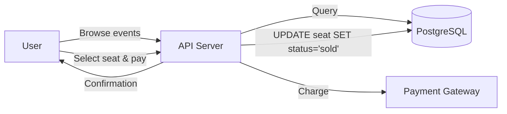
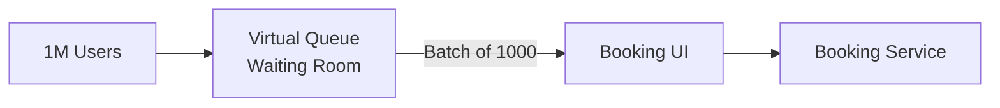
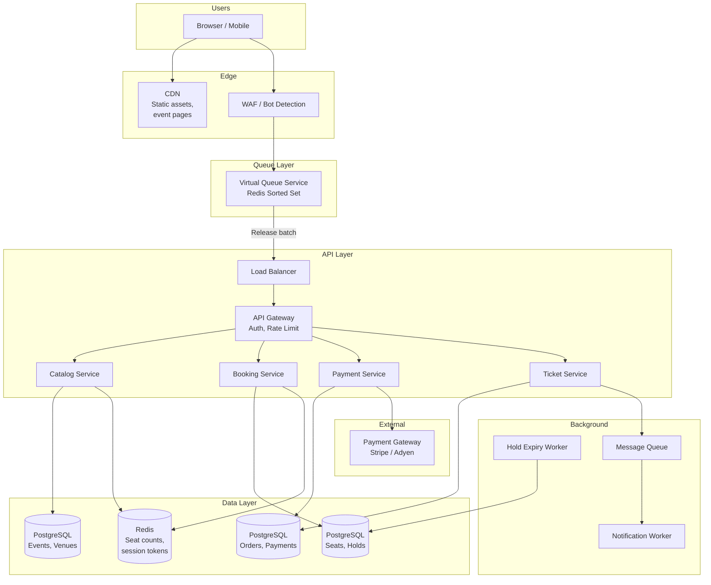
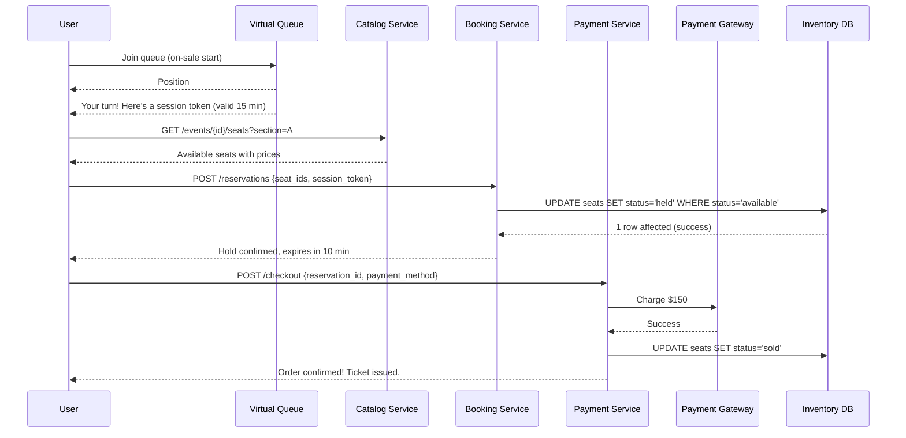

# System Design: Ticketmaster / Event Ticketing System

---

# 1. Problem Statement

**In plain English:** Build a system where users can browse events (concerts, sports, theater), view available seats, select seats, and buy tickets — all while preventing double-booking, handling massive traffic spikes when popular events go on sale, and stopping bots from scooping up all the tickets.

**Core user actions:**
- Browse upcoming events by category, date, or location.
- View a venue's seat map with real-time availability.
- Select one or more seats and proceed to checkout.
- Complete payment within a time window.
- Receive a ticket (digital) and confirmation.

**Scale assumptions:**
- 50M registered users.
- 10K events listed at any time.
- Popular event on-sale: 1M+ users hitting the page simultaneously.
- 50K seat inventory per large venue.
- A hot on-sale must sell 50K tickets in 10–30 minutes.
- Normal traffic: ~5K requests/sec. On-sale spike: **500K requests/sec**.

**Non-functional requirements:**
- **Consistency:** No double-booking. A seat can only be sold to one person. This is the #1 requirement.
- **Low latency:** Seat availability checks < 200ms.
- **High availability:** Checkout must not go down during an on-sale.
- **Fairness:** Real humans should get tickets, not bots.
- **Scalability:** Handle 100× traffic spikes during on-sales.

---

# 2. Requirements

## Functional Requirements
- Event CRUD (create, read, update, delete) for organizers.
- Browse/search events with filters.
- View real-time seat availability for an event.
- Reserve seats temporarily (hold for checkout).
- Complete purchase with payment processing.
- Issue digital tickets.
- Cancel/refund tickets.
- Waiting room / virtual queue for high-demand events.

## Non-Functional Requirements
- **Strong consistency** for seat inventory (no overselling).
- Handle 500K req/sec during on-sales.
- Temporary seat holds expire after ~10 minutes (prevent inventory lockout).
- Rate limiting and bot detection.
- PCI DSS (Payment Card Industry Data Security Standard) compliance for payment.

## Out of Scope
- Venue management and seating chart editor.
- Secondary market / resale.
- Detailed pricing engine (dynamic pricing).

---

# 3. Naive Solution

One server, one database, synchronous seat booking.



**How it works:**
1. User browses events → API queries DB.
2. User selects seat → API runs: `UPDATE seats SET status = 'sold', user_id = ? WHERE seat_id = ? AND status = 'available'`.
3. If update affects 1 row → success. If 0 rows → seat already taken.
4. API calls payment gateway → charges credit card.
5. Returns confirmation.

**Why this works at small scale:**
- 100 concurrent users? PostgreSQL handles it fine.
- The `WHERE status = 'available'` clause prevents double-booking at the DB level.
- Simple and correct.

**Why this breaks at scale:**
- **1M users hitting the same 50K seats** → extreme DB contention on the same rows.
- **Row-level locks** → transactions queue up, latency spikes to seconds/minutes.
- **Single server** → crashes under load during the most critical moment.
- **No temporary hold** → user selects a seat, goes to enter payment, and someone else buys it during those 30 seconds.
- **No queue** → everyone rushes at once → thundering herd.
- **No bot protection** → bots can request faster than humans → unfair.

---

# 4. Bottlenecks / Failure Modes

| Problem | What Happens | Impact |
|---------|-------------|--------|
| **Row contention** | 1K concurrent transactions on the same seat row | DB locks, timeouts, failed transactions |
| **Thundering herd** | 1M users hit the seat map at the exact same second | Server and DB overload |
| **No temporary hold** | User selects a seat, but it's sold while they type payment info | Frustrating UX, lost sales |
| **Hold never expires** | User abandons checkout but seat stays locked | Inventory stuck, unsold seats |
| **Double-booking** | Race condition: two users book the same seat simultaneously | Oversell → angry customers, refunds, legal issues |
| **Bots** | Automated scripts buy tickets faster than humans | Unfair; resellers monopolize inventory |
| **Payment delay** | Payment gateway takes 3–5 seconds; seat held during that time in a DB transaction | Long-running transactions = more contention |
| **Single point of failure** | Server crash during on-sale | Total outage at peak demand |

---

# 5. Evolved Solution

## Step 1: Separate Browsing from Booking

**Change:** Split into two services:
- **Catalog Service** (read-heavy): browse events, view seat maps. Can use caching and read replicas.
- **Booking Service** (write-heavy): reserve seats, process payments. Needs strong consistency.

**Why it helps:**
- Browsing traffic (millions of people looking) doesn't compete with booking traffic (thousands buying).
- Catalog Service can serve from cache → fast, scalable.
- Booking Service can be optimized for write correctness.

**Trade-off:** Two services to maintain. But the separation is critical for scale.

## Step 2: Add a Virtual Queue / Waiting Room

**Change:** When an on-sale starts, users are placed in a **virtual queue**. The system lets users through in batches (e.g., 1,000 at a time). Each user gets a position and waits their turn.

**Why it helps:**
- Controls the rate of traffic hitting the booking system.
- Prevents thundering herd.
- Feels fair to users (first-come, first-served position).
- Backend operates within its capacity limits.

**How it works:**
1. User arrives → gets a queue position (assigned randomly or by arrival time).
2. A queue controller releases N users per second to the booking page.
3. Released users get a time-limited token to proceed.

**Trade-off:** Users wait (minutes). But the alternative is a crashed system where nobody gets tickets. A queue is better than an error page.



## Step 3: Temporary Seat Holds with Expiration

**Change:** When a user selects a seat, the system creates a **temporary hold** (reservation) that expires after 10 minutes. The seat is marked as "held" — other users can't select it. If the user doesn't complete payment within 10 minutes, the hold expires and the seat becomes available again.

**Why it helps:**
- Users have time to enter payment info without losing their seat.
- Prevents inventory lockout — abandoned holds auto-expire.
- Moves the payment call *outside* the DB transaction.

**Implementation:**
```sql
-- Reserve with expiration
UPDATE seats 
SET status = 'held', 
    held_by = :user_id, 
    hold_expires_at = NOW() + INTERVAL '10 minutes'
WHERE seat_id = :seat_id 
  AND (status = 'available' OR (status = 'held' AND hold_expires_at < NOW()))
-- Returns 1 row if successful, 0 if seat is taken
```

A background job or lazy check reclaims expired holds:
```sql
UPDATE seats SET status = 'available', held_by = NULL, hold_expires_at = NULL
WHERE status = 'held' AND hold_expires_at < NOW()
```

**Trade-off:** Some seats will be temporarily unavailable while users decide. But 10 minutes is short enough to limit waste.

## Step 4: Optimistic Concurrency for Seat Booking

**Change:** Use optimistic concurrency control instead of long-running transactions.

**How it works:**
1. Read seat row (including a `version` column).
2. Process business logic (validate user, check limits).
3. `UPDATE seats SET status = 'held', version = version + 1 WHERE seat_id = ? AND version = ?`.
4. If 0 rows affected → someone else got there first → return "seat unavailable."

**Why it helps:**
- No explicit row locks held during business logic.
- Fast: the UPDATE is atomic and instant.
- Naturally prevents double-booking.

**Trade-off:** Under extreme contention (1,000 users racing for 1 seat), most will get "unavailable." But that's correct behavior — only one can win.

## Step 5: Partition Inventory by Section

**Change:** Instead of one big `seats` table, partition by `(event_id, section)`. Each section's inventory is managed independently.

**Why it helps:**
- Reduces contention: users booking Section A don't lock rows in Section B.
- Can assign different DB shards to different sections for very large events.

**Trade-off:** Cross-section queries (e.g., "show me all available seats") need to aggregate across partitions. But the booking hot path (one section at a time) is faster.

## Step 6: Payment Processing After Hold

**Change:** Payment happens *after* the seat is held, not during the same transaction.

**Flow:**
1. User selects seats → hold acquired (DB transaction: fast, <50ms).
2. User enters payment → API calls payment gateway (takes 2–5 seconds).
3. Payment success → `UPDATE seats SET status = 'sold'`.
4. Payment failure → release hold → `UPDATE seats SET status = 'available'`.

**Why it helps:**
- DB transaction for the hold is milliseconds, not seconds.
- Payment latency doesn't cause DB contention.
- If payment fails, seat goes back to inventory automatically.

**Trade-off:** There's a window where a seat is held but not paid for. If the user abandons, the 10-minute expiry reclaims it.

## Step 7: Bot Detection and Rate Limiting

**Change:** Add multiple layers of bot protection:
1. **CAPTCHA** before entering the queue.
2. **Rate limiting** per IP and per account.
3. **Device fingerprinting** to detect automated browsers.
4. **Purchase limits** per account (e.g., max 4 tickets per event).

**Why it helps:** Real humans get a fair shot at tickets.

**Trade-off:** CAPTCHA adds friction for legitimate users. Balance security with UX.

---

# 6. Final Architecture



**Request lifecycle — buying tickets:**



---

# 7. Data Model

## Events (PostgreSQL)
| Column | Type | Notes |
|--------|------|-------|
| `event_id` | UUID (PK) | |
| `name` | VARCHAR | "Taylor Swift – Eras Tour" |
| `venue_id` | UUID (FK) | |
| `event_date` | TIMESTAMP | |
| `on_sale_date` | TIMESTAMP | When tickets go on sale |
| `status` | ENUM | draft, on_sale, sold_out, past |
| `created_at` | TIMESTAMP | |

## Seats (PostgreSQL) — **the critical table**
| Column | Type | Notes |
|--------|------|-------|
| `seat_id` | UUID (PK) | |
| `event_id` | UUID (FK, indexed) | |
| `section` | VARCHAR | "A", "B", "Floor" |
| `row` | VARCHAR | "14" |
| `number` | INT | Seat number |
| `price_cents` | INT | Price in cents |
| `status` | ENUM | available, held, sold |
| `held_by` | UUID (FK, nullable) | User holding this seat |
| `hold_expires_at` | TIMESTAMP (nullable) | When the hold expires |
| `version` | INT | For optimistic concurrency |

**Indexes:**
- `(event_id, section, status)` — for seat availability queries.
- `(status, hold_expires_at)` — for hold expiry worker.

**Partition:** By `event_id` — each event's seats are isolated.

## Orders (PostgreSQL)
| Column | Type | Notes |
|--------|------|-------|
| `order_id` | UUID (PK) | |
| `user_id` | UUID (FK) | |
| `event_id` | UUID (FK) | |
| `seat_ids` | UUID[] | Array of purchased seat IDs |
| `total_cents` | INT | |
| `payment_status` | ENUM | pending, charged, refunded |
| `payment_ref` | VARCHAR | External payment gateway reference |
| `created_at` | TIMESTAMP | |
| `idempotency_key` | UUID (unique) | Prevents duplicate charges |

---

# 8. API Design

## Browse Events
```
GET /api/v1/events?category=music&city=NYC&date_from=2026-03-20&page=1
Authorization: Bearer <token>

Response 200:
{
  "events": [
    { "event_id": "...", "name": "...", "venue": "...", "date": "...", "on_sale_date": "..." }
  ],
  "next_page": 2
}
```

## Get Seat Availability
```
GET /api/v1/events/{event_id}/seats?section=A
Authorization: Bearer <token>

Response 200:
{
  "section": "A",
  "seats": [
    { "seat_id": "...", "row": "14", "number": 5, "price_cents": 15000, "status": "available" },
    { "seat_id": "...", "row": "14", "number": 6, "price_cents": 15000, "status": "held" }
  ]
}
```

## Reserve Seats
```
POST /api/v1/reservations
Authorization: Bearer <token>
Idempotency-Key: <uuid>
{
  "event_id": "...",
  "seat_ids": ["seat-1", "seat-2"],
  "session_token": "queue-token-abc"
}

Response 201:
{
  "reservation_id": "res-123",
  "expires_at": "2026-03-19T15:10:00Z",
  "total_cents": 30000
}

Response 409 (seat taken):
{ "error": "One or more seats are no longer available" }
```

## Complete Purchase
```
POST /api/v1/checkout
Authorization: Bearer <token>
Idempotency-Key: <uuid>
{
  "reservation_id": "res-123",
  "payment_method_token": "pm_..."
}

Response 200:
{
  "order_id": "ord-456",
  "tickets": [
    { "ticket_id": "tkt-1", "seat": "Section A, Row 14, Seat 5" }
  ]
}
```

**Notes:**
- Idempotency keys on all mutating endpoints prevent duplicate reservations and charges.
- Session token from virtual queue prevents bypassing the queue.

---

# 9. Scale and Performance

## Traffic Estimates
- Normal: 5K req/sec → standard web scale.
- On-sale spike: 500K req/sec for seat checks → most served from cache.
- Booking writes during on-sale: ~5K–10K reservations/sec for 10 minutes.
- 50K seats sold in 10 min = ~83 bookings/sec average, but bursty.

## Handling Spikes
- **Virtual queue** is the primary defense. It transforms a 500K req/sec spike into a controlled 5K req/sec to the booking service.
- **CDN** serves static event pages and seat map templates.
- **Redis** caches seat availability counts (updated on each booking). Seat map shows approximate availability; exact seat check happens at reservation time.
- **Read replicas** for the Catalog Service.

## Hot-Key Mitigation
- The hot key is the event itself — one event has 1M users.
- Virtual queue prevents direct hotspot on the DB.
- Partition seats by section → spread writes across partitions.
- Cache seat availability counts in Redis (one key per section) → most reads never hit DB.

## Caching Strategy
| Data | Cache Location | TTL | Invalidation |
|------|---------------|-----|--------------|
| Event listings | Redis + CDN | 5 min | On event update |
| Seat availability counts | Redis | Real-time update | On each booking/hold |
| Individual seat status | Not cached (strong consistency) | N/A | Always read from DB at reservation time |

**Important:** Individual seat status is NOT cached. The reservation `UPDATE` must hit the database to ensure consistency. Only aggregate counts ("42 seats left in Section A") are cached.

---

# 10. Reliability and Failure Handling

| Failure | Impact | Mitigation |
|---------|--------|------------|
| **Booking DB down** | Can't reserve seats | Auto-failover to standby DB; queue holds users meanwhile |
| **Payment gateway down** | Can't complete purchases | Hold is preserved; user can retry within 10 min; show "payment temporarily unavailable" |
| **Virtual queue service down** | Can't manage traffic | Fall back to rate limiting at LB; less fair but functional |
| **Hold expiry worker down** | Expired holds not reclaimed | Lazy expiry: the reservation query checks `hold_expires_at < NOW()` so stale holds don't block availability |
| **Payment succeeds but DB update fails** | Seat status not updated to "sold" | Payment service records the charge; a reconciliation worker matches payments to seats |

**Idempotency for payment:**
- The checkout endpoint accepts an `idempotency_key`.
- If the same key is submitted twice, the second call returns the same result without charging again.
- The payment gateway (Stripe, Adyen) also supports idempotency keys — we pass ours through.

**Reconciliation:**
- A background job compares payment gateway records with order records.
- Any mismatch (charged but no order, or order but no charge) triggers an alert.

---

# 11. Security and Abuse Prevention

| Concern | Mitigation |
|---------|-----------|
| **Bot prevention** | CAPTCHA at queue entry; device fingerprinting; behavioral analysis (too-fast clicks) |
| **Rate limiting** | Per IP: 10 req/sec; per account: 5 reservation attempts/min |
| **Purchase limits** | Max 4 tickets per account per event |
| **Account farming** | Require verified email/phone; flag accounts created just before on-sale |
| **Scalping prevention** | Non-transferable tickets (linked to buyer's ID); anti-fraud checks |
| **Payment security** | PCI DSS compliance; tokenized card numbers; never store raw card data |
| **Encryption** | TLS for all traffic; encryption at rest for payment and PII data |
| **Session hijacking** | Queue session tokens are short-lived, tied to IP and user agent, and single-use |
| **DDoS** | WAF (Web Application Firewall) in front of all public endpoints; CDN absorbs volumetric attacks |

---

# 12. Interview Talking Points

- [ ] **Consistency is king:** For ticketing, overselling is unacceptable. Seat status uses strong consistency — always read/write from the primary DB, never cache.
- [ ] **Optimistic concurrency:** `UPDATE ... WHERE version = ?` prevents double-booking without long locks.
- [ ] **Temporary holds with expiry:** Seats are held for 10 minutes. Expired holds are auto-reclaimed. This prevents inventory lockout.
- [ ] **Virtual queue:** Transforms uncontrolled spikes into controlled throughput. Essential for fairness and system survival.
- [ ] **Separate browsing from booking:** Read-heavy browsing uses cache/replicas. Write-heavy booking uses primary DB with strong consistency.
- [ ] **Payment decoupled from hold:** Hold is fast (<50ms DB write). Payment is slow (2–5s external call). Keep them separate.
- [ ] **Idempotency:** Critical for payments. Same idempotency key = same result, no double-charge.
- [ ] **Bot protection:** CAPTCHA, rate limiting, device fingerprinting, purchase limits.
- [ ] **Trade-off:** Virtual queue adds wait time but keeps the system stable. Users prefer waiting over a crashed page.
- [ ] **Partitioning:** Seats partitioned by event_id, further by section, to reduce contention.

---

# 13. Common Follow-Up Questions

**Q: How exactly do you prevent double-booking?**
A: The `UPDATE seats SET status = 'held' WHERE seat_id = ? AND status = 'available'` is an atomic operation. The database engine locks the row during the UPDATE. If two transactions try simultaneously, one succeeds (1 row affected) and one fails (0 rows affected). The losing transaction returns "seat unavailable." This is the same principle as an atomic compare-and-swap.

**Q: What if the hold expiry worker is slow and seats are locked too long?**
A: We use **lazy expiry** as a backup. The reservation query includes `OR (status = 'held' AND hold_expires_at < NOW())` — expired holds are treated as available. The worker is just an optimization to proactively clean up, not the only mechanism.

**Q: How does the virtual queue work internally?**
A: A Redis Sorted Set where the score is the arrival timestamp (or a random value for fairness). The queue controller pops the next N entries every second, generates time-limited session tokens, and pushes them to clients via WebSocket or polling. Clients can't access the booking page without a valid token.

**Q: What about general admission (no assigned seats)?**
A: Instead of individual seat rows, we have a `ticket_inventory` table with `event_id`, `tier` (e.g., "GA Floor"), `total_count`, and `sold_count`. Booking does: `UPDATE ticket_inventory SET sold_count = sold_count + 1 WHERE event_id = ? AND tier = ? AND sold_count < total_count`. Atomic increment prevents oversell.

**Q: How do you handle refunds?**
A: Mark the order as refunded, update seat status back to "available," and call the payment gateway's refund API. The seat goes back into inventory immediately. Need idempotency on the refund call too.

**Q: What if 10,000 people try to buy the last seat?**
A: 9,999 will get "seat unavailable" within milliseconds (the DB UPDATE returns 0 rows). One succeeds. The virtual queue reduces this contention significantly — by the time users reach the booking page, most seats are spread across sections. The "last seat" scenario is rarer than it seems.

---

# Summary in 60 Seconds

> "An event ticketing system needs strong consistency for seat inventory above all else. The architecture separates browsing (read-heavy, cacheable) from booking (write-heavy, consistent). During high-demand on-sales, a virtual queue controls traffic flow to prevent thundering herd. Users select seats which are temporarily held for 10 minutes using optimistic concurrency — `UPDATE WHERE status = 'available'` ensures only one user wins each seat. Payment is processed after the hold, keeping DB transactions short. Expired holds are auto-reclaimed. Bot protection uses CAPTCHA, rate limiting, and purchase limits. The seats table is partitioned by event and section to reduce contention. Idempotency keys on reservation and payment endpoints prevent double-booking and double-charging."

---

# What I Would Say If the Interviewer Pushes Deeper

**On distributed locks vs. DB-level concurrency:**
> "I'd avoid distributed locks (like Redis-based locks) for seat booking. The problem is perfectly solved by the database's own row-level locking via `UPDATE ... WHERE`. Distributed locks add complexity, failure modes (lock not released if holder crashes), and latency. The DB is already the source of truth — let it handle the concurrency."

**On eventual consistency for seat maps:**
> "The seat map shown to users can be slightly stale — it's a hint, not a guarantee. What matters is that the actual reservation attempt (the `UPDATE`) is strongly consistent. If the map shows a seat as available but it was just taken, the reservation will fail and the user picks another seat. This is fine. Trying to make the seat map perfectly real-time for 1M viewers would create enormous load for no practical benefit."

**On fairness at scale:**
> "True fairness is hard. A FIFO queue seems fair but penalizes users with slower internet. An alternative is a lottery: everyone who arrives in the first 60 seconds is assigned a random position. This eliminates the 'fastest-connection-wins' problem. Ticketmaster actually uses this approach for some on-sales. I'd discuss the trade-off with the product team."
