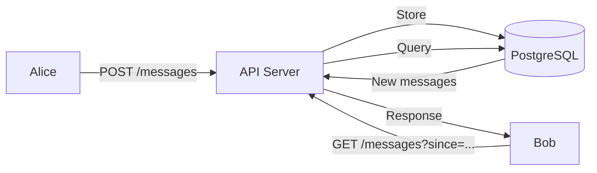
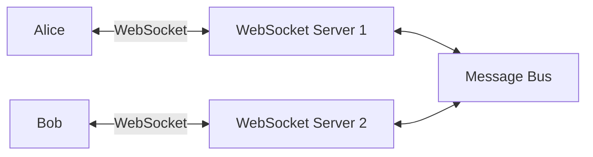
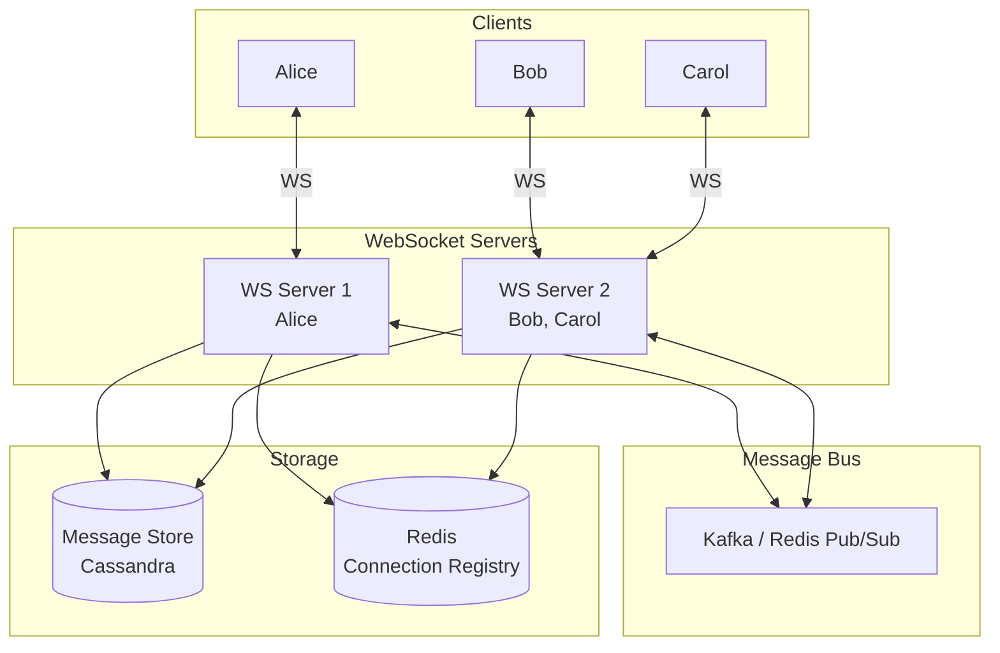
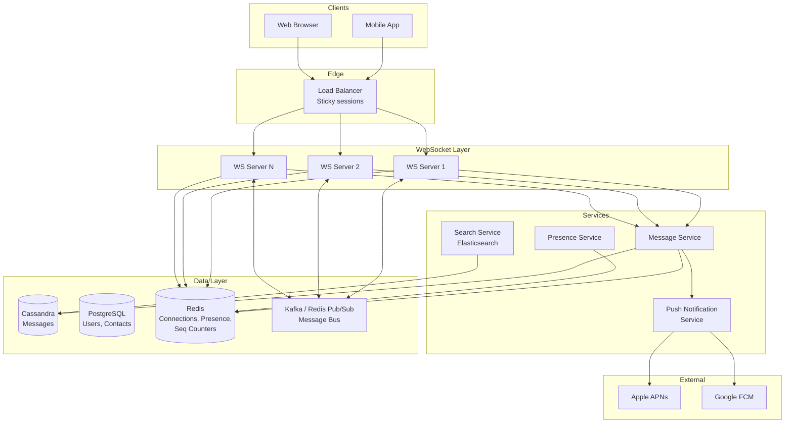
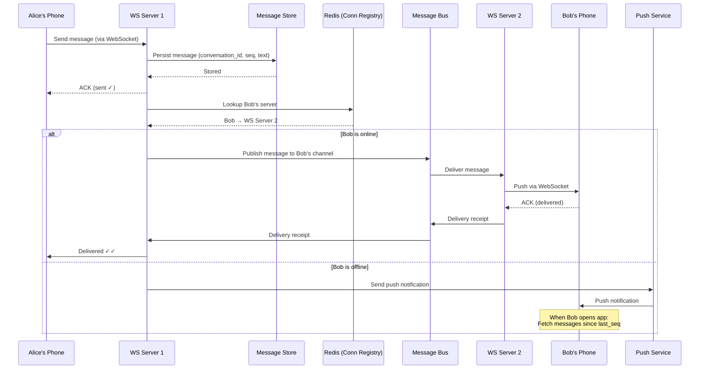

# System Design: Messenger / Chat System

---

# 1. Problem Statement

**In plain English:** Build a real-time messaging system where users can send text messages to each other (1:1 and group chats), see when messages are delivered and read, know when contacts are online, and catch up on missed messages when they come back online.

**Core user actions:**
- Send and receive messages in real time.
- Create 1:1 and group conversations.
- See delivery receipts (sent, delivered, read).
- See who's online (presence).
- See typing indicators ("Alice is typing...").
- Reconnect after going offline and receive all missed messages.
- Receive push notifications for new messages when the app is in the background.

**Scale assumptions:**
- 500M registered users, 100M daily active.
- 50M messages/day.
- Average message size: ~200 bytes.
- 5M concurrent connections at peak.
- Group chats: up to 256 members.
- P99 message delivery latency: < 500ms (real-time feel).

**Non-functional requirements:**
- **Low latency:** Messages should feel instant (< 500ms end-to-end).
- **Reliability:** No lost messages. Every message must be delivered (at-least-once).
- **Ordering:** Messages within a conversation should appear in the correct order.
- **Availability:** 99.99% — chat is a core communication tool.
- **Offline support:** Users should receive missed messages when they reconnect.

---

# 2. Requirements

## Functional Requirements
- 1:1 messaging.
- Group messaging (up to 256 members).
- Delivery receipts: sent → delivered → read.
- Online/offline presence indicators.
- Typing indicators.
- Push notifications for background/offline users.
- Message history and search.
- Media messages (images, files) — high level.

## Non-Functional Requirements
- Real-time delivery (< 500ms).
- Message ordering within a conversation.
- Exactly-once display (deduplication).
- At-least-once delivery (never lose a message).
- Horizontal scaling to 5M+ concurrent connections.

## Out of Scope
- End-to-end encryption protocol details.
- Voice/video calling.
- Stories/status updates.
- Rich message formatting.

---

# 3. Naive Solution

Users poll the server every few seconds to check for new messages.



**How it works:**
1. Alice sends a message → `POST /messages` → stored in PostgreSQL.
2. Bob polls `GET /messages?since=<last_timestamp>` every 2 seconds.
3. Server returns any new messages since Bob's last poll.

**Why this works at small scale:**
- 100 users polling every 2 seconds = 50 requests/sec. Trivial.
- PostgreSQL handles the queries fine.
- Simple to implement.

**Why this breaks at scale:**
- **100M users polling every 2 seconds** = 50M requests/sec. Impossible.
- **Most polls return empty** — 90%+ of polls find no new messages. Wasteful.
- **2-second latency** — messages feel sluggish, not real-time.
- **Single server** — can't handle millions of connections.
- **No presence or typing** — polling doesn't support real-time indicators.

---

# 4. Bottlenecks / Failure Modes

| Problem | What Happens | Impact |
|---------|-------------|--------|
| **Polling waste** | 90% of requests return nothing | Server resources wasted; high cost |
| **Latency** | 2-second poll interval = 2-second delay | Not real-time |
| **Connection overhead** | HTTP request per poll = TCP handshake overhead | High latency, high server load |
| **No push capability** | Server can't send data to client proactively | Can't do typing indicators or presence |
| **DB bottleneck** | Every poll queries the DB | DB overwhelmed at scale |
| **Ordering** | Clock skew between servers → messages out of order | Confused conversations |
| **Duplicate messages** | Client retries after timeout → same message stored twice | User sees duplicates |
| **Offline sync** | Client reconnects → needs to fetch potentially thousands of messages | Slow reconnection |
| **Fan-out for groups** | One group message → 256 DB queries (one per member's poll) | Hot partition on group messages |

---

# 5. Evolved Solution

## Step 1: Replace Polling with WebSockets

**Change:** Instead of the client polling the server, establish a persistent **WebSocket** connection. The server pushes messages to the client the instant they arrive.

**What is a WebSocket?** A long-lived, two-way connection between client and server. Once established, either side can send data at any time without a new HTTP request.

**Why it helps:**
- Zero wasted requests — server only sends data when there's something new.
- Sub-100ms push latency — messages delivered instantly.
- Enables typing indicators and presence — server pushes these too.

**Trade-off:** WebSocket connections are stateful — each connection is tied to a specific server. Need connection management and load balancing awareness.



## Step 2: Add a Connection Registry

**The problem:** Alice is connected to Server 1, Bob is connected to Server 2. When Alice sends Bob a message, Server 1 needs to know that Bob is on Server 2.

**Change:** Add a **Connection Registry** (Redis hash map) that maps `user_id → server_id`.

**How it works:**
1. Bob connects to Server 2 → Server 2 writes `{bob: server-2}` to Redis.
2. Alice sends a message to Bob → Server 1 looks up Bob's server in Redis → routes the message to Server 2 → Server 2 pushes to Bob's WebSocket.

**Why it helps:** Any server can find any user's connection.

**Trade-off:** Redis lookup per message. But Redis handles 100K+ ops/sec, so this is fast.

## Step 3: Use a Message Bus for Server-to-Server Communication

**Change:** Instead of servers calling each other directly, use a **message bus** (e.g., Redis Pub/Sub or Kafka). Each WebSocket server subscribes to a channel for the users it serves.

**Why it helps:**
- Decouples servers — they don't need to know about each other directly.
- Scales horizontally — add more WS servers without changing routing logic.
- If a server goes down, messages queue up and are delivered when the user reconnects elsewhere.

**Trade-off:** Adds latency (~1–5ms) and a dependency on the message bus.



## Step 4: Persist Messages and Handle Offline Delivery

**Change:** Every message is stored in a **message store** (Cassandra or DynamoDB) before delivery. If the recipient is offline, the message waits in the store. When the recipient comes online, they fetch all missed messages.

**Why it helps:**
- Messages are never lost — they're persisted before delivery.
- Offline users catch up via a single query: `SELECT * FROM messages WHERE conversation_id = ? AND created_at > ?`.

**Storage choice — why Cassandra/DynamoDB instead of PostgreSQL:**
- Write-heavy at scale: 50M messages/day = ~580 writes/sec average, but bursty.
- Partition by `conversation_id` → all messages in a conversation are co-located.
- Wide-column store handles time-series append workloads efficiently.

**Trade-off:** Cassandra doesn't support complex queries or transactions. But messages are simple: append-only, query by conversation + time range.

## Step 5: Message Ordering

**The problem:** In a distributed system, multiple servers might process messages for the same conversation, and clock skew can cause ordering issues.

**Change:** Use a **per-conversation sequence number**. Each message in a conversation gets an incrementing sequence number. The client orders by this number.

**Implementation options:**
1. **Server-assigned:** An atomic counter per conversation (e.g., Redis `INCR conversation:{id}:seq`).
2. **Client-assigned:** The sender assigns a local timestamp + a unique ID. The server stores as-is, and the client sorts by timestamp + ID.

**Why it helps:** Deterministic ordering within a conversation regardless of server clocks.

**Trade-off:** Atomic counter per conversation = one extra Redis call per message. Low overhead.

## Step 6: Delivery and Read Receipts

**Change:** Track message state: `sent → delivered → read`.

**How it works:**
1. Alice sends a message → server stores it → server sends ACK to Alice → **"sent" ✓**.
2. Server delivers to Bob's WebSocket → Bob's client sends ACK back → **"delivered" ✓✓**.
3. Bob opens the conversation and the client scrolls to the message → client sends "read" event → **"read" ✓✓ blue**.

**Why it helps:** Users expect delivery status in modern chat apps.

**Trade-off:** Each message now generates 2–3 status updates (extra writes). Use batching for read receipts ("mark all messages up to seq #42 as read" instead of one update per message).

## Step 7: Presence (Online/Offline)

**Change:** Track user online status. When a user connects via WebSocket → mark online. When they disconnect → mark offline (with a short grace period for reconnection).

**Implementation:**
- Redis key: `presence:{user_id}` with a TTL of 30 seconds.
- WebSocket server sends a heartbeat ping every 20 seconds → resets the TTL.
- If no heartbeat → TTL expires → user is offline.
- Presence changes are pushed to the user's contacts.

**Why it helps:** Users can see who's available.

**Trade-off:** Fan-out problem — when Alice comes online, all her contacts need to be notified. For a user with 500 contacts, that's 500 push events. Mitigate by only tracking presence for active conversations.

## Step 8: Typing Indicators

**Change:** When a user types, the client sends a "typing" event via WebSocket → server forwards to the other participant(s).

**Why it helps:** Real-time indicator that enhances chat UX.

**Trade-off:** High-frequency events — but they're ephemeral (not stored, not retried). Just best-effort push.

## Step 9: Push Notifications for Offline Users

**Change:** If the recipient is offline (no active WebSocket), send a push notification (APNs for iOS, FCM for Android).

**Why it helps:** Users get notified even when the app is closed.

**Trade-off:** Push notification delivery is not guaranteed (OS batches them). The message is also persisted — the push is just a notification to open the app.

---

# 6. Final Architecture



**How a message flows — Alice sends "Hello" to Bob:**



---

# 7. Data Model

## Messages (Cassandra)
| Column | Type | Notes |
|--------|------|-------|
| `conversation_id` | UUID (Partition Key) | Groups all messages in a conversation |
| `sequence_num` | BIGINT (Clustering Key, ASC) | Order within conversation |
| `message_id` | UUID | Globally unique, for dedup |
| `sender_id` | UUID | Who sent it |
| `content` | TEXT | Message body |
| `content_type` | VARCHAR | "text", "image", "file" |
| `media_url` | TEXT (nullable) | URL to media in object storage |
| `created_at` | TIMESTAMP | |

**Partition:** By `conversation_id`. All messages in a conversation live on the same partition. Queries are always by conversation + time/sequence range.

**Why Cassandra:** Append-only writes, ordered reads by clustering key, scales horizontally, handles high write throughput.

## Conversations (PostgreSQL)
| Column | Type | Notes |
|--------|------|-------|
| `conversation_id` | UUID (PK) | |
| `type` | ENUM | direct, group |
| `name` | VARCHAR (nullable) | Group name |
| `created_at` | TIMESTAMP | |

## Conversation Members (PostgreSQL)
| Column | Type | Notes |
|--------|------|-------|
| `conversation_id` | UUID (FK) | |
| `user_id` | UUID (FK) | |
| `joined_at` | TIMESTAMP | |
| `last_read_seq` | BIGINT | Last sequence number this user has read |

**Primary Key:** `(conversation_id, user_id)`

**Index:** `(user_id)` — to find all conversations for a user.

## Users (PostgreSQL)
| Column | Type | Notes |
|--------|------|-------|
| `user_id` | UUID (PK) | |
| `username` | VARCHAR (unique) | |
| `display_name` | VARCHAR | |
| `avatar_url` | TEXT | |
| `created_at` | TIMESTAMP | |

## Connection Registry (Redis)
```
conn:{user_id} → {server_id, connected_at}
presence:{user_id} → 1 (TTL: 30s, refreshed by heartbeat)
seq:{conversation_id} → current sequence number (INCR on each message)
```

---

# 8. API Design

Note: Most real-time operations use WebSocket frames, not REST. REST is used for non-real-time operations.

## WebSocket Events (bidirectional)

**Client → Server:**
```json
// Send message
{"type": "message", "conversation_id": "...", "content": "Hello!", "client_msg_id": "uuid"}

// Typing indicator
{"type": "typing", "conversation_id": "..."}

// Read receipt
{"type": "read", "conversation_id": "...", "up_to_seq": 42}

// Heartbeat
{"type": "ping"}
```

**Server → Client:**
```json
// Receive message
{"type": "message", "conversation_id": "...", "message_id": "...", "sender_id": "...", "content": "Hello!", "seq": 43}

// Message ACK
{"type": "ack", "client_msg_id": "uuid", "status": "sent"}

// Delivery receipt
{"type": "delivered", "conversation_id": "...", "message_id": "..."}

// Read receipt
{"type": "read", "conversation_id": "...", "reader_id": "...", "up_to_seq": 42}

// Typing indicator
{"type": "typing", "conversation_id": "...", "user_id": "..."}

// Presence
{"type": "presence", "user_id": "...", "status": "online"}
```

## REST APIs

**Fetch conversation history (offline sync):**
```
GET /api/v1/conversations/{id}/messages?after_seq=100&limit=50
Authorization: Bearer <token>

Response 200:
{
  "messages": [
    {"message_id": "...", "seq": 101, "sender_id": "...", "content": "...", "created_at": "..."}
  ],
  "has_more": true
}
```

**List conversations:**
```
GET /api/v1/conversations?page=1
Authorization: Bearer <token>

Response 200:
{
  "conversations": [
    {"conversation_id": "...", "type": "direct", "last_message": {...}, "unread_count": 3}
  ]
}
```

**Create group:**
```
POST /api/v1/conversations
Authorization: Bearer <token>
{
  "type": "group",
  "name": "Project Team",
  "member_ids": ["user-1", "user-2", "user-3"]
}
```

---

# 9. Scale and Performance

## Traffic Estimates
- 50M messages/day = ~580 messages/sec average, ~5K/sec peak.
- 5M concurrent WebSocket connections.
- Each WS connection: ~10 KB memory → 5M × 10 KB = 50 GB → ~50 servers @ 1 GB each (comfortable).
- Message storage: 50M × 200 bytes = 10 GB/day → 3.6 TB/year.
- Presence heartbeats: 5M users × 1 ping/20s = 250K Redis ops/sec.

## Handling Spikes
- WebSocket servers scale horizontally — add more servers behind the LB.
- Message bus (Kafka) handles burst writes and buffers.
- Cassandra scales write throughput by adding nodes.

## Hot-Key Mitigation
- **Hot conversation:** A group with 256 members generates 256 deliveries per message. But each delivery is a separate push to different WS servers — no single hotspot.
- **Celebrity user:** If one user has millions of contacts, presence fan-out is enormous. Solution: for high-fan-out users, don't push presence proactively — let contacts pull on demand.

## Caching Strategy
| Data | Cache | TTL |
|------|-------|-----|
| Recent messages | Client-side cache | Permanent (append-only) |
| Connection registry | Redis | Until disconnect |
| Presence | Redis | 30s (heartbeat refresh) |
| User profiles | Redis | 15 minutes |
| Conversation metadata | Redis | 5 minutes |

---

# 10. Reliability and Failure Handling

| Failure | Impact | Mitigation |
|---------|--------|------------|
| **WS server crash** | Users on that server disconnect | Client auto-reconnects to another server; fetches missed messages via REST |
| **Message bus down** | Server-to-server delivery fails | Messages are persisted first; delivery retried when bus recovers |
| **Cassandra node down** | Writes to affected partition fail | Cassandra replication factor 3 → two other nodes serve reads/writes |
| **Redis down** | Connection registry lost; presence lost | WS servers rebuild registry on recovery; presence gracefully degrades (show everyone as "unknown") |
| **Client disconnects** | Messages to that user aren't pushed | Messages are persisted; delivered on reconnect + push notification sent |
| **Network partition** | Some servers can't reach message bus | Queue messages locally; forward when partition heals |

**Deduplication:**
- Each message has a `client_msg_id` (UUID generated by the sender's client).
- Before persisting, the server checks if a message with this `client_msg_id` already exists in the conversation.
- If yes → skip (idempotent). Return the existing message's server-assigned `message_id`.
- This prevents duplicates on client retry.

**Ordering guarantee:**
- The server assigns `sequence_num` atomically (Redis INCR per conversation).
- Even if messages arrive out of order, the client sorts by `sequence_num`.
- This guarantees a consistent view for all participants.

---

# 11. Security and Abuse Prevention

| Concern | Mitigation |
|---------|-----------|
| **Authentication** | JWT tokens for API and WebSocket connections; token refresh on expiry |
| **Authorization** | Users can only read/write messages in conversations they're members of |
| **End-to-end encryption** | Messages encrypted on the sender's device and decrypted on the receiver's device; server cannot read content (mention as optional/advanced) |
| **Rate limiting** | Per user: max 100 messages/minute; per IP: connection rate limit |
| **Spam** | Flag accounts sending high volumes to new contacts; CAPTCHA for new accounts |
| **Abuse/harassment** | Block/report functionality; content moderation hooks |
| **Data privacy** | Messages stored encrypted at rest; access audit logging; GDPR deletion support |
| **WebSocket security** | WSS (WebSocket over TLS); validate Origin header; authenticate on connect |
| **Injection** | Sanitize message content on display (client-side); store raw but render safely |

---

# 12. Interview Talking Points

- [ ] **Push vs. Pull:** WebSockets for real-time push. REST for offline sync (pull). Combining both is essential.
- [ ] **Connection registry:** Maps `user_id → server_id` in Redis so any server can route to any user.
- [ ] **Message bus:** Decouples WS servers; enables horizontal scaling.
- [ ] **Persist-then-deliver:** Messages are stored before delivery attempt → never lost.
- [ ] **Offline sync:** When a user reconnects, they fetch messages since their `last_read_seq` via REST.
- [ ] **Ordering:** Per-conversation sequence numbers (Redis INCR) guarantee consistent ordering.
- [ ] **Deduplication:** `client_msg_id` prevents duplicate messages on retry.
- [ ] **Presence:** Heartbeat-based with TTL in Redis. Fan-out concern for popular users.
- [ ] **Group messages:** Fan-out at delivery time — one write, N pushes. Partition by `conversation_id`.
- [ ] **Trade-offs:** WebSocket = stateful connections = harder to load balance (sticky sessions). Cassandra = great for writes, not for ad-hoc queries.
- [ ] **Scale:** 5M concurrent WS connections across ~50 servers. Cassandra handles 580+ writes/sec easily.

---

# 13. Common Follow-Up Questions

**Q: Push vs. pull — when do you use each?**
A: Push (WebSocket) for real-time delivery when the user is online. Pull (REST API) for offline sync — the user reconnects and fetches missed messages. Push notifications (APNs/FCM) as a notification mechanism when the app is backgrounded.

**Q: How do you handle reconnects and missed messages?**
A: Each user tracks their `last_read_seq` per conversation. On reconnect, the client calls `GET /messages?after_seq={last_read_seq}`. The server returns all messages with a higher sequence number. This works whether the user was offline for 5 seconds or 5 days.

**Q: How do you scale WebSocket connections?**
A: Each WS server handles ~100K concurrent connections (limited by memory, ~10 KB per connection). For 5M concurrent users, we need ~50 servers. The load balancer does sticky sessions (route by user_id hash) so reconnects go to the same server when possible. The connection registry handles the routing regardless.

**Q: Why Cassandra instead of PostgreSQL for messages?**
A: Messages are append-only, time-ordered, and queried by conversation + time range — a perfect fit for Cassandra's clustering key model. At 50M messages/day, PostgreSQL would need careful partitioning and vacuuming. Cassandra handles this natively with time-based compaction. However, for a simpler system (< 10M messages/day), PostgreSQL with partitioning works fine.

**Q: How do you handle a group message to 256 members?**
A: One write to Cassandra (the message is stored once per conversation, not per member). Then fan-out at delivery: look up all 256 members in the connection registry, push to each online member via the message bus. For offline members, send push notifications. This is a small fan-out — manageable even at scale.

**Q: How do you handle message search?**
A: Index messages in Elasticsearch, partitioned by conversation_id. Users search within a conversation. Index is updated asynchronously via a change data capture (CDC) stream from Cassandra. Search results include message_id and seq — the client can jump to that point in history.

**Q: What about end-to-end encryption?**
A: The server stores encrypted blobs and never has the plaintext. The key exchange happens via a protocol like Signal's Double Ratchet (used by WhatsApp and Signal). This means the server can't do content-based search or moderation on encrypted messages — that's a deliberate trade-off for privacy.

---

# Summary in 60 Seconds

> "A modern chat system uses WebSocket connections for real-time push delivery instead of polling. Each user maintains a persistent WebSocket connection to one of many WebSocket servers. A connection registry in Redis maps each user to their server. When Alice sends Bob a message, it's first persisted to Cassandra (the message store), then routed via a message bus to Bob's WebSocket server. Messages are ordered by per-conversation sequence numbers assigned atomically by Redis. If Bob is offline, the message waits in the store and a push notification is sent. On reconnect, Bob's client fetches all messages with sequence numbers higher than their last-seen number. Delivery and read receipts are tracked per-conversation. Presence uses heartbeat-based TTL keys in Redis. The system scales by adding WebSocket servers (each handles ~100K connections) and Cassandra nodes for storage."

---

# What I Would Say If the Interviewer Pushes Deeper

**On WebSocket vs. long polling vs. SSE:**
> "WebSockets are bidirectional and persistent — ideal for chat where both sides send frequently. Long polling (HTTP request held open until data arrives) is simpler but less efficient: each message response requires a new request. Server-Sent Events (SSE) are push-only — good for notifications but not for sending messages from client. For a chat app, WebSockets are the clear choice. I'd fall back to long polling for environments that don't support WebSockets (corporate proxies, older browsers)."

**On consistency vs. availability:**
> "Chat systems lean toward availability (AP in CAP theorem terms). If there's a network partition, it's better for users to keep sending messages (which queue up) than to show an error. Messages might be temporarily out of order or delayed, but the sequence numbers ensure eventual correct ordering. The only place I need strong consistency is the sequence number counter — and Redis INCR on a single key is naturally serialized."

**On multi-device messaging:**
> "A user might have 3 devices (phone, tablet, web). Each device has its own WebSocket connection, all registered in the connection registry under the same user_id (but different connection_ids). When a message arrives, it's pushed to all active connections. Each device independently tracks `last_read_seq`. Read receipts take the max across devices — if the user read it on any device, it's marked read."
