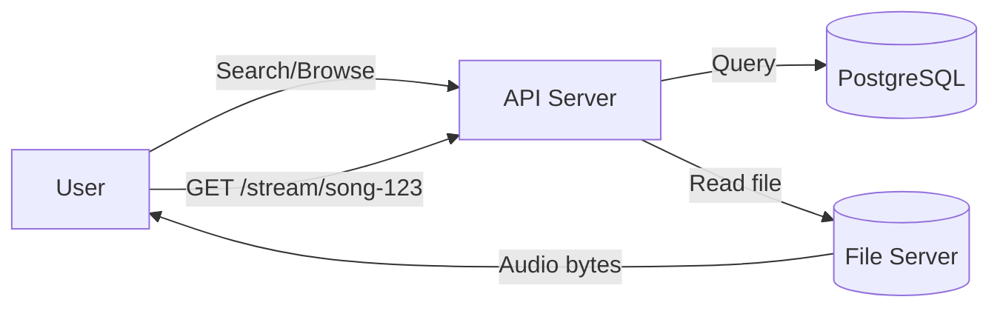
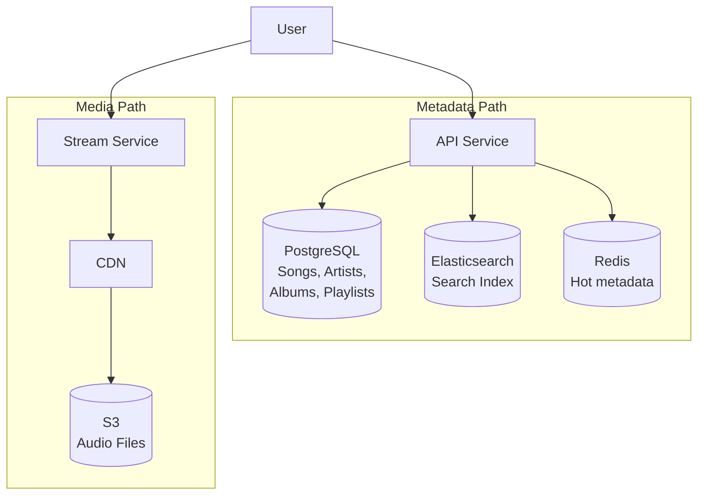
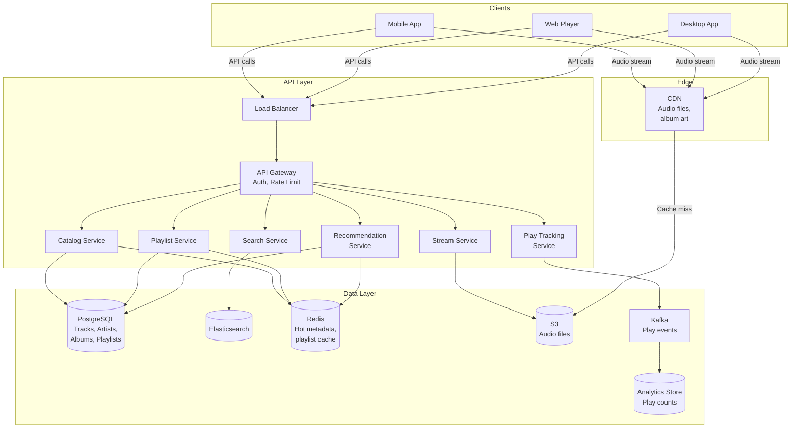
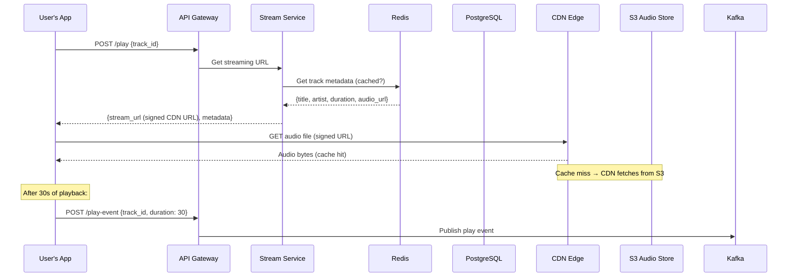

# System Design: Spotify / Music Streaming Player

---

# 1. Problem Statement

**In plain English:** Build a music streaming service where users can search for songs, create playlists, and press play to hear music stream smoothly — with support for offline downloads, personalized recommendations, and millions of tracks.

**Core user actions:**
- Search for songs, artists, and albums.
- Browse playlists (curated, personal, algorithmic).
- Play a song or playlist with gapless playback.
- Create and manage personal playlists.
- Download songs for offline listening.
- Get personalized recommendations ("Discover Weekly").

**Scale assumptions:**
- 400M registered users, 100M daily active.
- 100M tracks in the catalog.
- 5M concurrent streams at peak.
- Average song: ~4 minutes, ~10 MB (high quality).
- Total catalog: 100M × 10 MB = **~1 PB** of audio.
- 200M playlist creates/updates per day.
- Peak playback: 5M users × 1 song/4 min = 1.25M song starts per minute.

**Non-functional requirements:**
- **Low latency:** Song should start playing within 1 second.
- **High availability:** 99.9% uptime for playback.
- **Scalability:** Handle millions of concurrent streams.
- **Offline support:** Downloaded songs play without internet.
- **Geo-awareness:** Stream from nearby servers.

---

# 2. Requirements

## Functional Requirements
- User authentication and profiles.
- Search for songs, artists, albums, playlists.
- Stream music with gapless playback.
- Create, edit, and follow playlists.
- Download songs for offline playback (encrypted).
- Track play history ("Recently Played").
- Personalized recommendations.
- Like/save tracks and albums.

## Non-Functional Requirements
- Sub-1-second playback start time.
- Support multiple audio qualities (low, normal, high, lossless).
- CDN-backed streaming.
- Offline-capable client.
- Royalty tracking for artists (count plays accurately).

## Out of Scope
- Podcasts.
- Social features (following friends, activity feed) in depth.
- Artist upload and management portal.
- Advertising system for free tier.

---

# 3. Naive Solution

One server stores audio files. Users download and play them.



**How it works:**
1. User searches → API queries PostgreSQL → returns results.
2. User plays a song → API reads the audio file from disk and streams it back.

**Why this works at small scale:**
- 100 concurrent streams? One server can handle it.
- 1,000 songs × 10 MB = 10 GB — fits on one disk.

**Why this breaks at scale:**
- **1 PB of audio** doesn't fit on one server.
- **5M concurrent streams** = massive bandwidth — one server can't do this.
- **Geo latency** — a user in Tokyo streaming from Virginia waits too long.
- **No quality adaptation** — one file per song, one quality.
- **Single point of failure** — server crash = no music.
- **No offline** — requires internet for every play.

---

# 4. Bottlenecks / Failure Modes

| Problem | What Happens | Impact |
|---------|-------------|--------|
| **Bandwidth** | Single server can't serve 5M streams | Users can't play |
| **Storage** | 1 PB doesn't fit on one machine | Can't host full catalog |
| **Geo latency** | Distant users experience slow start | Bad first-play experience |
| **No CDN** | Every stream hits origin | Origin overloaded |
| **Hot tracks** | New release streamed by millions simultaneously | Single file becomes a bottleneck |
| **Metadata overload** | 100M tracks in one PostgreSQL table | Slow search, slow browse |
| **No offline** | Network dependency for every play | Unusable on planes, subways |
| **Play count accuracy** | Lost or duplicated play counts | Wrong royalty payments, legal issues |

---

# 5. Evolved Solution

## Step 1: Separate Metadata from Media

**Key concept:** There are two fundamentally different types of data:
- **Metadata** (small, structured): song titles, artist names, album art URLs, playlist contents, play counts. Stored in databases.
- **Media** (large, unstructured): audio files. Stored in object storage (S3/Blob).

**Why this helps:**
- Metadata is queried, searched, joined, and updated → needs a database.
- Audio files are read sequentially → need cheap, durable blob storage.
- They scale completely differently.

**Trade-off:** Two storage systems to manage. But mixing them (audio in a DB) would be catastrophic.



## Step 2: CDN for Audio Streaming

**Change:** Store audio files in object storage (S3). Serve them through a CDN. The CDN caches popular songs at edge nodes worldwide.

**Why it helps:**
- A user in São Paulo streams from a São Paulo edge server — sub-50ms latency.
- The top 1% of songs (1M tracks) account for 80%+ of plays → very high CDN cache hit ratio.
- CDN handles the bandwidth (terabits/sec distributed globally).

**Trade-off:** CDN costs per GB. But audio files are smaller than video (~10 MB vs. ~3 GB), so cost is much lower than Netflix.

**Cache behavior:**
- Hot tracks: always cached at every edge.
- Tail tracks: cached on first play, evicted after TTL (hours/days).
- CDN hit ratio for audio: ~95% (music catalogs have a very long tail, but the head is very hot).

## Step 3: Multiple Audio Qualities

**Change:** Encode each track at multiple quality levels: low (96 kbps), normal (160 kbps), high (320 kbps), lossless (~1,411 kbps FLAC).

**Why it helps:**
- Users on mobile data get a smaller file (low quality).
- Audiophiles on WiFi get lossless.
- The client selects quality based on settings and network.

**Trade-off:** Storage increases ~3× per track (multiple encodings). But storage is cheap ($0.023/GB/month on S3). 1 PB × 3 = 3 PB → ~$70K/month. Acceptable.

## Step 4: Search with Elasticsearch

**Change:** Index song metadata (title, artist, album, genre, lyrics) in Elasticsearch. Users search and get near-instant results with typo tolerance.

**Why it helps:**
- Full-text search with fuzzy matching, autocomplete, and ranking.
- PostgreSQL `LIKE` queries on 100M rows are slow and lack ranking.
- Elasticsearch returns results in ~20ms.

**Trade-off:** Need to keep the Elasticsearch index in sync with PostgreSQL. Use change data capture (CDC) or event-driven sync.

## Step 5: Playlist Management

**Change:** Playlists are stored in PostgreSQL with a join table for playlist-to-track relationships.

**Data model:**
```
playlist: {playlist_id, user_id, name, is_public, created_at}
playlist_tracks: {playlist_id, track_id, position, added_at}
```

**Why PostgreSQL:** Playlists need ordering (position), complex queries (user's playlists, followed playlists), and transactional updates (reorder, add, remove). Relational DB is the right fit.

**Caching:** Popular public playlists (e.g., "Today's Top Hits" with 30M followers) are cached in Redis. User's personal playlists are cached on-device and in Redis.

## Step 6: Play Tracking and Royalties

**Change:** Every play event (user pressed play and listened for ≥30 seconds) is recorded for royalty calculation.

**Flow:**
1. Client starts playing a song.
2. After 30 seconds of playback, client sends a "play" event.
3. Play event goes to a message queue (Kafka).
4. A streaming pipeline aggregates play counts.
5. Aggregated counts are used for royalty calculations, recommendations, and popularity.

**Why it helps:**
- Events are high volume (~1M/min at peak). A message queue absorbs the burst.
- Aggregation happens async — doesn't affect playback.
- Kafka guarantees durability — play events aren't lost.

**Trade-off:** Play counts are eventually consistent — the "Play count: 1.2B" on a song page might lag by minutes. That's fine.

## Step 7: Offline Downloads

**Change:** Users can download songs to their device for offline playback.

**How it works:**
1. User taps "Download" → client requests a download token from the API.
2. Client downloads the audio file from CDN → stored encrypted on device.
3. The DRM encryption key is tied to the user's subscription and device.
4. If the subscription lapses, the key expires → downloaded files become unplayable.

**Why it helps:** Users can listen on planes, subways, etc.

**Trade-off:** Requires DRM and device-level key management. Also, cached files use device storage — need to manage storage limits.

## Step 8: Recommendations

**Change:** A Recommendation Service generates personalized playlists based on listening history, liked tracks, and collaborative filtering.

**How it works:**
1. Play events and likes feed into a data pipeline.
2. ML models (collaborative filtering, content-based) are trained offline.
3. Recommendation Service calls the model at request time to generate "Discover Weekly," "Daily Mix," etc.
4. Results are cached per user in Redis (refreshed daily/weekly).

**Why it helps:** Keeps users engaged and discovering new music.

**Trade-off:** ML infrastructure is complex. But the interface to the rest of the system is simple: `GET /recommendations?user_id=X → [track_ids]`.

---

# 6. Final Architecture



**Request lifecycle — playing a song:**



---

# 7. Data Model

## Tracks (PostgreSQL)
| Column | Type | Notes |
|--------|------|-------|
| `track_id` | UUID (PK) | |
| `title` | VARCHAR | |
| `artist_id` | UUID (FK) | |
| `album_id` | UUID (FK) | |
| `duration_ms` | INT | Track length |
| `genre` | VARCHAR[] | Array of genres |
| `release_date` | DATE | |
| `audio_url_template` | TEXT | Pattern: `s3://audio/{track_id}/{quality}.mp3` |
| `play_count` | BIGINT | Denormalized, updated periodically from analytics |
| `created_at` | TIMESTAMP | |

**Indexes:** `(artist_id)`, `(album_id)`, `(title)` for lookups. Full-text search handled by Elasticsearch.

## Artists (PostgreSQL)
| Column | Type | Notes |
|--------|------|-------|
| `artist_id` | UUID (PK) | |
| `name` | VARCHAR | |
| `bio` | TEXT | |
| `image_url` | TEXT | |
| `monthly_listeners` | BIGINT | Updated periodically |

## Albums (PostgreSQL)
| Column | Type | Notes |
|--------|------|-------|
| `album_id` | UUID (PK) | |
| `title` | VARCHAR | |
| `artist_id` | UUID (FK) | |
| `cover_art_url` | TEXT | |
| `release_date` | DATE | |
| `track_count` | INT | |

## Playlists (PostgreSQL)
| Column | Type | Notes |
|--------|------|-------|
| `playlist_id` | UUID (PK) | |
| `owner_id` | UUID (FK) | Creator |
| `name` | VARCHAR | |
| `is_public` | BOOLEAN | |
| `follower_count` | BIGINT | |
| `created_at` | TIMESTAMP | |

## Playlist Tracks (PostgreSQL)
| Column | Type | Notes |
|--------|------|-------|
| `playlist_id` | UUID (FK) | |
| `track_id` | UUID (FK) | |
| `position` | INT | Order within playlist |
| `added_at` | TIMESTAMP | |

**Primary Key:** `(playlist_id, position)`.
**Index:** `(playlist_id)` for fetching playlist contents.

## Play Events (Kafka → Analytics Store)
| Field | Type | Notes |
|-------|------|-------|
| `user_id` | UUID | |
| `track_id` | UUID | |
| `played_at` | TIMESTAMP | |
| `duration_ms` | INT | How long they listened |
| `quality` | VARCHAR | "high", "low", etc. |
| `device` | VARCHAR | "mobile", "desktop" |

---

# 8. API Design

## Search
```
GET /api/v1/search?q=bohemian+rhapsody&type=track,artist&limit=10
Authorization: Bearer <token>

Response 200:
{
  "tracks": [{"track_id": "...", "title": "Bohemian Rhapsody", "artist": "Queen"}],
  "artists": [{"artist_id": "...", "name": "Queen"}]
}
```

## Get Track / Play
```
GET /api/v1/tracks/{track_id}/stream?quality=high
Authorization: Bearer <token>

Response 200:
{
  "stream_url": "https://cdn.example.com/audio/abc/high.mp3?token=...&expires=...",
  "track": {"title": "...", "artist": "...", "duration_ms": 354000},
  "next_track_id": "def"
}
```

The `stream_url` is a **signed URL** with an expiration — prevents URL sharing.

## Get Playlist
```
GET /api/v1/playlists/{playlist_id}?page=1&per_page=50
Authorization: Bearer <token>

Response 200:
{
  "playlist": {"name": "My Favorites", "owner": "...", "track_count": 142},
  "tracks": [{"track_id": "...", "title": "...", "position": 1}, ...],
  "next_page": 2
}
```

## Create/Update Playlist
```
POST /api/v1/playlists
Authorization: Bearer <token>
{
  "name": "Road Trip",
  "track_ids": ["track-1", "track-2"]
}

Response 201: {"playlist_id": "..."}
```

## Record Play Event
```
POST /api/v1/play-events
Authorization: Bearer <token>
{
  "track_id": "abc",
  "duration_ms": 45000,
  "quality": "high"
}

Response 202 Accepted
```

## Get Recommendations
```
GET /api/v1/recommendations?type=discover_weekly
Authorization: Bearer <token>

Response 200:
{
  "playlist_name": "Discover Weekly",
  "tracks": [{"track_id": "...", "title": "...", "artist": "..."}, ...]
}
```

---

# 9. Scale and Performance

## Traffic Estimates
- 1.25M song starts/min at peak = ~21K play requests/sec.
- Audio bandwidth: 5M streams × 160 kbps = 800 Gbps (handled by CDN).
- Search: ~10K searches/sec (Redis + Elasticsearch).
- Playlist reads: ~50K/sec (mostly cached).
- Play events: ~1M/min → Kafka handles this easily.
- Metadata storage: 100M tracks × 1 KB = 100 GB — fits in a single PostgreSQL instance (with read replicas).

## Handling Spikes
- **New album drop:** Millions of users play the same track. CDN cache serves it from edge. No origin pressure.
- **Play events spike:** Kafka absorbs the burst, analytics workers consume at their own pace.
- **Search spike:** Elasticsearch cluster scales horizontally.

## Hot-Key Mitigation
- **Hot track:** The #1 song globally is cached at every CDN edge. Origin never sees it.
- **Hot playlist:** "Today's Top Hits" cached in Redis. 30M followers reading the same cached object.
- **Play count updates:** Batched in Kafka → aggregated → written to DB periodically (not per-play).

## Caching Strategy
| Data | Cache Location | TTL |
|------|---------------|-----|
| Track metadata | Redis | 1 hour |
| Popular playlists | Redis | 5 minutes (frequently updated) |
| Search results | Elasticsearch (in-memory segments) | Real-time |
| Audio files | CDN edge | Days (popular), hours (long tail) |
| Album art | CDN | Days |
| User's personal playlists | Client + Redis | 5 minutes |
| Recommendations | Redis (per user) | 24 hours |

---

# 10. Reliability and Failure Handling

| Failure | Impact | Mitigation |
|---------|--------|------------|
| **CDN edge down** | Users in that region lose cache | CDN auto-routes to next-nearest edge |
| **S3 outage** | Cache misses fail | S3 cross-region replication; CDN still serves cached content |
| **PostgreSQL down** | No metadata lookups | Failover to standby; Redis cache serves most reads meanwhile |
| **Elasticsearch down** | Search unavailable | Fall back to PostgreSQL `LIKE` search (degraded but functional) |
| **Kafka down** | Play events not recorded | Buffer events on client/API server; replay when Kafka recovers; some events may be delayed but not lost |
| **Recommendation service down** | No personalized playlists | Fall back to curated/editorial playlists |

**Play event durability:**
- Play events are critical for royalties (money).
- Kafka with replication factor 3 ensures durability.
- Consumer offsets are committed after processing → at-least-once processing.
- Deduplication by `(user_id, track_id, played_at)` in the analytics pipeline.

---

# 11. Security and Abuse Prevention

| Concern | Mitigation |
|---------|-----------|
| **Authentication** | OAuth 2.0 / JWT for all API calls |
| **Signed streaming URLs** | Audio URLs expire after 1 hour; tied to user session |
| **DRM for downloads** | Downloaded files encrypted with device-specific key; key tied to active subscription |
| **Rate limiting** | Per user: 100 API calls/min; stream limit: 1 active stream per free account |
| **Play count fraud** | Detect bot-like patterns (same song on repeat, headless browsers); flag and exclude from royalty counts |
| **Content protection** | Audio watermarking for premium content; DRM for offline downloads |
| **Data privacy** | Listening history is private by default; GDPR deletion support |
| **Encryption** | TLS for all API and streaming traffic; S3 server-side encryption |

---

# 12. Interview Talking Points

- [ ] **Metadata vs. media storage:** Tracks/playlists in PostgreSQL; audio files in S3. Different data, different storage, different scale.
- [ ] **CDN is essential:** Audio streaming bandwidth (800 Gbps) can only be served by CDN edge nodes.
- [ ] **Read-heavy:** Catalog and playlists are read far more than written → cache aggressively in Redis.
- [ ] **Search:** Elasticsearch for typo-tolerant, ranked full-text search across 100M tracks.
- [ ] **Play tracking:** High-volume events go through Kafka → aggregated asynchronously. Critical for royalties.
- [ ] **Offline downloads:** DRM-encrypted files on device; key tied to subscription status.
- [ ] **Hot content is easy:** Top songs are cached everywhere. The long tail is the harder problem.
- [ ] **Playlists in PostgreSQL:** Need ordering, complex queries, and transactional updates. Relational DB is the right choice.
- [ ] **Trade-offs:** CDN cost for long-tail content; eventual consistency for play counts; storage cost for multiple audio qualities.
- [ ] **Signed URLs:** Prevent unauthorized streaming and URL sharing.

---

# 13. Common Follow-Up Questions

**Q: What's the difference between metadata storage and media storage?**
A: Metadata (song title, artist, album, playlist contents) is small, structured data queried with filters and joins → relational database (PostgreSQL). Media (audio files) is large, unstructured blobs read sequentially → object storage (S3). You'd never store a 10 MB audio file in a database row, and you'd never run SQL queries against an S3 bucket. They're completely different workloads.

**Q: How do you handle gapless playback?**
A: The client pre-fetches the next track while the current one is playing. The API returns `next_track_id` with each play response. The client starts downloading the next track's audio a few seconds before the current one ends. Crossfading or gapless transition happens client-side.

**Q: How do you ensure accurate play counts for royalties?**
A: A play is counted only after 30 seconds of continuous playback (industry standard). The client sends a play event after 30s. Events go to Kafka (durable, replicated). The analytics pipeline deduplicates by `(user_id, track_id, played_at)` to prevent double-counting. Aggregated counts are reconciled with music labels monthly.

**Q: How do you handle the long tail of rarely played songs?**
A: The long tail stays in S3. CDN doesn't cache it permanently — it's cached on first play and evicted if not played again within the TTL. The first play of a rare song might take slightly longer (cache miss → fetch from S3), but subsequent plays in the same region are fast.

**Q: How would you handle collaborative playlists?**
A: Allow multiple users to have "editor" permissions on a playlist. Use optimistic concurrency (version column) on the playlist to handle simultaneous edits. Client receives conflict resolution instructions if two users add a track at the same position. For real-time collaborative editing, use a WebSocket to push updates like the Chat system.

**Q: Why not use a NoSQL database for everything?**
A: Playlists need ordered tracks, joins with track metadata, and transactional updates (reorder, remove). PostgreSQL handles this naturally. Play events and listening history are append-only and high-volume → good fit for Kafka + a time-series/columnar store. Using the right tool for each workload is better than forcing one tool to do everything.

---

# Summary in 60 Seconds

> "A music streaming service separates metadata storage (PostgreSQL for tracks, artists, playlists) from media storage (S3 for audio files, served via CDN). When a user plays a song, the API returns track metadata and a signed CDN URL. The client streams audio from the nearest CDN edge node. Audio is encoded at multiple quality levels; the client selects based on network and settings. Search uses Elasticsearch for fast, typo-tolerant queries across 100M tracks. Playlists are stored in PostgreSQL with position ordering. Play events flow through Kafka to an analytics pipeline for royalty counting and recommendation training. Popular content (top 1% of tracks) is cached at every CDN edge and in Redis — handling the majority of traffic. Offline downloads use DRM-encrypted files tied to the user's subscription."

---

# What I Would Say If the Interviewer Pushes Deeper

**On CDN cost for audio vs. video:**
> "Audio is much cheaper than video to serve via CDN. A 4-minute song at 320 kbps is ~10 MB. A 4-minute video at 1080p is ~200 MB. So for the same number of streams, audio CDN cost is ~20× less. The cache hit ratio is also higher for music — people listen to the same songs repeatedly, vs. watching a movie once."

**On playlist scalability:**
> "The biggest playlist concern isn't the data volume — it's hot playlists. 'Today's Top Hits' has 30M followers. If each follower fetches the playlist, that's 30M reads/day for one row. Redis cache solves this trivially. The harder problem is updating a playlist that 30M people follow: the invalidation needs to propagate. But since playlist updates are infrequent (daily) and eventual consistency is fine (a user sees the updated playlist a few minutes late), this isn't a real problem."

**On multi-region:**
> "Audio files in S3 should be replicated to major regions (US, Europe, Asia). CDN covers the edge. For metadata, one primary PostgreSQL region with read replicas in others is sufficient — metadata changes are infrequent. Play events can be published to regional Kafka clusters and aggregated centrally. The key insight is that audio delivery (the heavy path) is entirely handled by CDN — our services only handle lightweight API calls."
