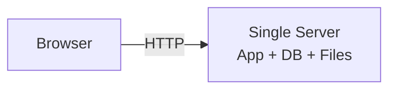
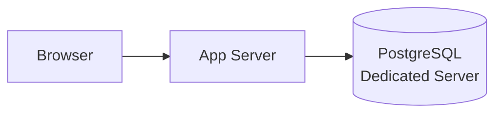
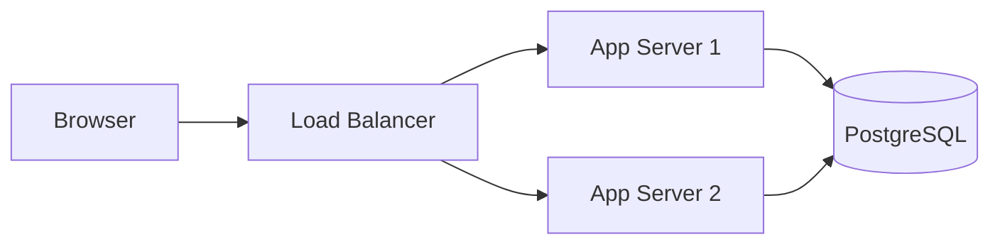
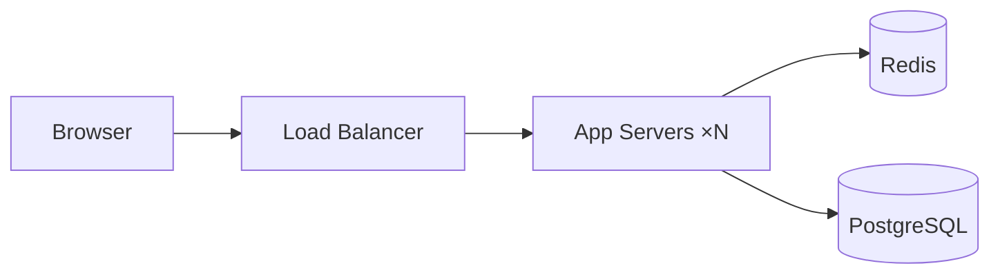
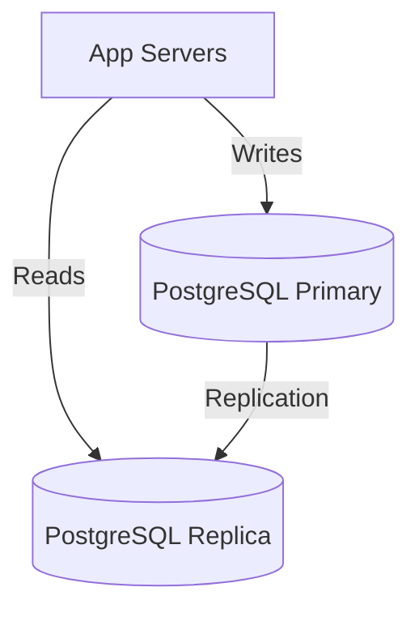
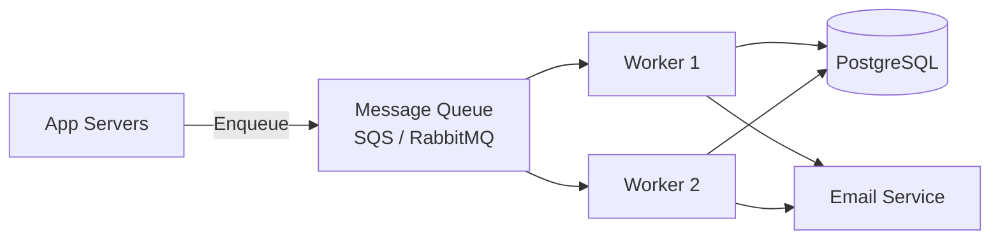
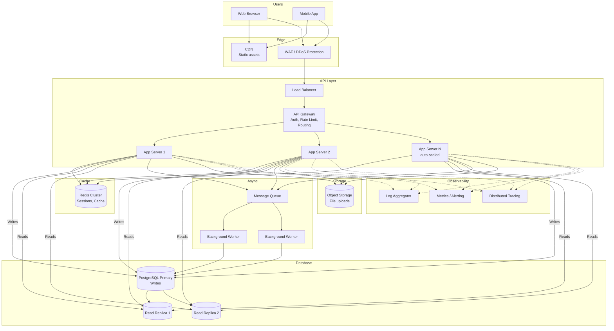
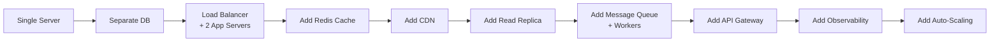

# System Design: Scalable Web Application from the Ground Up

---

# 1. Problem Statement

**In plain English:** Design the architecture for a general-purpose web application — think a SaaS product like a project management tool, CRM, or content management system — that starts with a handful of users and must scale to millions without being rewritten from scratch. This is the foundational architecture problem: how do you go from a single server to a production-grade, scalable system?

**Core user actions:**
- Register, log in, manage a profile.
- Create, read, update, delete core business entities (projects, tasks, documents, etc.).
- Upload files.
- Receive notifications.
- Use the app from anywhere in the world.

**Scale assumptions (target state):**
- 10M registered users, 1M daily active.
- 10K requests/sec at peak.
- 5 TB of data in the database.
- 99.9% availability.
- P99 API latency < 200ms.

**Non-functional requirements:**
- **Scalability:** Handle 10× growth without redesign.
- **Reliability:** No data loss; tolerate server failures.
- **Performance:** Fast page loads and API responses.
- **Security:** Protect user data, prevent common attacks.
- **Maintainability:** Easy to deploy, monitor, and debug.
- **Cost efficiency:** Don't over-provision; scale with demand.

---

# 2. Requirements

## Functional Requirements
- User authentication (registration, login, password reset).
- CRUD operations on business entities.
- File uploads and downloads.
- Search across entities.
- Notifications (email, in-app).
- Admin dashboard.

## Non-Functional Requirements
- Horizontal scalability.
- Database reliability with failover.
- Observability (logging, metrics, tracing).
- CI/CD pipeline (continuous integration/continuous deployment) — automated testing and deployment.
- Blue-green or rolling deployments with zero downtime.

## Out of Scope
- Specific business logic (this is about the infrastructure pattern).
- Mobile app backend specifics.
- Real-time features (covered in the Messenger design).

---

# 3. Naive Solution — Single Server



**How it works:**
1. One server runs everything: the web application, the database (PostgreSQL), and stores uploaded files on the local disk.
2. DNS points the domain to this server's IP.

**Why this works at small scale:**
- 10 users? One server handles it easily.
- Simple to set up, deploy, and debug.
- Costs ~$20/month.

**Why this breaks:**
- Server crash = everything is down (including the database).
- CPU/memory maxed out as traffic grows.
- Disk failure = data loss.
- No redundancy, no failover, no scaling.

---

# 4. Bottlenecks / Failure Modes

| Problem | When It Hits | Impact |
|---------|-------------|--------|
| **Single point of failure** | Server crash or reboot | Total outage |
| **CPU saturation** | ~100–500 concurrent users | Slow responses, timeouts |
| **Database contention** | App and DB on same CPU → app starves DB or vice versa | Both slow down |
| **Disk failure** | Hardware fault | Permanent data loss |
| **No horizontal scaling** | Can't add another server easily | Growth ceiling |
| **Deployment downtime** | Every deploy restarts the server | Users see errors during deploys |
| **No HTTPS** | Plain HTTP | Insecure — credentials sent in plaintext |
| **No monitoring** | Something breaks silently | Find out from users, not alerts |

---

# 5. Evolved Solution — Step by Step

This design builds up in layers, one improvement at a time.

## Step 1: Separate the Database

**Change:** Move the database to its own server (or a managed service like RDS / Azure Database for PostgreSQL).



**Why it helps:**
- App and DB no longer compete for CPU/memory.
- Can restart the app server without affecting the database.
- Can back up the database independently.
- Managed DB services provide automatic backups and failover.

**Trade-off:** Network latency between app and DB (~1ms in the same data center). Negligible.

## Step 2: Add a Load Balancer and Multiple App Servers

**Change:** Put a **load balancer** (LB) in front of 2+ identical app servers.



**Why it helps:**
- **Redundancy:** If one app server dies, the other handles traffic.
- **Scalability:** Add more servers to handle more traffic.
- **Zero-downtime deploys:** Roll updates one server at a time.

**Requirements for this to work:**
- App servers must be **stateless** — no session data stored locally. Use Redis for sessions or JWT tokens.
- All shared state lives in the database or a shared cache.

**Trade-off:** Need to manage session state externally. But this is standard practice.

## Step 3: Add Caching (Redis)

**Change:** Add a Redis cache between app servers and the database.



**Why it helps:**
- Frequently read data (user profiles, settings, hot records) served from memory → 10–100× faster than DB queries.
- Reduces DB load → DB can handle more writes.
- Session storage: fast, shared across all app servers.

**What to cache:**
- Database query results for hot data (TTL: minutes).
- User sessions (TTL: 30 minutes).
- Feature flags and config.
- Computed values (dashboard aggregations).

**Trade-off:** Cache invalidation complexity. Stale data possible. Use short TTLs and invalidate on writes for critical data.

## Step 4: Add a CDN for Static Assets

**Change:** Serve static files (JavaScript, CSS, images, fonts) from a CDN instead of the app server.

**Why it helps:**
- Static files served from edge servers close to the user → faster page loads.
- Offloads bandwidth from app servers.
- Static assets rarely change → long cache TTLs (days/weeks).

**Trade-off:** Need to version static assets (e.g., `app.v42.js`) so cache busting works on deploys.

## Step 5: Add a Read Replica for the Database

**Change:** Create a read replica of PostgreSQL. Send read queries to the replica, write queries to the primary.



**Why it helps:**
- Read-heavy workloads (most web apps are 80–90% reads) are offloaded from the primary.
- Primary handles writes without contention from read queries.
- Read replicas can be in different regions for geo-locality.

**Trade-off:** Replication lag — the replica might be a few milliseconds behind the primary. For most reads, this is fine. For read-after-write scenarios (user saves data, then immediately reads it back), route that read to the primary.

## Step 6: Add a Message Queue for Background Work

**Change:** Move slow or non-critical work (sending emails, generating reports, image processing) to background workers via a message queue.



**Why it helps:**
- API responds immediately instead of waiting for slow operations.
- Workers retry failed jobs → reliable processing.
- Workers scale independently from web servers.

**Trade-off:** Results are async. The user might need to see "Processing..." and poll or get a notification when done.

## Step 7: Add an API Gateway

**Change:** Put an API gateway in front of all services. It handles cross-cutting concerns.

**What it does:**
- Authentication / authorization.
- Rate limiting.
- Request routing (to different services if you've split into microservices).
- Request/response logging.
- TLS termination.

**Why it helps:** Centralizes security and routing instead of duplicating it in every service.

**Trade-off:** Single point of failure (mitigate with redundancy). Adds ~1–5ms latency per request.

## Step 8: Add Observability

**Change:** Instrument the system with three pillars of observability:

1. **Logging:** Structured logs from every service → shipped to a centralized log store (e.g., ELK stack, Datadog).
2. **Metrics:** Track request rate, error rate, latency (p50, p95, p99), DB query time, cache hit ratio, queue depth.
3. **Tracing:** Distributed traces show the full lifecycle of a request across services (e.g., Jaeger, OpenTelemetry).

**Why it helps:**
- Know when something is broken before users complain.
- Debug performance issues across services.
- Alerting on error rate spikes, latency increases, queue buildup.

**Trade-off:** Overhead (small CPU/network cost per request for tracing). But the debugging value is enormous.

## Step 9: Add Auto-Scaling

**Change:** Configure app servers and workers to auto-scale based on metrics (CPU usage, request rate, queue depth).

**Why it helps:**
- Scale up during traffic spikes (marketing campaign, business hours).
- Scale down during quiet periods → cost savings.
- Handles unexpected growth without manual intervention.

**Trade-off:** Need stateless servers (already done in Step 2). Small lag between traffic spike and new servers being ready (~1–3 minutes).

---

# 6. Final Architecture



**The journey in summary:**



---

# 7. Data Model

This depends on the specific application, but here's a general SaaS pattern:

## Users
| Column | Type | Notes |
|--------|------|-------|
| `user_id` | UUID (PK) | |
| `email` | VARCHAR (unique) | Login identifier |
| `password_hash` | VARCHAR | bcrypt / argon2 hash |
| `display_name` | VARCHAR | |
| `role` | ENUM | admin, member, viewer |
| `created_at` | TIMESTAMP | |

## Organizations / Tenants
| Column | Type | Notes |
|--------|------|-------|
| `org_id` | UUID (PK) | |
| `name` | VARCHAR | |
| `plan` | ENUM | free, pro, enterprise |
| `created_at` | TIMESTAMP | |

## Resources (generic business entity)
| Column | Type | Notes |
|--------|------|-------|
| `resource_id` | UUID (PK) | |
| `org_id` | UUID (FK, indexed) | Tenant isolation |
| `created_by` | UUID (FK) | |
| `title` | VARCHAR | |
| `status` | ENUM | Domain-specific |
| `data` | JSONB | Flexible attributes |
| `created_at` | TIMESTAMP | |
| `updated_at` | TIMESTAMP | |

**Index:** `(org_id, created_at DESC)` — most queries are within an org, sorted by recency.

**Tenant isolation:** Every query includes `WHERE org_id = ?` — enforced at the application or middleware layer.

---

# 8. API Design

## Authentication
```
POST /api/v1/auth/login
{
  "email": "user@example.com",
  "password": "..."
}

Response 200:
{
  "access_token": "eyJ...",
  "refresh_token": "...",
  "expires_in": 3600
}
```

## CRUD — List Resources
```
GET /api/v1/resources?status=active&page=1&per_page=20
Authorization: Bearer <token>

Response 200:
{
  "data": [{"resource_id": "...", "title": "...", "status": "active"}],
  "pagination": {"page": 1, "per_page": 20, "total": 142}
}
```

## CRUD — Create Resource
```
POST /api/v1/resources
Authorization: Bearer <token>
Idempotency-Key: <uuid>
{
  "title": "New Project",
  "data": {"priority": "high"}
}

Response 201:
{"resource_id": "...", "title": "New Project"}
```

## File Upload
```
POST /api/v1/files/upload
Authorization: Bearer <token>
Content-Type: multipart/form-data

file: document.pdf

Response 201:
{"file_id": "...", "url": "https://cdn.example.com/files/..."}
```

**API conventions:**
- All endpoints versioned (`/v1/`).
- JWT Bearer tokens for auth.
- Pagination via `page` and `per_page`.
- Idempotency keys on mutating operations.
- Consistent error format: `{"error": {"code": "NOT_FOUND", "message": "..."}}`

---

# 9. Scale and Performance

## Traffic Estimates
- 10K requests/sec at peak.
- 5 TB PostgreSQL data.
- 80% reads, 20% writes → 8K reads/sec from replicas, 2K writes/sec to primary.
- Redis cache hit ratio: ~90% → actual DB reads: ~800/sec. Comfortable.

## Scaling Cheat Sheet

| Concern | 100 users | 10K users | 1M users | 10M users |
|---------|-----------|-----------|----------|-----------|
| App Servers | 1 | 2–3 | 10–20 | 50+ (auto-scaled) |
| Database | Single instance | Primary + 1 replica | Primary + 3 replicas | Sharded or managed (Aurora) |
| Cache | Optional | 1 Redis node | Redis cluster | Redis cluster (sharded) |
| Queue | Not needed | 1 queue | Managed queue (SQS) | Managed queue + auto-scaled workers |
| CDN | Not needed | Basic CDN | Full CDN | Multi-origin CDN |
| Monitoring | Logs only | Basic metrics | Full observability | Full + alerting + on-call |

## Database Scaling Path
1. **Vertical scaling:** Bigger machine (works up to ~64 cores, 256 GB RAM).
2. **Read replicas:** Offload reads (works for read-heavy workloads).
3. **Connection pooling:** PgBouncer to handle thousands of connections.
4. **Partitioning:** Partition large tables by `org_id` or date.
5. **Sharding:** Split data across multiple PostgreSQL instances by `org_id` (last resort — adds significant complexity).

---

# 10. Reliability and Failure Handling

| Failure | Impact | Mitigation |
|---------|--------|------------|
| **App server crash** | LB routes to other servers | Health checks remove unhealthy servers; auto-scaling replaces them |
| **DB primary down** | Writes fail | Automated failover to standby (RDS multi-AZ); manual promotion of replica if no managed failover |
| **Redis down** | Cache miss → all reads hit DB | App servers fall back to DB; slightly slower but functional; alert ops |
| **Queue down** | Background jobs stall | Return 503 for async operations; buffer locally and retry |
| **Deployment failure** | New code has bugs | Rolling deployment: deploy to 1 server first, monitor, then roll to all; instant rollback if errors spike |
| **Region outage** | Everything in that region down | Multi-region setup with DNS failover (advanced — for 99.99%+) |

**Health checks:**
- LB pings `/health` on each app server every 10 seconds.
- `/health` checks: can the server reach the DB? Can it reach Redis? Is disk OK?
- Unhealthy server → removed from LB rotation → auto-scaling launches replacement.

---

# 11. Security and Abuse Prevention

| Concern | Mitigation |
|---------|-----------|
| **Authentication** | bcrypt/argon2 password hashing; JWT access tokens (15 min TTL); refresh tokens (7 day TTL, rotated on use) |
| **Authorization** | Role-based access control (RBAC); tenant isolation (`org_id` filter on every query) |
| **HTTPS everywhere** | TLS termination at LB; HSTS headers; redirect HTTP → HTTPS |
| **Rate limiting** | API gateway: 100 req/min per user; 1000 req/min per IP; tighter limits on auth endpoints |
| **SQL injection** | Parameterized queries (never string concatenation); ORM usage |
| **XSS (Cross-Site Scripting)** | Output encoding; Content-Security-Policy headers; sanitize user input on display |
| **CSRF (Cross-Site Request Forgery)** | SameSite cookies; CSRF tokens for form submissions |
| **Data encryption** | At rest: DB encryption, S3 encryption; in transit: TLS everywhere |
| **Secrets management** | API keys, DB passwords in a secrets manager (Vault, AWS Secrets Manager); never in code or logs |
| **Audit logging** | Log all authentication events, permission changes, data access; immutable audit trail |
| **Dependency scanning** | Automated vulnerability scanning for third-party packages |

---

# 12. Interview Talking Points

- [ ] **Start simple:** "I'd start with a single server and evolve, because over-engineering at the start wastes time and money."
- [ ] **Stateless app servers:** "All shared state is in the database or Redis. App servers are interchangeable."
- [ ] **Load balancer:** "Adds redundancy and enables horizontal scaling. Health checks remove failing servers."
- [ ] **Cache strategy:** "Redis for sessions and hot data. 90%+ of reads served from cache. Short TTLs for consistency."
- [ ] **Database scaling path:** "Vertical → read replicas → connection pooling → partitioning → sharding (last resort)."
- [ ] **Async processing:** "Slow work goes to a queue. Workers process at their own pace. API stays fast."
- [ ] **CDN:** "Static assets served from edge. Cuts page load time significantly."
- [ ] **Observability:** "Logs, metrics, and tracing are not optional. You need to know when things break and why."
- [ ] **Auto-scaling:** "Scale up on demand, scale down to save cost. Works because servers are stateless."
- [ ] **Security layers:** "HTTPS, rate limiting, input validation, parameterized queries, secrets management."
- [ ] **Deployment:** "Rolling deploys with health checks. Instant rollback if errors spike."
- [ ] **Cost:** "Don't over-provision. Start small, monitor, and scale when metrics justify it."

---

# 13. Common Follow-Up Questions

**Q: When would you choose microservices over a monolith?**
A: Start with a monolith. It's simpler to develop, deploy, and debug. Split into microservices when: (1) the team grows beyond ~10 engineers and stepping on each other, (2) different parts of the system need to scale independently (e.g., image processing needs GPU scaling while the API needs CPU scaling), or (3) deployment speed suffers because changing one feature requires re-deploying everything.

**Q: How do you handle database migrations without downtime?**
A: Use backward-compatible migrations: (1) Add new columns with defaults (doesn't lock the table in modern PostgreSQL). (2) Deploy new code that writes to both old and new columns. (3) Backfill old data. (4) Deploy code that reads from new column. (5) Remove old column later. Never rename or drop columns in one step.

**Q: When does PostgreSQL stop being enough?**
A: PostgreSQL can handle surprisingly large workloads — 10K+ QPS with read replicas, terabytes of data with partitioning. Most web apps never outgrow it. You'd need to consider alternatives when: (1) write throughput exceeds ~50K/sec (consider DynamoDB or Cassandra), (2) you need horizontal write scaling (sharding is complex), or (3) you need a fundamentally different data model (graph DB for social networks, time-series DB for metrics).

**Q: How do you handle multi-tenancy?**
A: Three approaches: (1) **Shared database, shared schema** — `org_id` column on every table, filtered in every query. Simplest, most efficient. (2) **Shared database, separate schema** — one PostgreSQL schema per tenant. Better isolation but more management. (3) **Separate database per tenant** — strongest isolation. Most expensive and complex. For most SaaS apps, option 1 with row-level security policies is the right choice.

**Q: How do you do blue-green deployments?**
A: Maintain two identical environments (blue and green). Deploy new code to the inactive environment. Run smoke tests. Switch the LB to point to the new environment. If something goes wrong, switch back. This requires stateless servers and a shared database/cache that's backward-compatible with both versions.

---

# Summary in 60 Seconds

> "A scalable web app starts as a single server and evolves by separating concerns. Step 1: move the database to its own server. Step 2: add a load balancer with multiple stateless app servers. Step 3: add Redis for caching sessions and hot data. Step 4: add a CDN for static assets. Step 5: add database read replicas. Step 6: add a message queue for background jobs. Step 7: add an API gateway for auth, rate limiting, and routing. Step 8: add observability with logs, metrics, and tracing. Step 9: add auto-scaling. Each step solves a specific bottleneck: the single server ceiling, the database bottleneck, slow reads, slow page loads, high DB load, blocking operations, and operational blindness. The key principle is separation of concerns — stateless compute, shared state in DB/cache, async work in queues."

---

# What I Would Say If the Interviewer Pushes Deeper

**On choosing PostgreSQL:**
> "PostgreSQL is my default choice for a relational database because it handles JSON (JSONB), full-text search, and partitioning natively — so I get NoSQL-like flexibility with relational guarantees. It's well-supported by every cloud provider as a managed service. I'd only move to a specialized database when PostgreSQL demonstrably can't meet the performance requirements for a specific workload."

**On cost optimization:**
> "The biggest cost drivers are compute (app servers), database, and CDN bandwidth. Auto-scaling directly reduces compute cost. Read replicas can be smaller than the primary. CDN costs are per-GB — caching static assets with long TTLs minimizes origin bandwidth. Reserved instances or savings plans reduce compute costs by 30–70% for predictable baseline traffic. The message here is: don't pay for what you don't use."

**On multi-region scaling:**
> "For 99.99% availability, you need multi-region. The app servers and cache can be deployed in 2+ regions easily (they're stateless). The hard part is the database: you need active-passive (failover across regions) or active-active (writes in multiple regions, requiring conflict resolution). For most apps, active-passive with async replication is sufficient. DNS-based failover (Route 53 health checks) routes users to the healthy region."
