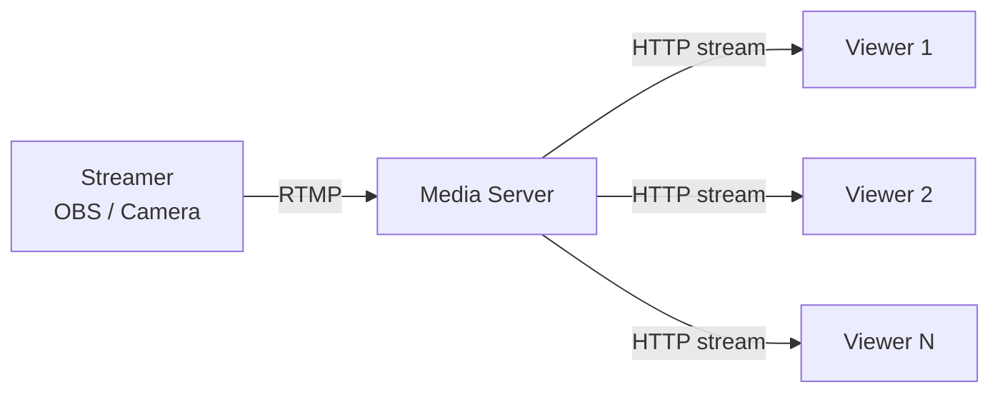
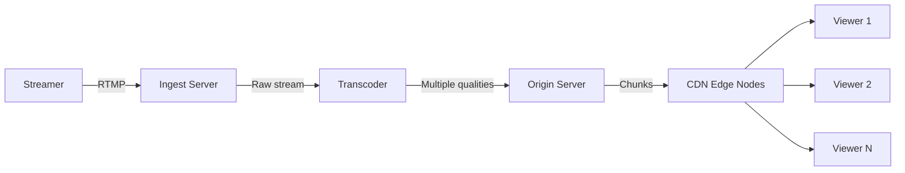
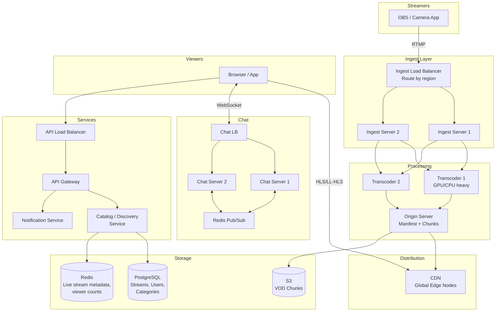
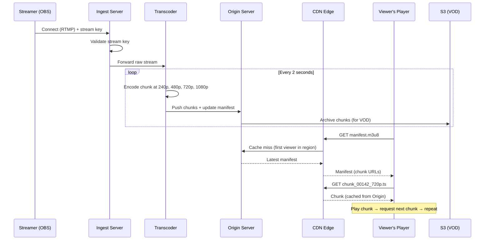

# System Design: Live Streaming Platform (Twitch-style)

---

# 1. Problem Statement

**In plain English:** Build a live video streaming platform where creators broadcast in real time and thousands to millions of viewers watch with only a few seconds of delay. Think Twitch, YouTube Live, or Instagram Live — the key difference from Netflix is that the content is being created *right now*, not pre-recorded.

**Core user actions:**
- **Streamer:** Go live, stream video + audio, interact with chat.
- **Viewer:** Browse live streams, watch with low latency (~3–5 seconds), chat, react.
- **After the stream:** Watch recorded VOD (video on demand) of past streams.

**Scale assumptions:**
- 10M daily active viewers.
- 100K concurrent live streams.
- Top stream: 500K concurrent viewers.
- Average stream: 50 viewers.
- Average stream length: 2 hours.
- Target latency: < 5 seconds from streamer to viewer.
- Chat: 10K messages/sec across all streams; top stream: 5K messages/sec.

**Non-functional requirements:**
- **Low latency:** < 5 seconds from camera to screen.
- **High availability:** Live streams must not drop.
- **Scalability:** Handle a top stream with 500K viewers.
- **Geo-awareness:** Viewers worldwide should see the stream from nearby servers.
- **Reliability:** Streams should be recorded for later viewing.

---

# 2. Requirements

## Functional Requirements
- Ingest live video from streamers (RTMP or WebRTC incoming).
- Transcode live video into multiple qualities in real time.
- Distribute live video to viewers globally with < 5s latency.
- Live chat alongside each stream.
- Browse and discover live streams.
- Record and store past streams as VOD.
- Follow streamers and get notified when they go live.

## Non-Functional Requirements
- Sub-5-second glass-to-glass latency (camera to viewer screen).
- Real-time transcoding at multiple bitrates.
- CDN distribution for live content.
- Chat at 10K messages/sec.
- 99.9% uptime for ingest (streamer's connection).

## Out of Scope
- Monetization (subscriptions, donations, ads).
- Clip creation and highlights.
- Detailed moderation tools.

---

# 3. Naive Solution

Streamers send video to a server. Viewers download from the same server.



**How it works:**
1. Streamer pushes a live video stream (using RTMP protocol) to a single media server.
2. The server re-broadcasts the stream to each viewer via HTTP.

**Why this works at small scale:**
- 10 viewers? One server can push 10 copies of the stream. Fine.
- Simple to set up with open-source tools (Nginx-RTMP, OBS).

**Why this breaks at scale:**
- **500K viewers = 500K outbound connections** from one server → impossible.
- **One quality level** → viewers with slow internet buffer; viewers with fast internet get unnecessary low quality.
- **Single location** → viewers far away get high latency (100ms+ round trip → adds to buffer delay).
- **No recording** → stream is ephemeral; no VOD.
- **Server crash** → stream dies for everyone.

---

# 4. Bottlenecks / Failure Modes

| Problem | What Happens | Impact |
|---------|-------------|--------|
| **Fan-out bandwidth** | One server can't push 500K streams | Viewers can't connect |
| **No transcoding** | Only one quality available | Buffering on slow connections |
| **Geo latency** | Viewers far from server see high latency | Stream feels delayed |
| **Single point of failure** | Server crash = stream ends for all | Lost viewership, poor reputation |
| **No recording** | Stream content lost after broadcast | No VOD, clips, or replay |
| **Chat at scale** | 5K messages/sec in one channel | Chat server overwhelmed |
| **Real-time requirement** | Transcoding adds latency | Stream delay > 10 seconds |

---

# 5. Evolved Solution

## Step 1: Separate Ingest from Distribution

**Key concept:** Split the system into three stages:
1. **Ingest:** Receive the streamer's video (one connection).
2. **Transcode:** Convert the single stream into multiple quality levels in real time.
3. **Distribute:** Fan out the video to all viewers via CDN.



**Why it helps:**
- Ingest handles just one connection per stream (the streamer).
- Transcoding is CPU-intensive but processes just one stream.
- Fan-out (1 → 500K) is handled by CDN, which is designed for exactly this.

**Trade-off:** Three stages add latency (each hop adds ~1s). But it's necessary for scale.

## Step 2: Real-Time Transcoding into Chunks

**Change:** Transcode the live stream into chunks (2–4 second segments) at multiple quality levels, just like Netflix — but in *real time* instead of offline.

**How it works:**
1. Ingest server receives the RTMP stream.
2. Transcoder segments the stream into 2-second chunks, encoding each chunk at 240p, 480p, 720p, 1080p.
3. Each chunk is immediately pushed to the origin server.
4. Origin server updates the live manifest (HLS `.m3u8`) to include the new chunk.
5. Viewers' players poll the manifest every 2 seconds and download the latest chunk.

**Why it helps:**
- Adaptive bitrate: viewers auto-switch quality based on their network.
- Chunks are small HTTP objects → CDN can cache them.
- Standard protocol (HLS/LL-HLS for Low-Latency HLS).

**Trade-off:** Chunking adds latency. Each 2-second chunk adds at least 2 seconds of delay. With encoding + transmission: ~3–5 seconds total. For most use cases, this is acceptable.

**Low-latency variant (LL-HLS / LL-DASH):**
- Encodes sub-second partial segments ("parts") within each chunk.
- Viewers can start playing a chunk before it's fully encoded.
- Reduces latency to ~2–3 seconds.

## Step 3: CDN for Live Content Distribution

**Change:** Push live chunks to CDN edge nodes. Viewers fetch from the nearest edge.

**How live CDN differs from VOD CDN:**
- In VOD, the full video is cached forever. In live, chunks are created every 2 seconds and are only relevant for minutes.
- CDN caching is short-lived: a chunk is cached at the edge when the first viewer in that region requests it, and evicted after a short TTL (30–60 seconds).
- The manifest file is never cached aggressively — it changes every 2 seconds.

**Why it helps:**
- 500K viewers don't all hit the origin. Each edge serves its local viewers.
- Global low-latency delivery.

**Trade-off:** CDN bandwidth for live is expensive because content is constantly changing (no long-term caching). But it's the only way to distribute at scale.

## Step 4: Record Streams for VOD

**Change:** The origin server pushes all chunks to object storage (S3) as they're created. After the stream ends, a background job stitches the chunks into a playable VOD with a full manifest.

**Why it helps:**
- Stream content isn't lost — viewers can watch later.
- VOD uses the same chunk-based delivery (same CDN, same player).
- VOD chunks get long TTLs → cheaper CDN caching.

**Trade-off:** Storage costs accumulate. Need retention policies (keep VODs for 60 days? Forever?).

## Step 5: Live Chat System

**Change:** Build a dedicated chat service for live streams. This is similar to the Messenger system but optimized for broadcast (one-to-many) rather than 1:1.

**How it differs from Messenger:**
- Messages are ephemeral (not permanently stored or queryable).
- Fan-out is huge: one message → 500K viewers.
- Ordering is best-effort (slight reordering in chat is acceptable).
- Viewers see a sampled subset of messages if volume exceeds display rate.

**Implementation:**
- Viewers connect via WebSocket to a chat server.
- Chat servers are grouped by stream (all viewers of stream X connect to the same cluster of chat servers).
- When a user sends a message, it's broadcast to all WebSocket connections for that stream via Pub/Sub.
- At 5K messages/sec, the client displays at most ~20 messages/sec (sample or buffer). The rest are dropped client-side.

**Trade-off:** Messages may be dropped or sampled. For live chat, this is expected and acceptable.

## Step 6: Stream Discovery and "Go Live" Notifications

**Change:**
- **Discovery:** A catalog service tracks all live streams with metadata (title, streamer, category, viewer count). Browse/search queries hit this service.
- **Notifications:** When a streamer goes live, a notification is sent to all followers via a push notification service.

**Fan-out concern for popular streamers:**
- A streamer with 5M followers goes live → 5M push notifications.
- This is a write fan-out problem. Use a message queue to send notifications asynchronously in batches.
- Stagger over 5–10 minutes (it's fine if some followers are notified a few minutes late).

---

# 6. Final Architecture



**Request lifecycle — streamer goes live:**



---

# 7. Data Model

## Streams (PostgreSQL)
| Column | Type | Notes |
|--------|------|-------|
| `stream_id` | UUID (PK) | |
| `streamer_id` | UUID (FK) | |
| `title` | VARCHAR | |
| `category` | VARCHAR | "Gaming", "Music", etc. |
| `status` | ENUM | live, ended |
| `started_at` | TIMESTAMP | |
| `ended_at` | TIMESTAMP (nullable) | |
| `stream_key` | VARCHAR (unique) | Secret key for RTMP auth |
| `manifest_url` | TEXT | Live manifest URL |
| `vod_manifest_url` | TEXT (nullable) | Available after stream ends |
| `peak_viewers` | INT | |
| `current_viewers` | INT | Updated in Redis, synced periodically |

## Users / Streamers (PostgreSQL)
| Column | Type | Notes |
|--------|------|-------|
| `user_id` | UUID (PK) | |
| `username` | VARCHAR (unique) | |
| `display_name` | VARCHAR | |
| `avatar_url` | TEXT | |
| `follower_count` | BIGINT | |
| `is_live` | BOOLEAN | Updated when stream starts/ends |

## Follows (PostgreSQL)
| Column | Type | Notes |
|--------|------|-------|
| `follower_id` | UUID (FK) | |
| `streamer_id` | UUID (FK) | |
| `followed_at` | TIMESTAMP | |

**Primary Key:** `(follower_id, streamer_id)`.
**Index:** `(streamer_id)` — for "notify all followers" queries.

## Viewer Counts (Redis)
```
viewers:{stream_id} → INT (atomic INCR/DECR)
live_streams:{category} → Sorted Set (score = viewer count, for "Top Streams" ranking)
```

---

# 8. API Design

## Go Live (Internal — triggered by ingest server)
```
POST /api/v1/internal/streams/start
{
  "stream_key": "...",
  "ingest_server": "ingest-us-east-1"
}

Response 200:
{
  "stream_id": "...",
  "manifest_url": "https://origin.example.com/live/abc/master.m3u8"
}
```

## Browse Live Streams
```
GET /api/v1/streams/live?category=gaming&sort=viewers&page=1
Authorization: Bearer <token>

Response 200:
{
  "streams": [
    {"stream_id": "...", "title": "...", "streamer": "ninja", "viewers": 45000, "thumbnail_url": "..."}
  ]
}
```

## Get Stream Info (for player page)
```
GET /api/v1/streams/{stream_id}
Authorization: Bearer <token>

Response 200:
{
  "stream_id": "...",
  "title": "Late Night Gaming",
  "streamer": {"username": "ninja", "avatar_url": "..."},
  "status": "live",
  "viewers": 45000,
  "manifest_url": "https://cdn.example.com/live/abc/master.m3u8",
  "chat_url": "wss://chat.example.com/streams/abc"
}
```

## Join/Leave Stream (viewer count)
```
POST /api/v1/streams/{stream_id}/join    → INCR in Redis
POST /api/v1/streams/{stream_id}/leave   → DECR in Redis
```

## Chat (WebSocket)
```
// Connect: wss://chat.example.com/streams/{stream_id}

// Send message
{"type": "chat", "text": "GG!"}

// Receive messages
{"type": "chat", "user": "alice", "text": "GG!", "timestamp": "..."}

// Receive system events
{"type": "system", "text": "Stream started"}
```

---

# 9. Scale and Performance

## Traffic Estimates
- 100K concurrent streams × average 50 viewers = 5M video sessions.
- Top stream: 500K viewers × 5 Mbps = 2.5 Tbps for that one stream. CDN handles this.
- Total CDN bandwidth: ~25 Tbps at peak.
- Chat: 10K messages/sec total. Top stream: 5K msg/sec.
- API calls (browse, search): ~50K req/sec.

## How Live CDN Handles 500K Viewers for One Stream
- CDN has thousands of edge nodes worldwide.
- The first viewer in each edge region triggers a cache miss → edge fetches from origin.
- All subsequent viewers in that region get the cached chunk.
- Even with 500K viewers, origin serves perhaps ~5K edge nodes, not 500K viewers directly.
- Each chunk is ~500 KB → origin pushes ~2.5 GB every 2 seconds to edges. Manageable.

## Handling Chat Scale
- Shard chat servers by stream. Top streams get dedicated chat server clusters.
- Use Redis Pub/Sub for broadcasting within a stream's chat cluster.
- Client-side sampling: display at most 20 messages/sec. Drop extras.
- Slow mode: limit users to 1 message per 5 seconds during high traffic.

## Transcoder Scaling
- Each stream needs its own transcoder instance (GPU or beefy CPU).
- 100K concurrent streams × 1 transcoder = 100K instances? Too expensive.
- Optimization: share transcoder hardware. One GPU can transcode ~5–10 streams simultaneously.
- Auto-scale transcoder pool based on active stream count.

---

# 10. Reliability and Failure Handling

| Failure | Impact | Mitigation |
|---------|--------|------------|
| **Ingest server crash** | Streamer disconnects | OBS auto-reconnects to another ingest server (LB routes to healthy server); ~2s interruption |
| **Transcoder crash** | Live chunks stop being produced | Health check detects failure; stream migrated to another transcoder; ~5s gap in stream |
| **CDN edge goes down** | Viewers in that region lose stream | CDN auto-routes to next-nearest edge; viewers experience ~2s rebuffer |
| **Origin server crash** | All CDN edges lose source | Standby origin with replicated state; automatic failover |
| **Chat server crash** | Chat for affected streams drops | Viewers reconnect to another chat server; messages during failure are lost (ephemeral) |
| **S3 outage** | VOD archival fails | Buffer chunks locally; upload when S3 recovers; live stream unaffected |

**Key reliability insight:** The live stream path (ingest → transcode → origin → CDN → viewer) must be highly available. The supporting services (chat, notifications, VOD archival) are less critical — they can degrade without killing the core experience.

---

# 11. Security and Abuse Prevention

| Concern | Mitigation |
|---------|-----------|
| **Stream key authentication** | Each streamer gets a unique stream key; ingest server validates before accepting |
| **Viewer authentication** | Optional (some streams are public); authenticated users get chat access |
| **Stream key rotation** | Keys rotatable if leaked; one-time-use streams for events |
| **Chat moderation** | Automated: word filters, spam detection, slow mode. Manual: moderators can timeout/ban users |
| **Re-streaming prevention** | Signed CDN URLs prevent unauthorized rebroadcasting |
| **DDoS on ingest** | Rate limit RTMP connections per IP; WAF on HTTP endpoints |
| **Content moderation** | Automated frame analysis for policy violations (nudity, violence) — async, doesn't affect live path |
| **Encryption** | RTMPS (RTMP over TLS) for ingest; HTTPS for chunk delivery; encryption at rest for VOD |

---

# 12. Interview Talking Points

- [ ] **Live vs. VOD:** Live streams can't be pre-encoded. Transcoding happens in real time. Chunks are created every 2 seconds.
- [ ] **Three-stage pipeline:** Ingest → Transcode → Distribute. Each stage scales independently.
- [ ] **CDN for fan-out:** 500K viewers don't each connect to origin. CDN edges serve local viewers from cached chunks.
- [ ] **Latency budget:** Camera → ingest (1s) → transcode (1s) → CDN propagation (1s) → player buffer (1–2s) = ~3–5s total.
- [ ] **HLS chunking:** 2-second chunks enable adaptive bitrate and CDN caching, but add inherent latency.
- [ ] **LL-HLS:** Low-Latency HLS reduces chunk latency with partial segments (~2–3s total).
- [ ] **VOD recording:** Chunks are archived to S3 as they're created. VOD is essentially reassembled chunks.
- [ ] **Chat is separate:** Chat system uses WebSockets with Pub/Sub fan-out. Ephemeral, best-effort, sampled at high volume.
- [ ] **Viewer counts:** Redis atomic counters. Synced to DB periodically for ranking.
- [ ] **Trade-offs:** Lower latency = higher CDN cost and more complex transcoding; chunking adds unavoidable delay.
- [ ] **Cost:** CDN bandwidth is the #1 cost for live streaming. Transcoder GPU/CPU is #2.

---

# 13. Common Follow-Up Questions

**Q: How is this different from Netflix (VOD)?**
A: Three key differences: (1) **Encoding is real-time** — Netflix encodes offline over hours; we must encode each 2-second chunk in < 2 seconds. (2) **Content is ephemeral** — CDN caching is short-lived (30–60s TTL) because new chunks appear constantly. (3) **Latency matters** — Netflix can buffer 30 seconds ahead; live streaming targets < 5 seconds end-to-end.

**Q: How do you achieve sub-5-second latency?**
A: Break it down: ~500ms for streamer's encoder, ~500ms for ingest transit, ~1s for real-time transcoding, ~500ms for CDN propagation, ~1–2s for player buffer. Using LL-HLS (partial segments within chunks), you can reduce the player buffer to < 1s. Total: ~3–4 seconds.

**Q: What protocol does the streamer use?**
A: RTMP (Real-Time Messaging Protocol) is the industry standard for ingest. It's optimized for low-latency, persistent streaming. Alternatives: SRT (Secure Reliable Transport) for better error correction over unreliable networks, or WebRTC for ultra-low-latency (< 1 second) but harder to scale.

**Q: What happens when the streamer's internet drops for 10 seconds?**
A: The ingest server detects the gap. The transcoder produces no chunks for 10 seconds. Viewers' players buffer and might show a spinner. When the streamer reconnects (OBS auto-reconnects), the stream resumes. The VOD will have a 10-second gap. This is normal and expected.

**Q: How do you handle a stream with 1 million concurrent viewers?**
A: Entirely a CDN problem. With CDN, origin serves ~10K edge nodes, not 1M viewers. Each edge caches and serves locally. The bottleneck shifts to the origin server's outbound bandwidth to edges — which can be mitigated by having multiple origin mirrors.

**Q: Why not use WebRTC for everything?**
A: WebRTC is peer-to-peer and ultra-low-latency (< 1 second), but it doesn't scale for broadcast. A streamer can't maintain 500K WebRTC connections. It's great for 1:1 or small groups (like Zoom). For broadcast, chunked HTTP streaming via HLS/DASH + CDN is the proven approach. Some platforms use WebRTC from streamer → ingest, then convert to HLS for distribution.

---

# Summary in 60 Seconds

> "A live streaming platform has three stages: ingest, transcode, and distribute. The streamer sends video via RTMP to an ingest server. A real-time transcoder converts the stream into 2-second chunks at multiple quality levels (240p to 1080p). Chunks are pushed to an origin server that maintains a live HLS manifest. A CDN distributes chunks globally — viewers download from the nearest edge, getting adaptive bitrate playback with ~3–5 seconds of latency. Chunks are also archived to S3 for later VOD playback. Chat is a separate WebSocket-based system with Redis Pub/Sub for fan-out, accepting that messages are ephemeral and sampled at high volume. The CDN handles the massive fan-out (500K viewers per stream), while our infrastructure only handles one ingest connection and one transcode pipeline per stream."

---

# What I Would Say If the Interviewer Pushes Deeper

**On real-time transcoding cost:**
> "Transcoding is the most expensive compute in this system. Encoding 1080p in real time needs hardware acceleration (GPU or dedicated ASIC). At 100K concurrent streams, that's ~20K GPUs (each handling ~5 streams). Cloud GPU instances cost ~$0.50–2/hour each. Optimization: tier the transcoding — small streams (< 100 viewers) get a single quality (no transcoding needed); medium streams get 2–3 qualities; only large streams get full 4-quality transcoding. This reduces GPU usage dramatically since most streams have < 50 viewers."

**On ultra-low-latency streaming:**
> "For sub-1-second latency (competitive gaming, auctions), HLS isn't fast enough even with LL-HLS. You'd use WebRTC from ingest to a selective forwarding unit (SFU) that relays to viewers. SFUs can handle ~1,000 viewers each. For 100K+ viewers, you'd cascade SFUs in a tree. This is much more complex and expensive than HLS+CDN, so it's only worth it when latency is critical."

**On cost of CDN for live:**
> "Live CDN is more expensive than VOD CDN per byte because: (1) content is constantly refreshing (poor long-term cache utilization), (2) origin bandwidth scales linearly with the number of edge nodes, and (3) manifest requests are frequent (every 2 seconds per viewer). Twitch estimated CDN costs at ~$0.015/viewer/hour. A stream with 100K viewers for 4 hours costs ~$6K in CDN alone. This is why live streaming platforms subsidize through ads, subscriptions, and bits/donations."
