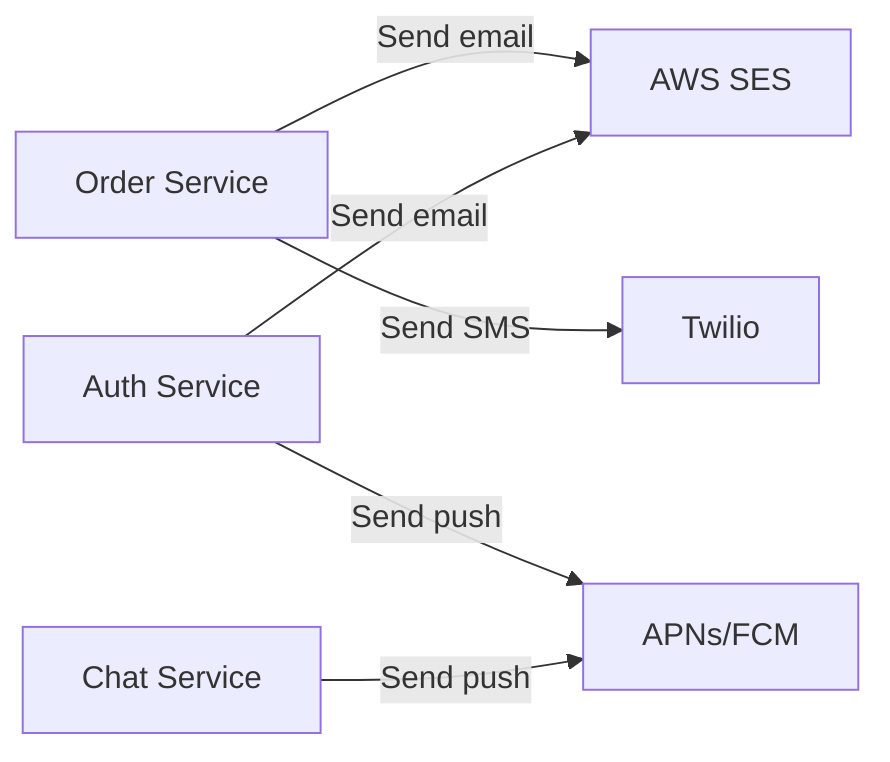
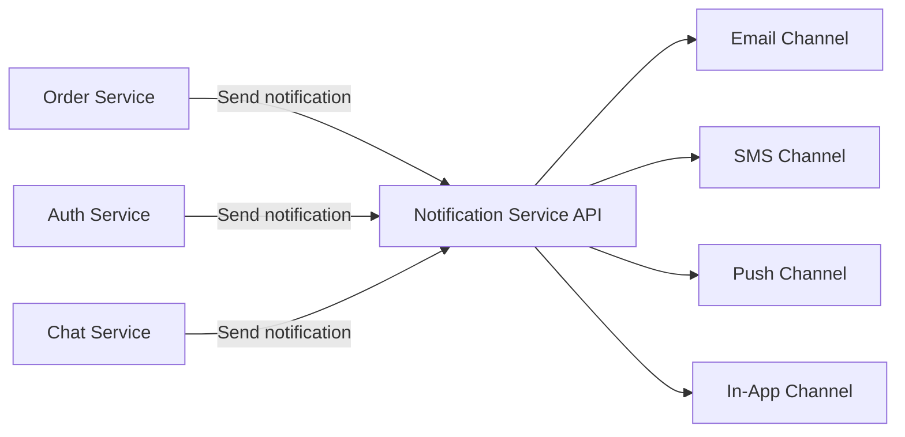
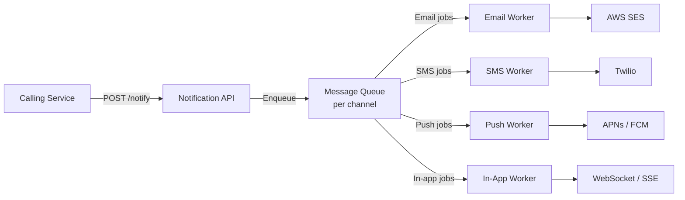
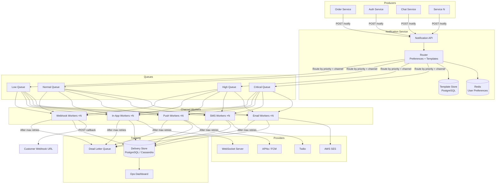
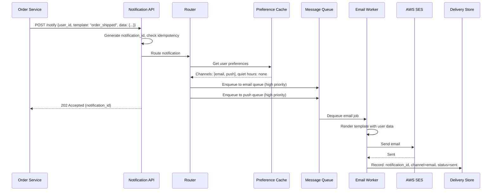
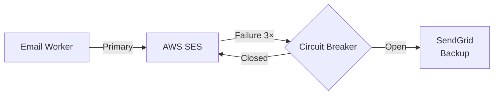

# System Design: Notification Service (Multi-Channel)

---

# 1. Problem Statement

**In plain English:** Build a centralized notification service that any product team can use to send notifications to users across multiple channels — email, SMS, push notification (mobile), in-app, and Slack/webhook. Think of it as the internal infrastructure that powers every "You got a new message," "Your order shipped," and "Your password was changed" notification across a company's products.

This is a SaaS-adjacent problem that exercises: event-driven architecture, fan-out, delivery tracking, rate limiting, user preferences, and multi-channel routing — all skills commonly tested in system design interviews.

**Core user actions (internal callers, not end users):**
- Product teams call the notification API: "Send this notification to these users."
- The system routes to the right channel(s) based on user preferences.
- The system tracks delivery status across channels.
- Users can manage their notification preferences (opt out of marketing emails but keep security alerts).

**Scale assumptions:**
- 500M notifications/day across all channels.
- 100K notifications/sec at peak (transactional bursts like password resets during an incident).
- 50M users with notification preferences.
- Channels: email (60%), push (25%), SMS (10%), in-app (30%), webhook (5%). (Percentages overlap — one notification may go to multiple channels.)

**Non-functional requirements:**
- **Reliability:** Critical notifications (password reset, security alerts) must never be lost.
- **Low latency:** Transactional notifications (OTP codes, order confirmations) delivered within seconds.
- **Scalability:** Handle bursts without dropping notifications.
- **Flexibility:** Easy to add new channels without rewriting the system.
- **User control:** Respect opt-outs, quiet hours, and channel preferences.

---

# 2. Requirements

## Functional Requirements
- Accept notification requests from internal services via API.
- Route notifications to one or more channels (email, SMS, push, in-app, webhook).
- Respect user notification preferences (channel, frequency, category opt-outs).
- Template-based notification content (with personalization).
- Track delivery status per channel (queued, sent, delivered, failed).
- Support immediate and scheduled notifications.
- Support bulk notifications (e.g., "notify all users in cohort X").
- Retry failed deliveries with backoff.

## Non-Functional Requirements
- At-least-once delivery for critical notifications.
- Idempotent processing (no duplicate notifications on retry).
- Horizontal scalability.
- Channel-specific rate limiting (respect SMS/email provider limits).
- Observable: track delivery rates, failure rates, latency per channel.

## Out of Scope
- Building the email/SMS/push providers themselves (we use third-party: SES, Twilio, APNs/FCM).
- Notification content creation UI.
- A/B testing on notification content.

---

# 3. Naive Solution

Each product team sends notifications directly from their service.



**How it works:**
1. Each service has its own code to call SES, Twilio, APNs/FCM.
2. Each service manages its own templates, retries, and delivery tracking.

**Why this works at small scale:**
- Two services, 100 notifications/day? Each team writes 20 lines of code. Done.

**Why this breaks:**
- **Duplicated logic:** Every team implements retries, rate limiting, preference checks, templates.
- **No central preferences:** A user opts out of marketing emails but each service has its own opt-out list.
- **Inconsistent behavior:** One service retries 3 times, another retries 10 times. One has rate limiting, another doesn't.
- **No visibility:** No central dashboard for "how many notifications did we send today? How many failed?"
- **Compliance risk:** No single place to enforce quiet hours, opt-outs, or GDPR right-to-erasure.
- **Provider switching:** If you need to switch from SES to SendGrid, you change code in every service.

---

# 4. Bottlenecks / Failure Modes

| Problem | What Happens | Impact |
|---------|-------------|--------|
| **Duplicated logic** | N services × M channels = N×M integrations to maintain | Engineering waste, inconsistency |
| **No preference enforcement** | User opts out but still receives notifications | User complaints, legal issues |
| **No rate limiting** | Runaway process sends 1M SMS in an hour | $$$ bill from Twilio, user annoyance |
| **No deduplication** | Same notification sent twice due to retry | User sees duplicates |
| **Provider outage** | SES goes down → no emails from any service | All email notifications fail |
| **No delivery tracking** | Can't answer "did this user receive the password reset?" | Support tickets, debugging blind spot |
| **Burst traffic** | Major incident triggers 1M password reset emails simultaneously | Provider rate limit hit, emails delayed |
| **Notification fatigue** | User gets 50 notifications/day from different services | User mutes all notifications |

---

# 5. Evolved Solution

## Step 1: Centralize Into a Notification Service

**Change:** Create a single Notification Service that all product teams call. It handles routing, preferences, templates, delivery, and tracking.



**Why it helps:**
- One place for preferences, templates, rate limiting, and delivery tracking.
- Product teams call one API: `POST /notify {user_id, template, data}`.
- Channel logic is abstracted away from callers.

**Trade-off:** Single service = potential bottleneck. Must be highly available and scalable.

## Step 2: Queue-Based Architecture for Reliability

**Change:** The API accepts notification requests and immediately enqueues them. Workers process the queue and send through each channel.



**Why it helps:**
- API responds immediately (< 50ms) → calling service isn't blocked.
- Queue absorbs bursts — workers consume at a steady rate.
- If a channel provider is down, messages stay in the queue and are retried.
- Workers are channel-specific and scale independently.

**Trade-off:** Notifications are async. For time-sensitive notifications (OTP codes), this adds a few hundred milliseconds. Acceptable.

## Step 3: Preference-Aware Routing

**Change:** Before sending, check the user's notification preferences:
- Which channels has the user opted into?
- Has the user muted this notification category?
- Is it within quiet hours?

**The Router component decides which channels to use:**
1. Caller sends: `{user_id, template: "order_shipped", data: {...}}`.
2. Router looks up the template's default channels (email + push).
3. Router checks user preferences: user opted out of push → only email.
4. Router enqueues to the email queue.

**Why it helps:** Central enforcement of preferences. Callers don't need to know about preferences.

**Trade-off:** Extra lookup per notification (Redis for preferences → fast).

## Step 4: Template System

**Change:** Templates are stored centrally. Callers reference a template ID and pass data.

```
Template: "order_shipped"
Subject: "Your order {{order_id}} has shipped!"
Body: "Hi {{first_name}}, your order is on its way. Track it here: {{tracking_url}}"
Channels: [email, push]
Category: transactional
```

**Why it helps:**
- Consistent messaging across all channels.
- Non-engineers (product, marketing) can update templates without code changes.
- Channel-specific rendering: same template renders as email HTML, push title+body, SMS text.

**Trade-off:** Need a template management interface. But templates are simple key-value structures.

## Step 5: Delivery Tracking and Idempotency

**Change:**
- Each notification gets a unique `notification_id`.
- Track status per channel: `queued → sent → delivered → failed`.
- Use the `notification_id` as an idempotency key — if the same notification is enqueued twice, the worker checks and skips duplicates.

**Why it helps:**
- "Did user X get the password reset email?" → query by `notification_id`.
- Retries are safe (idempotent).
- Delivery dashboard for ops.

**Trade-off:** Extra write per notification for status tracking. High volume → use a write-optimized store.

## Step 6: Rate Limiting and Throttling

**Change:** Multiple levels of rate limiting:
1. **Per-user:** Max 10 notifications/hour to prevent notification fatigue.
2. **Per-channel provider:** Respect SES (200/sec), Twilio, APNs limits.
3. **Per-calling-service:** Prevent one service from monopolizing capacity.

**Why it helps:**
- Protects users from notification spam.
- Protects provider accounts from being rate-limited or suspended.
- Ensures fair resource sharing between calling services.

**Trade-off:** Some notifications may be delayed or dropped (marketing notifications exceed user limit). Critical notifications (security alerts) bypass per-user limits.

## Step 7: Priority Levels

**Change:** Support priority tiers: `critical > high > normal > low`.
- **Critical:** Password reset, security alerts → dedicated high-priority queue, no rate limiting, immediate.
- **High:** Order confirmations → processed quickly.
- **Normal:** Marketing, recommendations → processed in order.
- **Low:** Weekly digests → batch and process during off-peak.

**Why it helps:** OTP codes aren't stuck behind a batch of 100K marketing emails.

**Trade-off:** Multiple queues/priority lanes to manage. But essential for a good user experience.

---

# 6. Final Architecture



**Request lifecycle — "Your order has shipped":**



---

# 7. Data Model

## Notification Requests (PostgreSQL or Cassandra)
| Column | Type | Notes |
|--------|------|-------|
| `notification_id` | UUID (PK) | Idempotency key |
| `user_id` | UUID (indexed) | Recipient |
| `template_id` | VARCHAR | Reference to template |
| `data` | JSONB | Template variables `{first_name, order_id, ...}` |
| `priority` | ENUM | critical, high, normal, low |
| `source_service` | VARCHAR | "order-service", "auth-service" |
| `created_at` | TIMESTAMP | |

## Delivery Status (Cassandra or PostgreSQL partitioned)
| Column | Type | Notes |
|--------|------|-------|
| `notification_id` | UUID (Partition Key) | |
| `channel` | VARCHAR (Clustering Key) | email, sms, push, in_app, webhook |
| `status` | ENUM | queued, sent, delivered, failed |
| `provider_ref` | VARCHAR | SES message ID, Twilio SID, etc. |
| `attempted_at` | TIMESTAMP | |
| `retry_count` | INT | |
| `error_message` | TEXT (nullable) | If failed |

**Why two tables:** The request table is written once. Delivery status is written multiple times (once per attempt per channel). Separating them avoids write contention.

## User Preferences (Redis + PostgreSQL backup)
```
prefs:{user_id} → {
  "channels": {"email": true, "push": true, "sms": false},
  "categories": {"marketing": false, "transactional": true, "security": true},
  "quiet_hours": {"start": "22:00", "end": "08:00", "timezone": "America/New_York"}
}
```

**Redis** for fast lookups (checked on every notification). **PostgreSQL** as the durable source of truth; synced to Redis on update.

## Templates (PostgreSQL)
| Column | Type | Notes |
|--------|------|-------|
| `template_id` | VARCHAR (PK) | "order_shipped" |
| `category` | VARCHAR | "transactional" |
| `default_channels` | VARCHAR[] | ["email", "push"] |
| `default_priority` | ENUM | high |
| `email_subject` | TEXT | "Your order {{order_id}} shipped!" |
| `email_body_html` | TEXT | HTML template |
| `push_title` | TEXT | "Order shipped!" |
| `push_body` | TEXT | "{{order_id}} is on its way" |
| `sms_body` | TEXT | "Your order shipped. Track: {{url}}" |
| `version` | INT | Template versioning |

---

# 8. API Design

## Send Notification
```
POST /api/v1/notifications
Authorization: Bearer <service-api-key>
Idempotency-Key: <uuid>
{
  "user_id": "user-123",
  "template_id": "order_shipped",
  "data": {
    "first_name": "Alice",
    "order_id": "ORD-456",
    "tracking_url": "https://track.example.com/ORD-456"
  },
  "priority": "high",
  "channels": ["email", "push"],        // optional override
  "scheduled_at": null                    // null = send immediately
}

Response 202 Accepted:
{
  "notification_id": "notif-789",
  "status": "queued",
  "channels": ["email", "push"]         // after preference filtering
}
```

## Send Bulk Notifications
```
POST /api/v1/notifications/bulk
Authorization: Bearer <service-api-key>
{
  "template_id": "feature_announcement",
  "user_filter": {"cohort": "pro_users"},
  "data": {"feature_name": "Dark Mode"},
  "priority": "low"
}

Response 202 Accepted:
{
  "batch_id": "batch-101",
  "estimated_recipients": 50000,
  "status": "processing"
}
```

## Get Notification Status
```
GET /api/v1/notifications/{notification_id}
Authorization: Bearer <service-api-key>

Response 200:
{
  "notification_id": "notif-789",
  "user_id": "user-123",
  "template_id": "order_shipped",
  "channels": {
    "email": {"status": "delivered", "sent_at": "2026-03-19T14:32:00Z"},
    "push": {"status": "sent", "sent_at": "2026-03-19T14:32:01Z"}
  }
}
```

## Update User Preferences
```
PUT /api/v1/users/{user_id}/notification-preferences
Authorization: Bearer <user-token>
{
  "channels": {"email": true, "push": true, "sms": false},
  "categories": {"marketing": false}
}

Response 200: {"status": "updated"}
```

---

# 9. Scale and Performance

## Traffic Estimates
- 500M notifications/day = ~5,800/sec average, 100K/sec peak.
- Per-channel: email ~3,500/sec, push ~1,500/sec, SMS ~580/sec, in-app ~1,750/sec.
- Delivery status writes: ~6K/sec (one write per channel per notification).
- Preference lookups: ~6K/sec (Redis handles this trivially).

## Handling Bursts
- **Queue absorbs everything.** 100K/sec burst → queue depth grows → workers drain it.
- Workers auto-scale based on queue depth.
- Priority queues ensure critical notifications aren't delayed by bulk sends.

## Hot-Key Mitigation
- **Bulk send to all users:** Split into batches of 1,000. Each batch is a queue message. Workers process batches in parallel.
- **Popular template:** Template is cached in memory (LRU) on each worker. No DB lookup after first hit.
- **High-volume user:** Per-user rate limit prevents one user from receiving 100 notifications/hour.

## Provider Rate Limits
| Provider | Rate Limit | How We Handle It |
|----------|-----------|-----------------|
| AWS SES | 200 emails/sec (default, raisable) | Token bucket rate limiter per worker pool |
| Twilio | 1 SMS/sec/phone number (raisable) | Multiple sending numbers + rate limiter |
| APNs | No hard limit, but throttles | Batch API (up to 1,000 per call) |
| FCM | 500K messages/sec per project | Rarely a bottleneck |

---

# 10. Reliability and Failure Handling

| Failure | Impact | Mitigation |
|---------|--------|------------|
| **Email provider down** | Emails not sent | Retry with backoff; fail over to backup provider (e.g., SES → SendGrid) |
| **SMS provider down** | SMS not sent | Retry; fall back to email if user has email enabled |
| **Push delivery fails** | Push not received | APNs/FCM return feedback; clean up invalid device tokens |
| **Worker crashes** | In-flight notification lost | Queue redelivers (visibility timeout); idempotency key prevents duplicate |
| **Queue is full** | API can't enqueue | Return 503; circuit breaker; alert ops |
| **Preference cache miss** | Slow routing | Fall back to PostgreSQL lookup; slightly slower but correct |

**Dead-Letter Queue (DLQ):**
- After 5 failed delivery attempts, the notification goes to the DLQ.
- Alert fires. Engineer investigates.
- DLQ items can be replayed after the issue is fixed.
- Critical notifications in DLQ get highest-priority alert.

**Provider fallback:**
- Configure a primary and secondary provider per channel.
- If primary fails 3 times in a row (circuit breaker pattern), switch to secondary.
- Alert ops team. Manual switch-back after primary recovers.



---

# 11. Security and Abuse Prevention

| Concern | Mitigation |
|---------|-----------|
| **API Authentication** | Service-to-service API keys (rotatable); mutual TLS for internal services |
| **Authorization** | Each calling service has a list of allowed templates/categories |
| **User opt-out enforcement** | Preferences checked on every notification; security category bypasses opt-out |
| **Rate limiting** | Per calling service: 10K/min; per user: 10/hour (marketing), unlimited (security) |
| **PII in notifications** | Template data may contain PII; encrypted in transit (TLS) and at rest; retention policy (delete delivery logs after 90 days) |
| **Template injection** | Sanitize template variables; never render raw HTML from user input |
| **Abuse prevention** | Alert if a calling service suddenly sends 10× normal volume; circuit breaker pauses sends |
| **Audit logging** | Every notification request logged with source service, template, and user_id |
| **GDPR compliance** | Support right-to-erasure: delete all notification logs for a user on request |
| **Webhook security** | Webhook payloads signed with HMAC; receiver can verify authenticity |

---

# 12. Interview Talking Points

- [ ] **Centralized service:** One notification service replaces duplicated notification logic across all product teams.
- [ ] **Queue per channel per priority:** Decouples API from delivery; absorbs bursts; enables independent scaling.
- [ ] **Preference-aware routing:** Check user preferences before enqueuing. Respect opt-outs, channels, quiet hours.
- [ ] **Template system:** Callers pass template ID + data. Rendering is channel-specific and centralized.
- [ ] **Priority queues:** Critical (OTP, security) bypasses lower priorities. Never delayed by bulk sends.
- [ ] **Idempotency:** `notification_id` prevents duplicate sends on retry.
- [ ] **Provider abstraction:** Workers call a provider interface. Swapping SES for SendGrid = config change, not code change.
- [ ] **Provider fallback:** Circuit breaker switches to backup provider on repeated failures.
- [ ] **Rate limiting:** Three levels — per-user, per-service, per-provider. Prevents abuse and provider penalties.
- [ ] **Delivery tracking:** Per-channel status with provider references. Supports debugging and compliance.
- [ ] **Trade-offs:** Async delivery adds latency (100ms–1s). Priority queues mitigate for critical notifications.
- [ ] **Cost:** SMS is expensive ($0.01/msg). Rate limiting and preference routing prevent waste.

---

# 13. Common Follow-Up Questions

**Q: Why not let each service send its own notifications?**
A: It works at small scale but creates a maintenance nightmare: duplicated code, inconsistent retry logic, no central preference management, no unified delivery tracking, and no rate limiting across services. A centralized service costs more upfront but pays off quickly as the company grows.

**Q: How do you handle a provider outage?**
A: Circuit breaker pattern. After 3 consecutive failures to a provider, the circuit opens and traffic is routed to a backup provider (e.g., SES → SendGrid). When the primary recovers (health check passes), the circuit closes again. This happens automatically — no human intervention.

**Q: How do you prevent notification fatigue?**
A: Per-user rate limiting (max 10 notifications/hour), category preferences (user can mute marketing), quiet hours (no notifications between 10 PM and 8 AM), and digesting (batch low-priority notifications into a daily summary).

**Q: How do you handle scheduled notifications?**
A: The notification request includes `scheduled_at`. A Scheduler service polls for notifications where `scheduled_at <= now()` and enqueues them. Uses the same pattern as the email campaign scheduler.

**Q: How do you support a new channel (e.g., Slack)?**
A: Add a new channel worker that implements the channel interface (render template → call Slack API). Add "slack" to the channel options in preferences and templates. Deploy the worker. No changes to the core routing or API logic.

**Q: How do you track whether a push notification was actually seen?**
A: Push providers (APNs, FCM) confirm delivery to the device, not that the user saw it. For "seen" tracking, the client reports back when the notification is displayed or tapped. For email, open tracking uses a pixel; click tracking uses URL redirects.

**Q: How do you handle a bulk send to 10 million users?**
A: The bulk endpoint enqueues a "bulk job" message. A Bulk Splitter worker queries the user segment, splits into batches of 1,000, and enqueues each batch to the normal priority queue. This spreads the send over minutes/hours instead of overwhelming the system. The bulk job tracks overall progress.

---

# Summary in 60 Seconds

> "A notification service centralizes all notification logic into one system. Product teams call a single API with a user ID, template, and data. The Router checks user preferences (channels, categories, quiet hours) and enqueues to channel-specific, priority-stratified queues. Channel workers process queues independently — email workers call SES, push workers call APNs/FCM, SMS workers call Twilio. Each channel has its own rate limiter respecting provider limits. Delivery status is tracked per notification per channel. Idempotency keys prevent duplicate sends on retry. Failed deliveries retry with exponential backoff; after max retries, they go to a DLQ. Provider fallback via circuit breaker switches to backup providers during outages. The key design choices are: queue-based async processing, preference-aware routing, priority queues for critical notifications, and a provider abstraction layer that makes channel providers swappable."

---

# What I Would Say If the Interviewer Pushes Deeper

**On exactly-once delivery:**
> "True exactly-once is impossible in distributed systems. We aim for at-least-once with idempotency: the notification might be processed twice, but the idempotency check on the `notification_id` prevents sending it twice. For email, SES also supports idempotency. For SMS, Twilio deduplicates by message SID. The practical result is effectively-once delivery."

**On cost optimization:**
> "SMS is the most expensive channel (~$0.01/message). Rate limiting and preference routing prevent unnecessary sends. For less urgent notifications, we prefer push (free) or email (~$0.0001/email) over SMS. We also batch notifications when possible — a digest email with 5 updates is cheaper and less annoying than 5 separate messages. The daily cost for 500M notifications: email ~$15K/month, SMS ~$150K/month, push ~$0."

**On multi-region deployment:**
> "For global reach, deploy workers in multiple regions with region-local queues. The API accepts requests centrally, but routes queue messages to the region closest to the user (for latency-sensitive channels like push). Preference cache (Redis) is replicated across regions. Delivery tracking uses a global store with eventual consistency — a few seconds of lag is fine for reporting."
