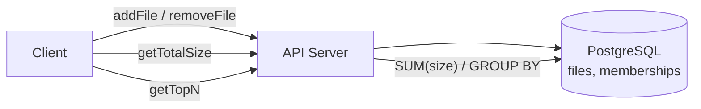
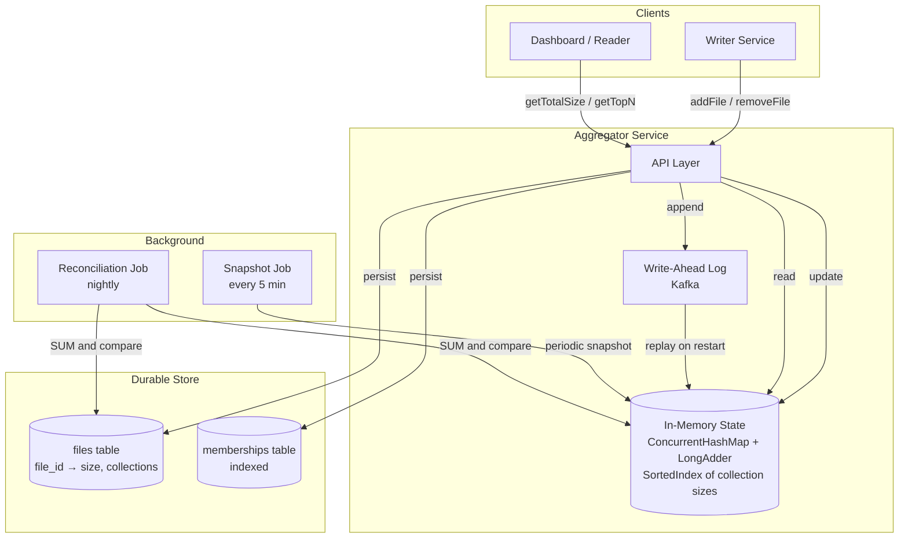
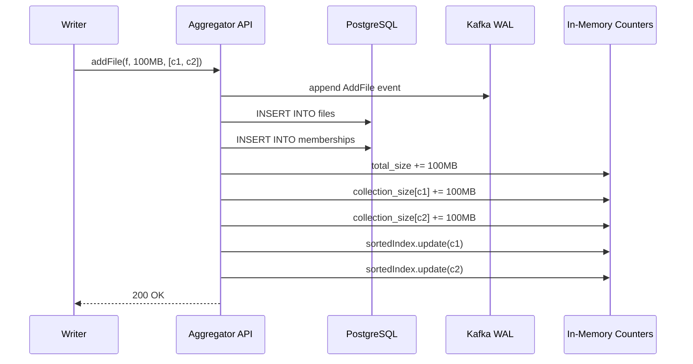

# System Design: File Size Aggregation and Top-N Collections

---

# 1. Problem Statement

**In plain English:** Design a system that tracks files where each file belongs to one or more **collections** (think folders, albums, tags, or buckets). The system must answer two questions quickly:

1. **What is the total size of all files in the system?**
2. **Which N collections are the largest, ranked by total file size?**

This is a deceptively simple-sounding problem that exercises: aggregation under writes, top-K queries, concurrent counters, and the classic trade-off between "compute on read" and "maintain on write."

**Core operations:**
- `addFile(fileId, size, collectionIds[])` — register a file in one or more collections.
- `removeFile(fileId)` — delete a file (update all affected collections).
- `getTotalSize()` — total bytes across all files.
- `getTopNCollections(N)` — the N largest collections by aggregate file size.

**Scale assumptions:**
- 1B files, 50M collections.
- Average file ∈ 1–2 collections; rare "viral" files in 1,000+ collections.
- 10K writes/sec (add/remove), 1K reads/sec for top-N (dashboards), 10K reads/sec for total size.
- N is typically ≤ 100; sometimes up to 10,000.

**Non-functional requirements:**
- **Low-latency reads:** `getTotalSize()` and `getTopNCollections()` must return in < 50 ms.
- **Correctness:** Eventual consistency is acceptable for top-N; total size should be accurate within a small window.
- **Thread-safe:** Many concurrent writers; no lost updates, no torn reads.
- **Memory-efficient:** Don't store every (file, collection) pair in RAM unless we have to.

---

# 2. Requirements

## Functional Requirements
- Add a file with size and a list of collection IDs.
- Remove a file (cascade size deduction from every collection it belonged to).
- Move/re-tag a file between collections (atomic semantically).
- Return the global total file size.
- Return the top N collections ranked by total size.
- Support a single file being a member of many collections (M:N relationship).

## Non-Functional Requirements
- Thread-safe under high concurrency (lock-free for hot paths).
- O(1) for total size; O(N) or O(N log K) for top-N where K = #collections touched.
- Bounded memory: O(#files + #collections + #memberships).
- Survives process restart (durable backing store).

## Out of Scope
- File content storage (this is metadata-only; treat file bytes as opaque blob in S3).
- Permissions / sharing semantics.
- Versioning of files.

---

# 3. Naive Solution

The simplest design: store everything in a relational table and compute aggregates on read.



**Schema:**
```sql
files(file_id PK, size BIGINT)
memberships(file_id, collection_id, PRIMARY KEY(file_id, collection_id))
```

**How it works:**
- `getTotalSize()` → `SELECT SUM(size) FROM files;`
- `getTopN(N)` → `SELECT collection_id, SUM(size) FROM memberships m JOIN files f USING(file_id) GROUP BY collection_id ORDER BY 2 DESC LIMIT N;`

**Why this works at small scale:**
- Correct by construction. SQL does the work.
- 10K files? Query takes milliseconds. Done.

**Why this breaks at scale:**
- `SUM(size)` over 1B rows = full table scan = seconds to minutes.
- `GROUP BY` over a billion-row memberships table is brutal even with indexes.
- Every dashboard refresh hammers the DB.
- Locks on writes contend with long-running aggregation reads.

---

# 4. Bottlenecks / Failure Modes

| Problem | What Happens | Impact |
|---------|--------------|--------|
| **Recompute on read** | Aggregations scan billions of rows | Read latency in seconds |
| **Single hot row** for total size counter | All writers contend on one row | Lock contention; throughput collapses |
| **Top-N requires sort of all collections** | 50M collections sorted on every request | Slow even with indexes |
| **Multi-collection file** | One file → many counter updates → must be atomic | Risk of partial updates / inconsistency |
| **Concurrent updates** | Two threads add files to the same collection | Lost increments without locking |
| **Counter sharding without aggregation plan** | Sharded counters reduce contention but make top-N harder | Read-side complexity |
| **Removal cascades** | Removing a file in 1,000 collections = 1,000 decrements | Write amplification |

---

# 5. Evolved Solution

## Step 1: Maintain Aggregates on Write (Materialized Counters)

**Change:** Don't compute on read. Keep two derived structures **updated on every write**:

- `total_size` — a single 64-bit counter (global file byte total).
- `collection_size[c]` — a map from `collection_id` to its aggregate size.

When a file is added with size `S` and collections `[c1, c2, c3]`:
- `total_size += S`
- For each `ci`: `collection_size[ci] += S`

When a file is removed: do the inverse.

**Why it helps:** Reads become O(1) (total) or O(#collections) (sorted view). Writes become O(K) where K = collections per file (usually small).

**Trade-off:** Eventual consistency between the source-of-truth tables and the aggregates. Need an idempotent reconciliation job to catch drift.

## Step 2: Use the Right Concurrency Primitive for the Counters

A naive `synchronized` block around the counter map will serialize every write. At 10K writes/sec, the lock is the bottleneck.

**Better choices:**
- **`AtomicLong` / `LongAdder`** (Java) or **`atomic.Int64`** (Go) for `total_size`. `LongAdder` is much better under contention because it shards the counter internally.
- **`ConcurrentHashMap<CollectionId, LongAdder>`** for `collection_size`. Each collection has its own striped counter — no global lock.
- For multi-collection updates, do **per-collection atomic adds** in any order. Each `LongAdder` is independent.

**The key insight:** atomic adds commute. We don't need a transaction across all collections for a single file — we just need each individual counter update to be atomic. The total stays consistent because every increment to `total_size` is matched by increments to each collection counter.

## Step 3: Top-N Without Sorting 50M Items

Sorting 50M entries every read is wasteful when N is small (e.g., 10 or 100).

**Options:**

### A. Min-Heap of size N (computed on read)
- Walk the `collection_size` map once, keep a min-heap of size N.
- Time: O(M log N) where M = total collections.
- For 50M collections and N=100: ~50M × log₂(100) ≈ 350M ops. Fast in native code (< 1 sec) but still expensive.

### B. Maintain a Sorted Index
- Use a balanced BST or skip-list keyed by `(size, collection_id)`.
- On every counter update, remove the old entry and reinsert with the new size.
- Top-N is O(N) walk from the max.
- Cost: O(log M) per write. Acceptable.

### C. Approximate Top-N with Count-Min Sketch + Heavy Hitters
- For very high write rates where exact top-N can lag, use streaming algorithms.
- Misra–Gries / Space-Saving algorithm maintains the top-K with bounded memory and bounded error.
- Useful when M is huge and we accept ~1% error.

### D. Cached Top-N, Refreshed Every X Seconds
- Compute top-N every 5 seconds in the background.
- Reads return the cached snapshot.
- Trade freshness for simplicity. Often this is all the dashboard needs.

**Recommendation for the interview:** "I'd start with option (A) — a min-heap on-demand — and add the sorted index (B) if reads are frequent. (D) is a great optimization if the dashboard refresh rate is the only consumer."

## Step 4: Handle Multi-Collection Files Correctly

**The key invariant:** `total_size = Σ file.size` (one entry per file), but `Σ collection_size[c] ≥ total_size` because a file in K collections contributes K times.

Don't try to make these equal — they answer different questions:
- `total_size` = "how much storage is used?" → sum each file once.
- `collection_size[c]` = "how big is this collection?" → sum files in that collection, including files shared with other collections.

**Implementation:** track `file → (size, [collections])`. On remove, look up the file's collection list and decrement each.

```python
def add_file(file_id, size, collection_ids):
    files[file_id] = (size, collection_ids)
    total_size.add(size)
    for c in collection_ids:
        collection_size[c].add(size)

def remove_file(file_id):
    size, collection_ids = files.pop(file_id)
    total_size.add(-size)
    for c in collection_ids:
        collection_size[c].add(-size)
```

**Atomicity gotcha:** between the `pop` and the loop, another reader could see a stale top-N. For most use cases this is fine. If strict consistency is required, use a per-file lock or version stamp.

## Step 5: Durability and Recovery

Counters in memory are fast but lose state on restart.

- **Write-ahead log** every `addFile` / `removeFile` to durable storage (PostgreSQL or Kafka).
- On startup, replay the log to rebuild counters, **or** snapshot counters periodically and replay from the snapshot.
- The source-of-truth tables (`files`, `memberships`) live in PostgreSQL.
- A reconciliation job runs nightly: `SELECT collection_id, SUM(size) ...` and compares to the in-memory counters. Alert on drift > 0.1%.

## Step 6: Scale Beyond One Machine

When 50M collections × 8 bytes counter + per-file metadata exceeds one machine's RAM (or one machine can't handle the write QPS):

- **Shard by `collection_id`.** Each shard owns a subset of collections.
- `getTotalSize()` = sum across shards (`Σ shard.total_size`). Each shard tracks total of files **whose primary collection lives on it**; or maintain a separate global counter via Kafka.
- `getTopN()` = each shard returns its local top-N; coordinator merges N×#shards entries and picks global top-N. Classic map-reduce top-K.
- **Multi-collection files** that span shards: replicate the increment to each shard owning one of the file's collections (write fan-out). Or keep the file-→-collections map centrally and use it to fan out.

---

# 6. Final Architecture



**Lifecycle of `addFile(fileId, 100MB, [c1, c2])`:**



---

# 7. Data Model

## `files` table (PostgreSQL)
| Column | Type | Notes |
|--------|------|-------|
| `file_id` | UUID (PK) | |
| `size` | BIGINT | Bytes |
| `created_at` | TIMESTAMP | |

## `memberships` table (PostgreSQL)
| Column | Type | Notes |
|--------|------|-------|
| `file_id` | UUID (FK) | |
| `collection_id` | UUID (FK) | |
| **PK** | (file_id, collection_id) | Composite |

Indexes: `(collection_id)` for fast removal lookups.

## In-Memory Aggregates
```
totalSize: LongAdder
collectionSize: ConcurrentHashMap<UUID, LongAdder>
sortedIndex: ConcurrentSkipListMap<Long, Set<UUID>>   // size → collections of that size
fileIndex: ConcurrentHashMap<UUID, FileMeta>          // file_id → (size, collections[])
```

---

# 8. API Design

```
POST /files
{
  "file_id": "f-001",
  "size": 1048576,
  "collection_ids": ["c-1", "c-7"]
}
→ 200 { "status": "ok" }

DELETE /files/{file_id}
→ 200 { "status": "ok" }

GET /aggregates/total
→ 200 { "total_size_bytes": 1234567890 }

GET /aggregates/top?n=10
→ 200 {
  "top": [
    {"collection_id": "c-42", "size_bytes": 9001000000},
    {"collection_id": "c-7",  "size_bytes": 8000000000},
    ...
  ]
}
```

---

# 9. Concurrency Deep Dive (Multi-Threaded Optimization)

This is what interviewers love to drill into.

### Why a plain `HashMap<Long>` fails
- Not thread-safe. Two threads doing `map.put(c, map.get(c) + size)` lose updates.
- Wrapping with `synchronized` works but serializes all writers.

### Why `ConcurrentHashMap<UUID, Long>` is still wrong
- The map's `put`/`get` are safe individually, but `get → add → put` is not atomic.
- Use `map.compute(key, (k, v) -> (v == null ? 0 : v) + size)` — that **is** atomic per key, but the lambda holds a bucket-level lock.

### Why `ConcurrentHashMap<UUID, LongAdder>` is the right answer
- `LongAdder` uses internal striping (per-thread cells). High write throughput under contention.
- Reads (`.sum()`) are eventually consistent and very cheap.
- Use `map.computeIfAbsent(c, k -> new LongAdder())` once to ensure the adder exists, then `.add(size)` lock-free.

### Lock-free updates of the sorted index
- `ConcurrentSkipListMap` provides lock-free / wait-free reads and lock-striped writes.
- Update pattern is read-modify-write on (oldSize, newSize), so use CAS on the `collection_size[c]` value to get a coherent old→new transition. If you can't get a coherent old value, accept that the sorted index may be slightly stale and reconcile in the background.

### Bulk operations (file in 1000 collections)
- Don't hold any global lock. Iterate the collection list and update each `LongAdder` independently.
- For the sorted index, batch the updates to avoid thrashing the skip-list.

### Java sketch
```java
ConcurrentHashMap<UUID, LongAdder> collectionSize = new ConcurrentHashMap<>();
LongAdder totalSize = new LongAdder();

void addFile(UUID fileId, long size, List<UUID> collections) {
    fileIndex.put(fileId, new FileMeta(size, collections));
    totalSize.add(size);
    for (UUID c : collections) {
        collectionSize.computeIfAbsent(c, k -> new LongAdder()).add(size);
    }
}
```

### Reading top-N consistently
- `LongAdder.sum()` is not a snapshot across keys — by the time you read collection 10, collection 1 may have moved.
- For analytics, this is fine.
- If a "consistent" snapshot is required, pause writes briefly (read–write lock) or use MVCC: tag every update with a monotonic version, build the snapshot for version V.

---

# 10. Scale and Performance

| Metric | Target | Notes |
|--------|--------|-------|
| Add file p99 | < 5 ms | In-memory + async WAL append |
| getTotalSize p99 | < 1 ms | `LongAdder.sum()` |
| getTopN (N=100) p99 | < 20 ms | Walk skip-list, take first 100 |
| Throughput | 50K writes/sec | Sharded by collection range |
| Memory per collection | ~64 bytes | LongAdder + map entry |
| Memory for 50M collections | ~3 GB | Fits one box; shard if it grows |

**Scaling levers:**
- Vertical: more RAM, more cores. A single box handles a lot.
- Horizontal: shard by `hash(collection_id) % N`. Coordinator merges shard results.
- Cache top-N for 1–5 seconds for ultra-high read QPS.

---

# 11. Reliability and Failure Handling

| Failure | Impact | Mitigation |
|---------|--------|------------|
| **Process crash** | In-memory counters lost | Rebuild from WAL + last snapshot |
| **Drift between DB and counters** | Wrong top-N | Nightly reconciliation; alert on > 0.1% drift |
| **Partial multi-collection update** | One counter incremented, another not (after crash) | WAL is per-event; on replay, the whole event is re-applied (idempotent via event_id) |
| **Hot collection** (e.g., a viral album) | Many writes to one `LongAdder` | LongAdder striping handles it; if not enough, shard the counter further (collection_id + bucket) |
| **Removing a file with 10K collections** | 10K decrements | Acceptable; can be done async if needed |
| **Sorted index inconsistency** | Top-N briefly wrong | Reconcile by walking `collectionSize` once per minute |

---

# 12. Interview Talking Points

- [ ] **Maintain on write, not on read.** Aggregates are too expensive to compute on every request.
- [ ] **Total size = Σ files, collection size = Σ files in collection.** These are different sums; multi-collection files contribute to multiple collection sums but only once to total.
- [ ] **`ConcurrentHashMap<Key, LongAdder>`** is the canonical thread-safe counter map. Striped, lock-free, scales with cores.
- [ ] **Top-N options:** on-demand heap, maintained sorted index, approximate sketches, cached snapshot. Pick based on read frequency and N.
- [ ] **Atomic per-counter, not transactional across counters.** Adds commute; partial updates resolve via WAL replay.
- [ ] **Sharding strategy:** by `collection_id` for top-N; merge top-N across shards via map-reduce.
- [ ] **WAL + snapshot** for recovery. Source of truth in DB.
- [ ] **Multi-collection files** = write fan-out, not double-counting in total.
- [ ] **Hot collection mitigation:** further shard the LongAdder for a single collection if one counter becomes a bottleneck.

---

# 13. Common Follow-Up Questions

**Q: A single file is in 10,000 collections — how do you keep the add fast?**
A: Each per-collection `LongAdder` update is independent and lock-free. 10K adds at ~50 ns each = ~500 µs. Acceptable. If we needed it faster, we'd do the updates asynchronously after acknowledging the API and persist the event to a WAL for durability.

**Q: How do you handle concurrent writers and readers without race conditions?**
A: Three layers. (1) For counters, `LongAdder` gives lock-free striped increments. (2) For the map, `ConcurrentHashMap` with `computeIfAbsent` ensures we never create duplicate adders. (3) For top-N reads, we accept eventual consistency — `LongAdder.sum()` is a "good enough" snapshot. If strict consistency is required, we'd use MVCC versioning.

**Q: What's the worst case for top-N latency?**
A: With a maintained `ConcurrentSkipListMap` sorted by size, top-N is O(N) — about 1 µs per entry. For N=10,000, that's ~10 ms. Without a sorted index, walking 50M entries to find the top-100 is ~50 ms in native code.

**Q: How do you support "move file from collection A to B" atomically?**
A: Single event in the WAL: `Move(file, A, B, size)`. The handler does `collectionSize[A] -= size; collectionSize[B] += size;` Both adds are atomic; the order doesn't matter; total_size is unchanged.

**Q: What if `total_size` becomes the bottleneck?**
A: Stripe it. Use multiple `LongAdder`s indexed by `Thread.currentThread().getId() % K`. `getTotalSize()` sums all K. Or accept that `LongAdder` already does this internally — it's effectively a striped counter — and is rarely a real bottleneck.

**Q: How does the system handle deletions efficiently?**
A: We index `file_id → (size, [collection_ids])` so delete is O(K) where K = the file's collection count. The same fan-out as add, just with negative amounts.

**Q: Approximate top-N — when would you use it?**
A: When M (total collections) is in the hundreds of millions and exact ordering doesn't matter for the bottom tail. Space-Saving algorithm gives top-K with bounded memory (O(K/ε)) and bounded error. We'd use it for a "trending collections" feed, not for billing or audit.

---

# Summary in 60 Seconds

> "I maintain aggregates on write, not on read. Each file's metadata includes its size and the list of collections it belongs to. A global `LongAdder` tracks the total size; a `ConcurrentHashMap<collection_id, LongAdder>` tracks per-collection size. Adds and removes do lock-free atomic increments on each affected counter. For top-N, I keep a `ConcurrentSkipListMap` sorted by size, so top-N is an O(N) walk from the largest. A write-ahead log (Kafka) plus periodic snapshots gives durability and crash recovery, and a nightly reconciliation job catches drift between the in-memory counters and the source-of-truth DB. For multi-collection files, the same file size contributes to multiple collection counters (by design) but only once to the global total. To scale beyond one machine, I shard by `collection_id` and merge top-N across shards using a coordinator — classic map-reduce top-K."

---

# What I Would Say If the Interviewer Pushes Deeper

**On lock-free design:**
> "`LongAdder` is the key primitive — it shards the counter internally so concurrent writers rarely touch the same cell. For the map of counters, `ConcurrentHashMap` provides per-bucket striping. The combination is effectively lock-free under realistic contention. For the sorted index, `ConcurrentSkipListMap` has a similar profile — lock-free reads, lock-striped writes."

**On consistency:**
> "I trade strict consistency for throughput. `LongAdder.sum()` isn't a snapshot. A top-N response may show collections in an order that didn't exactly exist at any single instant. For dashboards, this is fine. For billing, I'd use MVCC: every update gets a version stamp and reads pin to a version."

**On memory pressure:**
> "50M collections × ~64 bytes per LongAdder ≈ 3 GB. Plus the sorted index. Fits on a modern server. If we needed billions of collections, I'd shard horizontally — each shard owns a partition of the key space — and let a thin coordinator merge top-N across shards. The coordinator only needs N × #shards entries to compute the global top-N."
