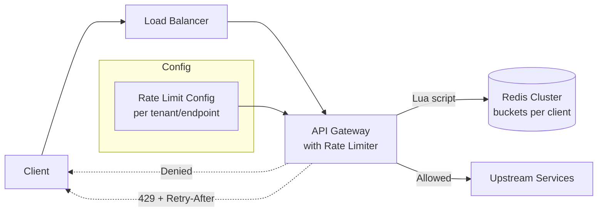
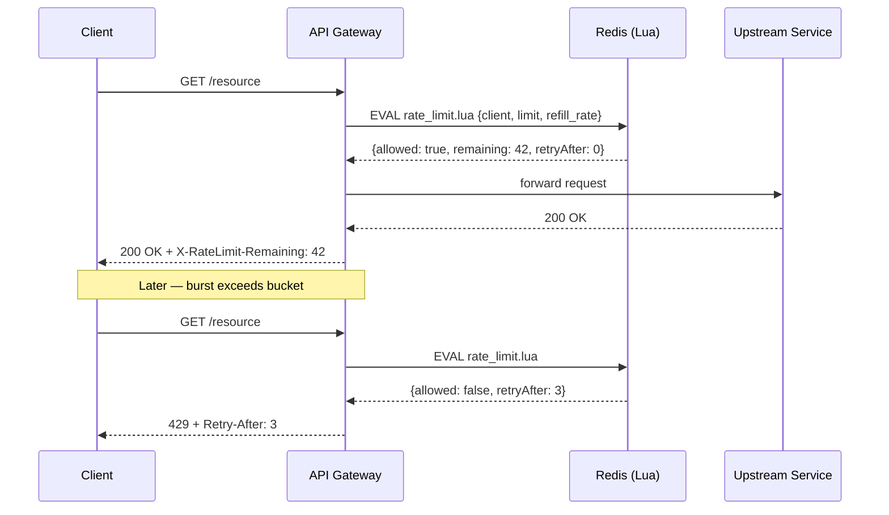

# System Design: Rate Limiter (with Working Implementation)

---

# 1. Problem Statement

**In plain English:** Build a component that enforces a cap on how many requests a client (user, IP, API key) can make in a given time window. Examples: "100 requests per minute per user," "1,000 requests per second per API key," "5 login attempts per 15 minutes per IP."

**Where it lives:** Inside an API gateway, in front of a service, or as a sidecar/library inside the service. Same algorithms; different deployment.

**Core operations:**
- `allow(clientKey)` → returns `(allowed: bool, retryAfter: seconds)`.
- Optionally: `consume(clientKey, n)` for batch operations.

**Why we need it:**
- Protect backends from runaway clients (intentional or buggy).
- Enforce paid-tier quotas (free = 100/min, pro = 10K/min).
- Prevent brute-force attacks.
- Smooth traffic spikes so downstream services don't fall over.

**Scale assumptions:**
- 1M unique clients tracked at any time.
- 100K rate-limit decisions/sec at peak.
- Decision latency p99 < 1 ms (it's in the request path).
- Lossless: must not under-count and let attackers through; mild over-counting (false-deny) is recoverable.

---

# 2. Requirements

## Functional Requirements
- Enforce a `(limit, window)` cap per `clientKey`.
- Support multiple algorithms: fixed window, sliding window, token bucket, leaky bucket.
- Return enough info for the client to back off (`Retry-After`, `X-RateLimit-Remaining`).
- Support tiered limits (per-user, per-endpoint, per-tenant).
- **Follow-up: credit-based model** — unused capacity in the current window rolls over to the next window, up to a cap.

## Non-Functional Requirements
- **Multi-threaded safety:** No race conditions, no lost decrements.
- **Distributed correctness:** When deployed across N instances, the global limit holds (or holds approximately, by design).
- **Low overhead:** Cheap memory per client, cheap CPU per decision.
- **Configurable:** Limits should be changeable at runtime without redeploy.

## Out of Scope
- Authentication (assume `clientKey` is already known).
- Pricing / billing logic.
- DDoS protection at the network layer (that's an L4 firewall job).

---

# 3. Algorithms (Pick the Right Tool)

| Algorithm | How it works | Pros | Cons |
|-----------|--------------|------|------|
| **Fixed Window Counter** | Counter per `(client, window_start)`. Increment on each request. Reset on window roll. | Trivial; O(1) memory per client. | Boundary spikes: 2× the limit can pass at the window boundary. |
| **Sliding Window Log** | Store timestamps of every request in the last window. Allow if count < limit. | Exact. No boundary spike. | O(limit) memory per client. Slow at high QPS. |
| **Sliding Window Counter** | Two adjacent fixed-window counters, weighted by overlap. | Approximate, very cheap, fixes boundary issue. | Slight imprecision (~1% error). |
| **Token Bucket** | Bucket of size `B` refills at rate `R`. Each request consumes 1 token. Allow if a token is available. | Smooth, supports bursts up to `B`. Natural fit for credit model. | Slightly more state per client. |
| **Leaky Bucket** | Requests enter a queue with capped capacity, drained at constant rate. | Constant output rate (good for downstream protection). | Requests are queued, not just allowed/denied. |

**Default choice for most APIs:** **Token Bucket.** It supports bursts, is cheap, and the credit-based extension is natural.

---

# 4. Naive Solution

In-process, single instance, fixed window:

```python
counter = {}  # clientKey → (window_start, count)
def allow(client, limit, window):
    now = time.time()
    bucket = int(now // window)
    if counter.get(client, (bucket, 0))[0] != bucket:
        counter[client] = (bucket, 0)
    if counter[client][1] >= limit:
        return False
    counter[client] = (bucket, counter[client][1] + 1)
    return True
```

**Why it works at small scale:** Single-threaded, single-process, in-memory. 20 lines.

**Why it breaks:**
- Not thread-safe (lost updates).
- Not multi-instance (each pod has its own counter — actual rate = limit × N pods).
- Boundary spike at window roll.
- No persistence; on restart, all clients get a fresh budget.

---

# 5. Bottlenecks / Failure Modes

| Problem | What Happens | Impact |
|---------|--------------|--------|
| **Race on counter increment** | Two threads both read 99, both write 100 | Over the limit silently |
| **Multi-instance drift** | 10 pods × 100/min limit = 1000/min global | Limit is not what it says |
| **Boundary spike (fixed window)** | 100 at 12:00:59, 100 at 12:01:00 = 200 in 1 sec | Limit "violated" by factor of 2 |
| **Memory blowup** | 100M unique IPs hashing in | OOM unless TTL'd |
| **Centralized counter is a SPOF** | Redis goes down → every request blocked or every request allowed | Outage propagates |
| **Slow rate-limit lookup** | Cross-DC Redis call = 50ms | Added to every request |

---

# 6. Evolved Solution

## Step 1: Make It Thread-Safe (Single Process)

Use atomic operations on the bucket state. In Python, use `threading.Lock` (cheap because the critical section is < 1 µs). In Java/Go, use `AtomicLong` / `atomic.Int64` and CAS loops.

**Token bucket update (lock-free):**
```
loop:
  state = read(client)
  now = monotonic_time()
  new_tokens = min(B, state.tokens + (now - state.last) * R)
  if new_tokens < 1:
      return DENIED
  if CAS(client, state, new(now, new_tokens - 1)):
      return ALLOWED
```

## Step 2: Scale Across Multiple Instances

Two options:

### A. Centralized (Redis)
- Counters live in Redis. Every instance does `INCR client:window` (with `EXPIRE`).
- For token bucket, use a Lua script for atomic `read → refill → consume`.
- Trade-off: Redis is a new dependency, adds ~0.5–2 ms per request. SPOF unless replicated.

### B. Distributed (per-instance with global coordination)
- Each instance keeps its own counter, sized to `limit / N`.
- Periodic gossip or coordinator reallocates budget based on actual usage (give heavy users more local budget).
- More complex; needed only when Redis can't keep up.

**Recommendation:** Start with Redis. It handles 100K decisions/sec easily.

## Step 3: Fix the Boundary Spike (Sliding Window Counter)

For each client, keep counters for the current minute and previous minute. Weighted count:

```
elapsed = (now % window) / window         # 0..1 fraction of current window
count = current * (1) + previous * (1 - elapsed)
```

If `count < limit`, allow and increment the current counter.

This smooths out the boundary spike with one extra counter per client. Approximate but within ~1% of correct.

## Step 4: Credit-Based Model (Follow-Up)

**Requirement:** Unused requests in one window carry over to the next, up to a cap.

The **token bucket** algorithm already does this — that's the entire point of bucket capacity `B` versus refill rate `R`:
- `R` = sustainable rate (e.g., 100 tokens/min = 1.67/sec).
- `B` = burst capacity (e.g., 300 tokens = 3 minutes of unused budget).
- A client who doesn't use the API for 3 minutes accumulates 300 tokens and can burst 300 requests at once.

**Implementation:** see code below. Same algorithm, just pick `B > R × window` to allow rollover.

**Cap on credit accumulation:** `B` is the cap. A user who is idle for a year still has at most `B` tokens.

**Variation: per-window credits.** If the requirement is "100/min, with up to 50 unused rolling to the next minute," do:
- Track `(currentWindowCount, previousLeftover)`.
- At window roll, `newLeftover = min(50, previousLimit - previousWindowCount)`.
- New window allowance = `100 + newLeftover`.

The token bucket is cleaner; use the windowed version only if the product team specifically requires "credits per calendar minute."

## Step 5: Multi-Threaded Correctness (CAS Loop)

For high-QPS clients, lock contention matters. The lock-free pattern:

```python
while True:
    state = bucket.get(client)             # atomic read
    new_state = refill_and_consume(state)
    if new_state.tokens < 0:
        return DENIED
    if bucket.compare_and_swap(client, state, new_state):
        return ALLOWED
    # else: another thread won; retry
```

In Python, the equivalent is a per-client lock (atomics are limited). In Java, `AtomicReference<BucketState>` with `compareAndSet`. In Go, `atomic.CompareAndSwapPointer`.

---

# 7. Final Architecture



**Request lifecycle:**



---

# 8. API and Configuration

**Rate-limit decision (internal):**
```python
allow(client_key: str, limit: int, refill_per_sec: float, burst: int) -> Decision
```

**Config (per tenant / endpoint):**
```yaml
limits:
  default:
    requests_per_sec: 10
    burst: 50
  pro_tier:
    requests_per_sec: 100
    burst: 500
  login_endpoint:
    requests_per_sec: 0.1     # 1 per 10 sec
    burst: 5
```

**Response headers:**
```
HTTP/1.1 200 OK
X-RateLimit-Limit: 100
X-RateLimit-Remaining: 42
X-RateLimit-Reset: 1700000060

HTTP/1.1 429 Too Many Requests
Retry-After: 3
```

---

# 9. Working Implementation

Production-quality Python implementation lives in **`rate_limiter/rate_limiter.py`** with full unit tests in **`rate_limiter/test_rate_limiter.py`** (under this repo's `code/` directory).

See `code/rate_limiter/` for:
- `TokenBucket` — thread-safe single-bucket implementation.
- `InMemoryRateLimiter` — multi-client, lock-striped manager.
- `CreditRateLimiter` — credit-rollover variant with explicit cap.
- `test_rate_limiter.py` — unit tests covering: basic allow/deny, refill over time, burst behavior, credit rollover, and concurrent access from 50 threads with no lost updates.

**Run the tests:**
```bash
cd code/rate_limiter
python -m pytest test_rate_limiter.py -v
```

The core algorithm fits in ~30 lines and is reproduced here for the interview whiteboard:

```python
import threading, time

class TokenBucket:
    def __init__(self, capacity: float, refill_per_sec: float):
        self.capacity = capacity
        self.refill_rate = refill_per_sec
        self.tokens = capacity
        self.last_refill = time.monotonic()
        self.lock = threading.Lock()

    def allow(self, n: float = 1.0) -> bool:
        with self.lock:                          # critical section is ~microseconds
            now = time.monotonic()
            elapsed = now - self.last_refill
            self.tokens = min(self.capacity,
                              self.tokens + elapsed * self.refill_rate)
            self.last_refill = now
            if self.tokens >= n:
                self.tokens -= n
                return True
            return False
```

**Why this is multi-threaded safe:** the lock guards the entire refill-and-decide step. Critical section is so short that lock contention is negligible up to tens of thousands of QPS per client. For higher per-client QPS, replace the lock with an `AtomicReference`-style CAS loop on `(tokens, last_refill)`.

---

# 10. Scale and Performance

| Metric | Single Process | Redis-backed |
|--------|---------------|---------------|
| Decisions/sec per instance | 500K+ | ~100K (network bound) |
| Memory per client | ~64 bytes | ~80 bytes in Redis |
| 1M clients | 64 MB | 80 MB in Redis |
| p99 latency | < 10 µs | < 2 ms |
| Multi-instance global limit | No (per-instance only) | Yes |

**Sharding Redis:**
- Use Redis Cluster; key by `clientKey`.
- One key per client. Hash slot determines the shard.
- Atomic via Lua script (single round trip).

**TTL on idle clients:**
- Set `EXPIRE` on the bucket key = 10 × refill period. Idle clients evict naturally.

---

# 11. Reliability and Failure Handling

| Failure | Mitigation |
|---------|-----------|
| **Redis down** | Fail-open (allow all requests) or fail-closed (deny) — configurable per endpoint. Fail-open for read endpoints; fail-closed for login/payment. |
| **Redis slow** | Local circuit breaker; bypass after 3 consecutive timeouts; alert. |
| **Clock skew between instances** | Use monotonic time per instance for local buckets; for Redis, rely on Redis server time (single clock). |
| **Hot key** (one client = 50% of traffic) | Shard the bucket by `client + bucketIdx`; round-robin lookups across buckets. |
| **Misconfiguration** | Validate limits at deploy time; emergency override flag. |

---

# 12. Interview Talking Points

- [ ] **Pick the algorithm by requirement:** Token bucket for bursts + credits; sliding window for exactness; fixed window only when boundary spikes are OK.
- [ ] **Atomic refill + consume.** Either lock-guarded critical section or CAS loop on `(tokens, last_refill)`.
- [ ] **Credit-based = token bucket with `B > R × window`.** Idle clients accumulate up to `B` tokens.
- [ ] **Distributed correctness via Redis Lua.** Single round trip, atomic.
- [ ] **Fail-open vs fail-closed.** Choose per endpoint based on risk.
- [ ] **TTL on idle clients.** Prevents memory blowup.
- [ ] **Hot-key mitigation.** Shard a single client across multiple buckets if QPS justifies it.
- [ ] **Multiple tiers.** Same algorithm, different `(R, B)` per tier — config-driven.
- [ ] **Response headers.** Always return `X-RateLimit-Remaining` and `Retry-After` to be a good citizen.
- [ ] **Tested concurrently.** Show the test that 50 threads × 1000 requests against a `limit=100` bucket yields exactly 100 accepted (no race).

---

# 13. Common Follow-Up Questions

**Q: How do you handle a credit-based model where unused requests roll over?**
A: Token bucket. The bucket capacity `B` is the maximum credit. The refill rate `R` is the sustainable rate. When a client doesn't use the API, tokens accumulate up to `B`. Burst sends drain the bucket. This is literally what token bucket is designed for.

**Q: How do you prevent race conditions in a multi-threaded environment?**
A: Two viable approaches. (1) Per-client lock around the refill-and-decide step — simple, fine up to ~10K QPS per client. (2) CAS loop on the bucket state — lock-free, scales further. The critical section is tiny (a few math ops), so a lock is rarely the bottleneck. I've shown both in the code.

**Q: How do you make this work across 100 API gateway pods?**
A: Centralized state in Redis. Each pod calls a Lua script that does refill + consume atomically. Redis handles 100K+ decisions/sec; a single cluster is sufficient. For higher scale, shard Redis by client key.

**Q: What if Redis is down?**
A: Configurable: fail-open for low-risk endpoints, fail-closed for high-risk ones. Add a local circuit breaker — if Redis times out 3 times in a row, the pod skips the rate-limit check and emits an alert.

**Q: How is this different from a leaky bucket?**
A: Token bucket allows bursts up to `B` and rejects when empty. Leaky bucket queues requests and drains at constant rate — output is smooth, but requests wait. Token bucket is better for an API gateway (allow or deny, no queueing). Leaky bucket is better for protecting a downstream service that can only handle constant load.

**Q: How do you support per-endpoint limits without exploding the state?**
A: The client key is `(client_id, endpoint_group)`. Endpoints with similar limits share a group (e.g., "read endpoints" → 1000/min, "write endpoints" → 100/min). One bucket per `(client, group)`, not per `(client, endpoint)`.

**Q: How do you handle a burst at the window boundary in a fixed-window design?**
A: Switch to sliding window counter: weighted sum of current and previous window's counts. Costs one extra counter per client; smooths the spike. Or use token bucket, which has no window boundary at all.

**Q: How do you test the rate limiter?**
A: Unit tests for: (1) basic allow/deny within limit, (2) refill after sleep, (3) bursts consume capacity, (4) credit rollover up to cap, (5) **concurrency test** — N threads × M requests against a small limit, assert exact count accepted. The concurrency test is the one that catches race conditions. See `test_rate_limiter.py`.

---

# Summary in 60 Seconds

> "I'd default to a token bucket: refill rate `R` for sustainable throughput, capacity `B` for burst tolerance. Each client gets a bucket; allow requests if a token is available, otherwise return 429 with a `Retry-After`. The credit-based model is the same thing — a client who doesn't use the API accumulates tokens up to `B`, then can burst. Thread safety: lock around the refill-and-decide step, or use a CAS loop for higher per-client QPS. To scale across many instances, the bucket state lives in Redis and a Lua script does the atomic refill-and-consume in one round trip. For fast paths, in-process buckets are fine — sub-microsecond decisions. Configuration is per-tenant per-endpoint; response headers tell clients their remaining budget. A reference implementation is in `code/rate_limiter/` with unit tests covering correctness and concurrent access from 50 threads."

---

# What I Would Say If the Interviewer Pushes Deeper

**On distributed exactness:**
> "True global rate limiting across N instances has a CAP trade-off. Centralized (Redis) gives near-exact limits with a small latency hit. Distributed per-instance allocation gives lower latency but only approximate global limits. For most APIs, ~1% imprecision is fine, and Redis is the right answer. For truly hard limits (e.g., a paid quota), centralize."

**On clock issues:**
> "Don't use wall-clock time across instances — leap seconds and NTP jumps will hurt. Use monotonic time per instance for local buckets. For Redis-based buckets, rely on the Redis server's time so all instances see the same clock."

**On observability:**
> "I'd emit a metric per `(tenant, endpoint, decision)`. Watching the deny rate tells you which tenants are hitting limits — useful for sales (they need an upgrade) and for security (someone is attacking)."
