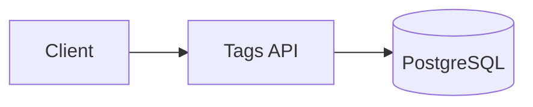
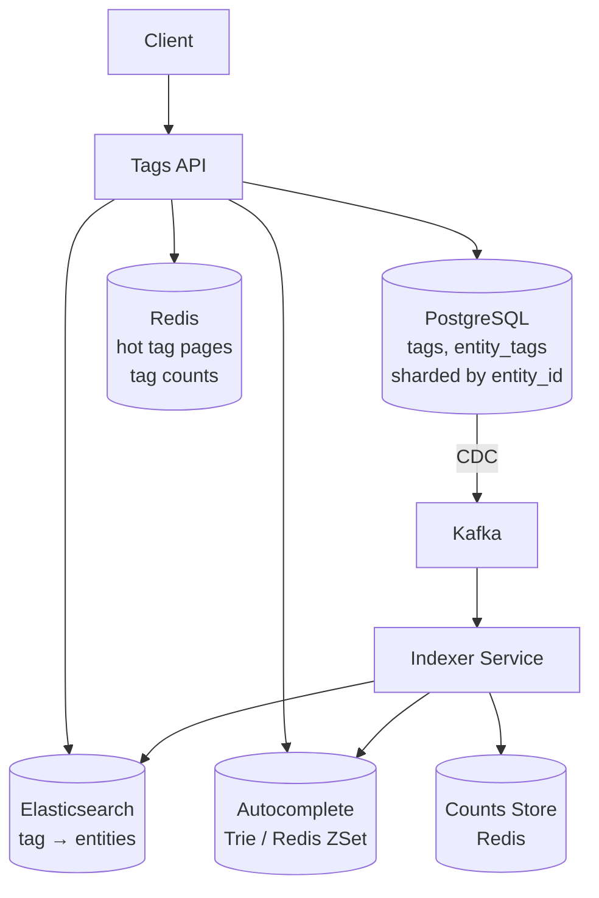
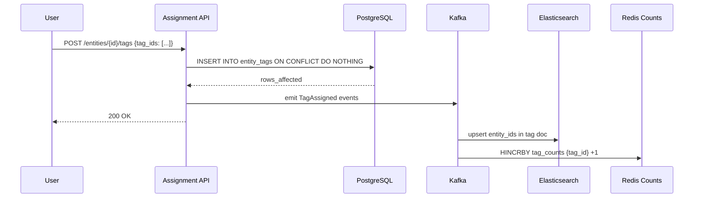
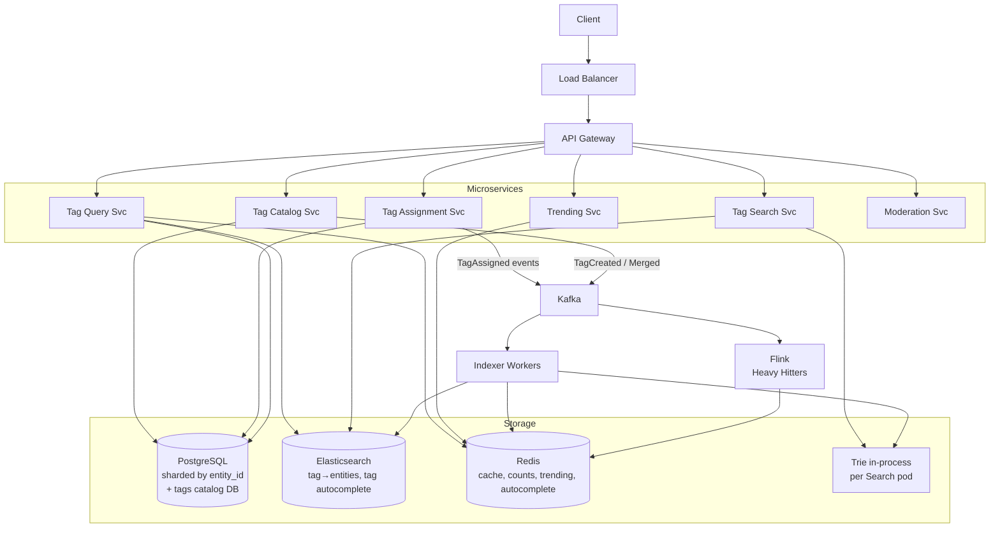

# System Design: Tags Management Service

---

# 1. Problem Statement

**In plain English:** Build a service that lets users attach **tags** (short labels like `#cooking`, `#javascript`, `#blackfriday`) to **entities** (posts, products, photos, tickets, documents). The system must support adding/removing tags, listing all tags on an entity, listing all entities for a tag, autocompleting tag names, surfacing popular tags, and doing all of this at platform scale.

This is the kind of system that lives behind Instagram hashtags, Stack Overflow tag pages, Shopify product taxonomies, and Jira labels.

**Core user actions:**
- Create / edit / delete a tag.
- Assign one or more tags to an entity.
- Remove a tag from an entity.
- Search tags by prefix (autocomplete).
- View entities with a given tag (with pagination).
- View top / trending tags.
- View tags by category (curated taxonomy) or by user (folksonomy).

**Scale assumptions:**
- 1B entities, 50M unique tags, average 5 tags per entity → 5B tag-entity links.
- 100K writes/sec at peak (creating posts with tags).
- 500K reads/sec (browsing tag pages, autocomplete).
- A small set of "viral" tags accrue millions of new entities per hour (e.g., a trending event).

**Non-functional requirements:**
- **Latency:** Tag autocomplete < 100 ms; tag-page read < 200 ms.
- **Consistency:** New tag assignments visible to the author immediately; visible to others eventually (seconds).
- **Search:** Prefix and fuzzy search on tag names.
- **Trending:** Real-time-ish (under a minute) popular tags.
- **Multi-tenant:** Same architecture serves multiple product surfaces.

---

# 2. Requirements

## Functional Requirements
- CRUD a tag (with metadata: name, slug, description, category, language).
- Assign/unassign tags to entities (entity_id, entity_type, tag_id).
- List tags for an entity.
- List entities for a tag (paginated, sorted by recency or popularity).
- Prefix search and autocomplete on tag names.
- Tag aliases / synonyms (`#js` → `#javascript`).
- Trending tags (per region, per category).
- Moderation: block / merge / rename tags.

## Non-Functional Requirements
- Horizontal scalability for writes and reads.
- Eventual consistency for read-heavy aggregates (tag entity counts, trending).
- Strong consistency for ownership/authorship reads (your own posts).
- Idempotent assign/unassign (re-tagging the same thing is a no-op).
- Observability per tag (counts, trends, abuse signals).

## Out of Scope
- Personalization / "recommended tags for you."
- Content moderation of underlying entities.
- Real-time push of new entities under a tag.

---

# 3. Naive Solution

A single PostgreSQL with two tables and a join.

```sql
tags(id PK, name UNIQUE, created_at);
entity_tags(entity_id, entity_type, tag_id, created_at, PRIMARY KEY(entity_id, entity_type, tag_id));
```



**Why it works at small scale:** Two indexes, a JOIN, done. 100K entities? Sub-100 ms reads.

**Why it breaks:**
- 5B rows in `entity_tags` → JOINs are slow even with indexes.
- "List entities for `#blackfriday`" returns 10M rows → must paginate efficiently.
- Autocomplete on 50M tags via `LIKE 'js%'` is a full index range scan and slow.
- Counting entities per tag (for trending) on demand is impossible at scale.
- A single hot tag write (everyone tagging `#worldcup`) contends on the same `tags` row counter.

---

# 4. Bottlenecks / Failure Modes

| Problem | What Happens | Impact |
|---------|--------------|--------|
| **Single-table joins** | 5B-row table joined to 1B-row entity table | Multi-second queries |
| **Hot tag write** | Millions of users assign `#worldcup` simultaneously | Lock contention on tag row / counter |
| **Hot tag read** | `#blackfriday` page fetched 1M/sec | Read amplification |
| **Autocomplete latency** | `LIKE 'java%'` across 50M tags | 500 ms+ |
| **Trending recomputation** | Aggregating counts over 5B rows | Hours |
| **Cardinality explosion** | Free-form tags → millions of typos and near-duplicates | Bad UX, poor search |
| **Cross-product consistency** | Tag count on tag page doesn't match actual entities listed | User confusion |
| **Tag deletion** | Removing a popular tag = 10M deletes | Locks, replication lag |

---

# 5. Evolved Solution

## Step 1: Split the Data Model by Access Pattern

Three storage systems, each tuned to one pattern:

1. **Source of truth (relational):** `tags`, `entity_tags`. PostgreSQL, sharded by `entity_id`.
2. **Inverted index (search):** Elasticsearch / OpenSearch. Docs keyed by `tag_id`; field `entity_ids` (or a child relation). Drives "list entities for tag X."
3. **Autocomplete index:** A separate ES index, or a Trie/Redis sorted set. Tag name → tag_id with prefix lookup.

**Why three stores:** No single technology is good at all three patterns. Sharded SQL is the truth; ES handles "by tag" queries; Trie handles autocomplete.



## Step 2: Microservices

| Service | Responsibility |
|---------|----------------|
| **Tag Catalog Service** | CRUD on tag definitions (name, slug, aliases, category). Strong consistency. |
| **Tag Assignment Service** | Assign/unassign tags to entities. Idempotent writes. Source of truth: `entity_tags`. |
| **Tag Query Service** | Read paths: list tags on entity, list entities by tag. Hits cache → ES → SQL. |
| **Tag Search Service** | Autocomplete and search. Hits Trie/ES. |
| **Trending Service** | Streaming aggregation (Flink/Spark Streaming) of tag events from Kafka. Writes top-K per window. |
| **Moderation Service** | Merge, rename, alias, block tags. Coordinates updates across stores. |

Communication: synchronous REST/gRPC for reads; Kafka events for cross-service propagation (`TagAssigned`, `TagRemoved`, `TagCreated`).

## Step 3: Write Path



**Why this works:**
- SQL is the truth; the event stream propagates eventually to all read stores.
- ON CONFLICT DO NOTHING makes assignment idempotent.
- Re-tagging the same thing emits no event (we only emit on actual change).

## Step 4: Read Path

For "List entities for tag `#javascript`, page 2":

1. Cache lookup: `cache:tag:javascript:page:2`. Hit → return.
2. Miss → ES query: `GET tag-entities/javascript?from=20&size=20`. Return.
3. SQL fallback only for cold data.
4. Async populate cache on miss with a short TTL (e.g., 30 s).

For autocomplete `java`:
1. Trie lookup (in-process per pod) → top 10 tags by popularity prefixed with `java`.
2. ~1 ms response. Trie rebuilt nightly from the tags table; updated incrementally from Kafka for new tags.

For tag count display ("12.4M posts"):
1. Read `redis:tag_count:{tag_id}`.
2. Refreshed by the streaming consumer.
3. May lag by seconds — acceptable.

## Step 5: Trending Tags (Real-Time)

- Kafka topic `tag.events` receives every assignment with timestamp.
- Flink job windows the stream by region and category (5-minute tumbling window).
- Computes top-K tags using **Space-Saving / Heavy Hitters** algorithm — O(K) memory per window.
- Writes top-K to Redis: `trending:global:5m`, `trending:US:5m`, `trending:gaming:1h`.
- Trending page reads directly from Redis. Sub-millisecond.

## Step 6: Hot Tag Mitigation

When `#worldcup` gets 10K assignments/sec:

- **Write hot spot in PostgreSQL:** The row for `tag_id = worldcup` isn't the contention — `entity_tags` rows have distinct PKs (composite `(entity_id, tag_id)`). The hot spot is the count cache. We use **`HINCRBY`** on Redis (atomic) and **sharded counters**: `tag_count:{tag_id}:{shard}` then sum on read.
- **Read hot spot in ES:** the tag doc has millions of entity_ids → use child relations or a separate `tag_entities` index where the parent is the tag and children are recent entities; query by tag with sort by created_at desc, return top page only. Older pages hit SQL.
- **Cache aggressively:** First page of every popular tag cached with TTL 30 seconds; refresh in the background.

## Step 7: Aliases, Synonyms, and Merges

- Tag catalog has `canonical_tag_id`. Aliases point to a canonical.
- At read time, `#js` resolves to `#javascript`'s entity list.
- **Merging two tags** (`#js` into `#javascript`): mark `#js.canonical = #javascript.id`; emit `TagMerged` event; the indexer rewrites entity_tags rows asynchronously. Reads via `#js` start hitting the merged result immediately because the API resolves to canonical first.

## Step 8: Moderation & Quality

- Auto-block tags matching a denylist.
- Detect near-duplicates (`#blackfriday2025` vs `#black-friday-2025`) and suggest a canonical to moderators.
- Cap free-form tags per entity (e.g., max 30).
- Rate-limit new tag creation per user.

---

# 6. Final Architecture



---

# 7. Data Model

## PostgreSQL — Tag Catalog (single DB, small)
```sql
CREATE TABLE tags (
  id           BIGSERIAL PRIMARY KEY,
  name         CITEXT UNIQUE NOT NULL,
  slug         TEXT UNIQUE NOT NULL,
  description  TEXT,
  category     TEXT,
  language     TEXT,
  canonical_id BIGINT REFERENCES tags(id),   -- NULL = canonical itself
  status       TEXT,                          -- active | blocked | merged
  created_at   TIMESTAMP DEFAULT now()
);

CREATE INDEX idx_tags_canonical ON tags(canonical_id);
CREATE INDEX idx_tags_name_prefix ON tags (name text_pattern_ops);
```

## PostgreSQL — Entity Tags (sharded by entity_id)
```sql
CREATE TABLE entity_tags (
  entity_id   BIGINT,
  entity_type SMALLINT,
  tag_id      BIGINT,
  added_at    TIMESTAMP DEFAULT now(),
  added_by    BIGINT,
  PRIMARY KEY (entity_id, entity_type, tag_id)
);

CREATE INDEX idx_entity_tags_tag ON entity_tags(tag_id, added_at DESC);
```

Sharding strategy: shard by `entity_id` (hash). `idx_entity_tags_tag` is **local to each shard** — fine for "tags of one entity," but "all entities of one tag" requires fan-out. That's why ES is the answer for tag-page reads, not SQL.

## Elasticsearch — Tag → Entities
```
Index: tag_entities
Doc: { tag_id, entity_id, entity_type, added_at, popularity_score }
Routing: by tag_id    // colocate everything for a tag on one shard
```

Query: `tag_id = X, sort by added_at desc, paginate`. Routing keeps query latency low.

## Redis
```
Key: tag_count:{tag_id}                   → integer
Key: tag_count:{tag_id}:shard:{i}         → integer (sharded for hot tags)
Key: cache:tag:{slug}:page:{n}            → JSON page
Key: trending:{scope}:{window}            → ZSet (tag_id → count)
Key: autocomplete:{prefix}                → ZSet (tag_id → score) [top results]
```

---

# 8. API Design

### Create / Manage Tags
```
POST /tags
{ "name": "#javascript", "category": "tech", "description": "..." }
→ 201 { "tag_id": 42, "slug": "javascript" }

PATCH /tags/{tag_id}/merge
{ "canonical_id": 42 }   // merge this tag into #javascript
→ 202 Accepted
```

### Assign / Unassign Tags
```
POST /entities/{entity_id}/tags
{ "tag_ids": [42, 77] }
→ 200 { "added": [42], "already_present": [77] }

DELETE /entities/{entity_id}/tags/{tag_id}
→ 204
```

### Read
```
GET /entities/{entity_id}/tags
→ 200 { "tags": [ {id, name, slug}, ... ] }

GET /tags/{slug}/entities?cursor=...&limit=20
→ 200 { "entities": [...], "next_cursor": "..." }

GET /tags/search?q=java&limit=10
→ 200 { "tags": [{id, name, count}, ...] }   // autocomplete

GET /tags/trending?region=US&window=1h
→ 200 { "tags": [...] }
```

### Bulk
```
POST /entities/{entity_id}/tags:replace
{ "tag_ids": [...] }   // idempotent set replace
```

---

# 9. Scale and Bottleneck Analysis

This is the heart of the interview — knowing **where** each component breaks and **how** to scale past it.

### A. PostgreSQL `entity_tags` (5B rows)

**Bottleneck:** Single instance can't hold 5B rows nor service 100K writes/sec.

**Scale strategy:**
- **Shard by `entity_id`** (hash). Each shard holds ~1/N of rows.
- Writes from "tag my entity" land on one shard — perfect.
- Reads of "tags of my entity" hit one shard — perfect.
- Reads of "all entities of a tag" must fan out across all shards — **bad**. That's why ES.
- Add read replicas per shard for scale.

### B. PostgreSQL `tags` Catalog

**Bottleneck:** Hot tag rows for popular tags, but only on `UPDATE` (counts, status). Catalog itself is small (50M rows, ~10 GB) — fits one instance.

**Scale strategy:**
- Don't store live counts in this table — counts live in Redis.
- Read replicas for catalog reads.

### C. Elasticsearch (Tag → Entities)

**Bottleneck:**
- 5B documents, hot tags with 100M entries.
- Pagination beyond page ~10K is expensive ("deep pagination problem").

**Scale strategy:**
- **Custom routing by tag_id** keeps each tag's data on one shard; query stays a single-shard request.
- **Time-bucketed indices**: `tag_entities_2026_05`, `tag_entities_2026_04`. Most reads hit the latest index; old data tiers to cold storage.
- **Use `search_after` cursors**, not `from + size`, for deep pagination.
- **Pre-aggregated counts** in Redis, not via ES aggregations on every read.

### D. Redis (Cache + Counts + Trending)

**Bottleneck:**
- Single node Redis caps around 100K ops/sec.
- Hot key (`tag_count:worldcup`) hammered by every read and write.

**Scale strategy:**
- **Redis Cluster** — shard by key.
- **Hot key sharding:** `tag_count:{tag_id}:{shard}` with N shards per hot tag. Writers pick a shard randomly; readers sum all N. Trades read cost for write throughput.
- **Client-side cache** (e.g., near-cache in API pod with 1–2 s TTL) for ultra-hot keys.

### E. Autocomplete Trie / Search

**Bottleneck:**
- 50M tags in a Trie ≈ 1–2 GB depending on encoding.
- Updates need to propagate to every pod's in-memory trie.

**Scale strategy:**
- Build the trie offline; ship as a versioned artifact; pods load on startup.
- For incremental updates, consume Kafka and apply deltas.
- Or use Elasticsearch's `completion` suggester — managed, fast, scales horizontally.

### F. Kafka

**Bottleneck:** Single partition can do ~10K events/sec.

**Scale strategy:**
- Partition `tag.events` by `tag_id` (so all events for a tag stay ordered).
- 100 partitions = 1M events/sec headroom.
- Hot tag = hot partition → split via sub-keying (`tag_id + entity_id_hash`) and accept that within a tag, order is per-substream.

### G. Indexer Workers

**Bottleneck:** Falls behind during write spikes.

**Scale strategy:**
- Stateless workers; scale on Kafka consumer lag.
- Backpressure: if ES rejects, retry with exponential backoff; surge protect via secondary topic.

### H. Trending (Flink)

**Bottleneck:** High cardinality (50M tag IDs in a window) blows up state.

**Scale strategy:**
- Heavy-hitters / Space-Saving algorithm with bounded memory (top-K with ε precision).
- Tumbling 1-min windows; merge into 1-hr / 1-day rollups asynchronously.

### Summary Table — Which Component Bottlenecks First?

| Layer | First Bottleneck | Fix |
|-------|-----------------|-----|
| API pods | CPU at ~10K rps each | Autoscale horizontally |
| Catalog DB | Write QPS at ~5K/s | Read replicas, move counts out |
| `entity_tags` DB | Storage + write QPS | Shard by entity_id |
| ES tag→entities | Deep pagination, hot tag shard | Routing by tag_id, time-bucketing, `search_after` |
| Redis counts | Hot keys (viral tags) | Sharded counters, near-cache |
| Kafka | Per-partition throughput | Partition by tag_id; sub-key hot tags |
| Indexer | Consumer lag during spikes | Autoscale; backpressure |
| Trie / Autocomplete | Memory per pod | Versioned artifact; or use ES completion |
| Trending | State size in Flink | Heavy hitters / sketches |

---

# 10. Reliability and Consistency

| Concern | Approach |
|---------|----------|
| **Read your writes** | After assigning a tag, the API returns the new state and the client uses optimistic UI. The author's view bypasses cache for 5 s after write. |
| **Indexer lag** | Track Kafka consumer lag; alert at > 60 s. Surface "data may be stale" in the UI when severe. |
| **ES/SQL drift** | Daily reconciliation: sample entity_tags, verify ES has the same. Repair drift via a reindex job. |
| **Idempotency** | `entity_tags` has composite PK; INSERT ON CONFLICT DO NOTHING. Event consumers use `event_id` for dedupe. |
| **Tag deletion** | Soft delete (`status = deleted`); background job tombstones entity_tags rows; ES removes via update_by_query. |
| **Merge correctness** | Reads resolve alias → canonical at query time. Background indexer migrates rows so reads on the old slug eventually hit a clean canonical doc. |

---

# 11. Security and Abuse Prevention

| Concern | Mitigation |
|---------|-----------|
| **Tag spam / SEO abuse** | Rate-limit tag creation per user; flag low-quality near-duplicates; ML classifier for spammy tags |
| **Profanity / banned terms** | Denylist + ML model at create time |
| **PII in tag names** | Reject tags matching email/phone/SSN regexes |
| **Trending manipulation** | Detect bursty bot patterns; filter from trending; rate-limit assignments |
| **Permission to tag** | Service-level check: can user X tag entity Y? Enforced by Assignment Service |
| **Aliases as a vector** | Only moderators / trusted automation can set `canonical_id`; alias loops detected |

---

# 12. Interview Talking Points

- [ ] **Separate storage by access pattern:** SQL for truth, ES for "by tag," Redis for hot reads/counts, Trie for autocomplete.
- [ ] **Shard `entity_tags` by `entity_id`.** Tag-page reads go to ES, not a fanned-out SQL query.
- [ ] **Microservices split:** Catalog, Assignment, Query, Search, Trending, Moderation — each scales independently.
- [ ] **Idempotent writes via composite PK + Kafka event_id dedupe.**
- [ ] **Counts live in Redis, not in the catalog table** — avoids row contention on viral tags.
- [ ] **Hot-tag mitigation:** sharded Redis counters, ES routing by tag, time-bucketed indices.
- [ ] **Trending = streaming heavy hitters** (Space-Saving), not on-demand aggregation.
- [ ] **Autocomplete = in-memory Trie or ES completion suggester**, never a `LIKE 'x%'` SQL scan.
- [ ] **Aliases / merges resolved at read time first**, then background-migrated.
- [ ] **Eventual consistency for tag pages** is acceptable; author's own view bypasses cache.

---

# 13. Common Follow-Up Questions

**Q: How would you scale the system as tag volume and entity volume grow?**
A: Three axes. (1) Shard `entity_tags` by entity_id; reads of "tags on one entity" stay single-shard. (2) Mirror to ES with routing by tag_id; reads of "entities on one tag" stay single-shard on ES. (3) Cache hot tag pages in Redis with a 30-second TTL. The first two prevent fan-out queries; the third absorbs read spikes.

**Q: Which component bottlenecks first?**
A: Typically **the read path for hot tags** — millions of users hitting the page for `#worldcup` during a major event. The mitigation is layered caching (Redis near-cache in API pods + Redis Cluster + ES routing) and sharded counters. Write QPS bottlenecks come second; Kafka and sharded SQL handle 100K/sec easily.

**Q: What happens when a single tag becomes viral?**
A: (1) Counter on that tag shards into N sub-counters; reads sum, writes pick a shard randomly. (2) ES routing keeps it on one shard but with time-bucketed indices the active partition is bounded. (3) Tag page first page is cached with sub-second refresh; deeper pages query ES. (4) Trending picks it up via heavy-hitters and tells the UI to display it.

**Q: How do you support autocomplete at scale?**
A: Two viable options. (1) Build a Trie offline from the tags catalog, ship as a versioned artifact, each Search pod loads it; updates via Kafka. (2) Use Elasticsearch's `completion` suggester, which is purpose-built for this. Option (1) gives sub-millisecond responses but heavier ops; option (2) is hands-off but slightly higher latency.

**Q: How do you handle merging two tags (e.g., `#js` → `#javascript`)?**
A: Set `tags.canonical_id`. API resolves to canonical on every read, so reads via `#js` immediately hit `#javascript`'s entity list. A background job rewrites `entity_tags` rows from `js` to `javascript` (or just deletes them, since the resolution layer handles it). ES gets a reindex job.

**Q: How do you keep ES in sync with SQL?**
A: Change Data Capture via Kafka. Every commit on `entity_tags` emits an event; an indexer consumes and upserts into ES. We track Kafka consumer lag as the SLI; reconcile drift daily via a sample-based audit.

**Q: How would you implement trending tags?**
A: Stream all tag-assigned events into Kafka. A Flink job runs a Heavy-Hitters / Space-Saving algorithm in tumbling windows (1 min, 5 min, 1 hr). Output is the top-K tags per window per scope (global, region, category). Stored in Redis sorted sets. The trending API just reads from Redis.

**Q: How do you prevent a user from spamming tag creation?**
A: Per-user rate limits via the rate limiter service (token bucket). Tag creation also runs through a quality check: denylist, profanity, near-duplicate detection. Auto-generated tags get a lower trust score and require moderation before appearing in autocomplete.

**Q: What if Elasticsearch goes down?**
A: Reads fail over to SQL with a degraded mode banner ("results may be limited"). For the "list entities for tag" query, fallback to SQL would be slow for hot tags; we'd serve from Redis cache as long as possible and rate-limit tag-page reads to protect SQL.

---

# Summary in 60 Seconds

> "I'd split tag management into six microservices — Catalog, Assignment, Query, Search, Trending, Moderation — backed by three storage systems chosen by access pattern: PostgreSQL (sharded by entity_id) as the source of truth, Elasticsearch (routed by tag_id) for 'entities of a tag' reads, and Redis for caches, counts, and trending. Writes go through Assignment → SQL → Kafka, and a stream of `TagAssigned` events fans out to update ES, Redis counters, and an in-memory Trie that powers autocomplete. Hot tags are mitigated by sharded Redis counters, ES routing, and aggressive page-level caching. Trending is a Flink heavy-hitters job over the Kafka stream, written to Redis sorted sets. Aliases and merges are resolved at read time via the catalog's `canonical_id` and migrated in the background. Each layer scales horizontally; the system's first bottleneck under viral load is the read path for hot tag pages, which we solve with layered caching."

---

# What I Would Say If the Interviewer Pushes Deeper

**On consistency:**
> "Tag pages are eventually consistent — the indexer might be 1–5 seconds behind the SQL write. For the author's own view, we bypass the cache and read directly from SQL for the first few seconds after a write. For other users, slight staleness is invisible. The trade-off buys us 10× the read throughput."

**On data model trade-offs:**
> "I deliberately did not denormalize entity → tag_ids into the entity table. Tagging is a many-to-many relationship that changes more often than the entity itself, and we want to query in both directions ('tags on entity' and 'entities on tag') efficiently. Two access patterns, two indexes — that's why we maintain SQL by entity_id and ES by tag_id."

**On scaling beyond one ES cluster:**
> "If a single tag's entity stream exceeds one ES shard's capacity (~50 GB rule of thumb), we time-bucket the index — `tag_entities_YYYY_MM`. Reads default to the latest bucket; pagination into older data hits older indices, which can live on cheaper tiered storage. This is the same pattern Elastic uses for log search at scale."

**On what I'd monitor:**
> "Per-tag write QPS distribution (catch hot tags early), Kafka consumer lag on the indexer (catch staleness), ES query p99 by tag-shard (catch hot shards), Redis hit rate (catch cache misses), trending refresh latency (catch Flink lag). The early-warning signal for a viral event is a sharp uptick in writes to a single tag's partition — we autoscale and shard the counter in response."
